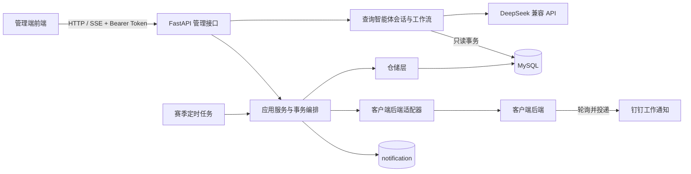

# 燃动现象智能管理平台后端

> **项目定位**
>
> 本仓库提供“燃动现象”企业运动平台的管理端后端服务，负责赛季与挑战配置、运动凭证终审、赛季结算、积分和奖品履约、用户意见处理、自然语言只读数据查询，以及客户端后端图片资源的安全中转。

## 1. 项目概览

“燃动现象”以赛季为周期组织企业员工参加运动挑战。用户在客户端报名、选择项目和挑战等级、上传运动凭证；管理员通过本服务配置玩法、处理终审和奖品发放，并在赛季结束后完成积分结算。

当前核心管理链路已经基本落地：应用包含完整的 FastAPI 路由、Schema、服务、仓储、异步 MySQL 访问、客户端后端适配器和进程内定时任务。详细玩法与业务不变量以[项目总览](description/project.md)为准，接口契约以[项目文档地图](description/README.md)中的 API 文档为准。

本仓库的职责边界如下：

- **负责**管理端 HTTP API、管理操作的事务编排、赛季状态与结算任务、业务结果通知入库。
- **依赖**现有 MySQL 业务库，以及客户端后端提供的图片、结算遗留立即初审和补交专用初审内部接口。
- **不负责**员工客户端、管理端前端、用户凭证上传、钉钉通知实际投递和排行榜刷新。
- **不自动建表**，也不在应用启动时执行数据库迁移；数据库结构必须由部署环境提前准备。

---

## 2. 已实现能力

| 能力域 | 当前能力 | 详细文档 |
| --- | --- | --- |
| 管理认证 | 使用共享管理员密钥换取短期 Bearer Token，并统一保护业务接口 | [管理端密钥认证 API](description/api/admin-authentication.md) |
| 赛季管理 | 查询与创建赛季，校验完整日历月、历史边界和可见项目容量 | [赛季管理 API](description/api/season.md) |
| 赛季统计 | 查询当前赛季、正式参赛用户和指定项目进度 | [赛季统计 API](description/api/season-statistics.md) |
| 项目配置 | 查询、创建、隐藏或恢复运动项目，读取项目挑战规则 | [运动项目管理 API](description/api/project.md) |
| 挑战等级 | 查询与创建等级，修改奖励积分和既有项目规则值 | [挑战等级管理 API](description/api/project-level.md) |
| 凭证终审 | 查询待终审凭证；通过时确认结果，拒绝时原子回退并回补进度 | [凭证终审 API](description/api/proof.md) |
| 赛季结算 | 遗留凭证初审、补传资格准备、终审联动、定分、积分发放和一键收口 | [赛季结算 API](description/api/settlement.md) |
| 商品与履约 | 商品新增、编辑、上下架、待发放查询，以及礼品确认或拒绝退款 | [积分商城商品 API](description/api/product.md) |
| 图片资源 | 安全中转头像、项目图标、商品图、凭证图和活动海报，并支持替换固定海报 | [图片安全中转 API](description/api/image.md) |
| 用户与意见 | 批量查询用户展示信息，查询并处理用户意见 | [用户信息 API](description/api/user.md)、[用户意见 API](description/api/suggestion.md) |
| 业务通知 | 将终审、结算和礼品结果写入通知表，交由客户端后端投递钉钉工作通知 | [业务结果通知写入](description/application/result-notifications.md) |
| 查询智能体 | 通过业务对齐、需求确认、交互式原料查询与塑形、安全 SQL、字段注释翻译和结果审计回答运动及积分奖品业务数据问题；操作员可复核最终行数与表头并提出修改意见，工作流使用 SSE 推送进度，并通过 `domain_key` 选择 `sports` 或 `rewards` | [可交互数据查询智能体](description/features/query-agent.md)、[积分与奖品查询业务域](description/application/rewards-query.md) |
| 后台任务 | 按上海业务日期推进赛季状态、持续结算，并可按配置自动一键收口 | [赛季状态与结算定时任务](description/job/season-status-transition.md) |

赛季主状态按以下方向流转：

```text
0 未开始 → 1 进行中 → 2 结算中 → 3 已结束
```

结算、终审拒绝、进度回补、积分发放和礼品拒绝退款均属于高一致性操作，必须通过既有服务层事务执行，不能绕过服务直接修改单表。

---

## 3. 系统架构



请求调用方向固定为：

```text
router → services → repositories / clients
   │
   └── schemas
```

各层职责：

| 目录 | 职责 |
| --- | --- |
| `app/agent/` | 智能体业务命名空间；当前 `text2sql/` 独立承载查询会话、交互、事件、业务域和完整查询工作流 |
| `app/router/` | HTTP 路径、认证依赖、服务调用和异常映射；共享传输细节集中在 `support/` |
| `app/schemas/` | Pydantic 请求响应模型及传输层字段校验 |
| `app/services/` | 业务用例、事务边界、跨仓储和外部服务编排 |
| `app/repositories/` | 参数化 SQL、行锁、聚合查询和持久化结果映射 |
| `app/clients/` | 客户端后端固定 HTTP 协议和连接池 |
| `app/jobs/` | 赛季状态与结算任务的触发、重试和生命周期接入 |
| `app/core/` | 环境配置、管理员 Token 缓存等应用级能力 |
| `app/db/` | 异步 MySQL 引擎、连接池和请求级会话 |

更完整的分层与事务约束参见[应用服务层设计](description/application/service-layer.md)和[FastAPI 应用结构与基础连接](description/infrastructure/application-structure.md)。

---

## 4. 技术基线

| 分类 | 技术 |
| --- | --- |
| 运行环境 | Python 3.12、Uvicorn |
| Web 框架 | FastAPI、Pydantic |
| 数据访问 | SQLModel、SQLAlchemy AsyncIO、asyncmy、MySQL |
| 配置管理 | pydantic-settings、根目录 `.env` |
| 内部 HTTP | HTTPX，共享异步连接池 |
| 文件处理 | python-multipart、Pillow |
| 查询智能体 | OpenAI SDK、DeepSeek、LangGraph、SQLGlot、PyYAML；不执行凭证初审 |
| 自动化验证 | Python 标准库 `unittest`、`compileall` |
| 部署 | Docker、单进程 Uvicorn、`Asia/Shanghai` 时区 |

运行依赖以 [`requirements.txt`](requirements.txt) 为唯一安装入口，详细说明参见 [Python 运行依赖](description/infrastructure/python-dependencies.md)。当前依赖未锁定精确版本，生产构建应保留经过验证的镜像或另行建立可复现的锁定方案。

---

## 5. 本地启动

### 5.1 前置条件

开始前需要准备：

- Python 3.12；
- 已按 `description/db/` 说明准备好表结构的 MySQL 数据库；
- 非空管理员密钥；
- 需要图片、项目创建、商品图片或赛季遗留初审能力时，可访问对应的客户端后端管理接口。

> **注意**
>
> 赛季后台任务默认启用，并在应用启动后立即访问数据库。仅调试无数据库依赖的健康检查或认证时，应在本地 `.env` 中设置 `SEASON_STATUS_CHECK_ENABLED=false`。

### 5.2 安装依赖

在仓库根目录执行：

```bash
python -m venv .venv
source .venv/bin/activate
python -m pip install --upgrade pip
python -m pip install -r requirements.txt
```

### 5.3 配置环境

```bash
cp .env.example .env
```

至少检查并修改以下配置：

```dotenv
ADMIN_KEY=<local-admin-key>

MYSQL_HOST=127.0.0.1
MYSQL_PORT=3306
MYSQL_USER=<mysql-user>
MYSQL_PASSWORD=<mysql-password>
MYSQL_DATABASE=flame_sport_pheno

CLIENT_BACKEND_BASE_URL=http://backend:8000/flame/api/admin
```

`.env` 已被 Git 忽略。禁止把真实管理员密钥、数据库密码、DeepSeek Key 或生产地址写入代码、测试、日志和文档。

### 5.4 启动服务

以下命令会读取 `.env` 中的 `APP_HOST`、`APP_PORT` 和 `APP_DEBUG`：

```bash
python -m app.main
```

默认本地地址为 `http://127.0.0.1:8001`。启动后可访问：

- 健康检查：`GET http://127.0.0.1:8001/flame/admin/api/health`
- Swagger UI：`http://127.0.0.1:8001/docs`
- ReDoc：`http://127.0.0.1:8001/redoc`

验证存活状态：

```bash
curl --fail http://127.0.0.1:8001/flame/admin/api/health
```

获取管理员 Token：

```bash
curl --request POST \
  --url http://127.0.0.1:8001/flame/admin/api/auth/login \
  --header 'Content-Type: application/json' \
  --data '{"admin_key":"<local-admin-key>"}'
```

除健康检查和登录外，管理接口均需携带：

```http
Authorization: Bearer <access-token>
```

---

## 6. 环境配置

所有配置的模板和安全默认值位于 [`.env.example`](.env.example)。主要配置分组如下：

| 配置组 | 关键变量 | 说明 |
| --- | --- | --- |
| 应用与路由 | `APP_ENV`、`APP_DEBUG`、`APP_HOST`、`APP_PORT`、`API_PREFIX`、`PUBLIC_API_PREFIX` | 运行环境、监听地址和内外部路径前缀 |
| 跨域 | `CORS_ORIGINS` | 允许访问管理 API 的前端来源 JSON 数组 |
| 管理认证 | `ADMIN_KEY`、`ADMIN_TOKEN_TTL_SECONDS`、`ADMIN_TOKEN_CACHE_MAX_SIZE` | 共享密钥、Token 有效期和进程内缓存上限 |
| 配置保护 | `ACTIVE_SEASON_CONFIG_EDIT_WINDOW_HOURS` | 激活赛季开始后允许调整高影响配置的小时数 |
| 赛季任务 | `SEASON_STATUS_CHECK_*`、`SEASON_SETTLEMENT_*` | 轮询、遗留初审批次、自动收口和连续完成奖励 |
| MySQL | `MYSQL_*` | 数据库连接、字符集、日志和连接池 |
| 客户端后端 | `CLIENT_BACKEND_BASE_URL`、`CLIENT_BACKEND_TIMEOUT_SECONDS` | 内部管理接口基础地址和超时 |
| 图片缓存 | `IMAGE_CACHE_SECONDS` | 可缓存图片中转响应的私有缓存秒数 |
| 模型连接 | `DEEPSEEK_*` | OpenAI 兼容模型连接及查询各阶段单次输出预算；仅创建查询后调用 |
| 查询智能体 | `AGENT_QUERY_*` | 全局模型请求体系与共享工具标签模板、生成与工具预算、活动会话、事件历史、会话保留、SSE 心跳和脱敏诊断日志 |

业务日期统一使用 `Asia/Shanghai`。容器时区也固定为该值，但日期边界相关代码仍显式指定时区，不依赖宿主机默认配置。

> **警告**
>
> 管理员 Token、活动查询任务、待回答交互和 SSE 历史只保存在当前进程内。成功查询的安全状态、友好轨迹和表格结果会保存到 `data/query-history/query-history.sqlite3`，生产 Compose 将整个 `/workspace/data` 挂载至 `flame_manage_data` 卷，服务重启后仍可按查询 ID 读取；失败、放弃和取消查询不会落盘。现阶段仍必须使用单 Worker、单实例部署。

---

## 7. API 导航

FastAPI 内部基础路径为 `/flame/admin/api`。开发环境经 Nginx 暴露时使用 `/dev/flame/admin/api`，其中 `/dev` 由 Nginx 摘除，不属于 FastAPI 路由。

接口按以下文档维护：

| 路由组 | 文档 |
| --- | --- |
| `/health`、`/auth` | [健康检查](description/api/health.md)、[管理员认证](description/api/admin-authentication.md) |
| `/agent/queries` | [查询智能体](description/api/agent-query.md) |
| `/season`、`/season-statistics` | [赛季管理](description/api/season.md)、[赛季统计](description/api/season-statistics.md) |
| `/settlement` | [赛季结算](description/api/settlement.md) |
| `/project`、`/project-level` | [运动项目管理](description/api/project.md)、[挑战等级管理](description/api/project-level.md) |
| `/proof` | [凭证终审](description/api/proof.md) |
| `/product` | [积分商城商品](description/api/product.md) |
| `/image` | [图片安全中转](description/api/image.md) |
| `/user`、`/suggestion` | [用户信息](description/api/user.md)、[用户意见](description/api/suggestion.md) |

接口字段、状态码、幂等语义和请求示例只在对应 API 文档中维护。README 不复制完整接口定义，以避免形成第二份容易失效的契约。

---

## 8. 测试与验证

执行语法编译检查：

```bash
python -m compileall -q app
```

检查已安装依赖是否存在声明冲突：

```bash
python -m pip check
```

项目约定 `tests/` 为本地未跟踪目录。如果当前工作区包含测试集，可执行：

```bash
python -m unittest discover -s tests -v
python -m compileall -q app tests
```

测试应使用替身隔离外部服务，不依赖生产数据库、真实钉钉或 DeepSeek。涉及真实数据库结构的验证必须明确目标环境，不得把生产数据复制到测试日志或测试代码。

---

## 9. Docker 部署

仓库根目录 [`Dockerfile`](Dockerfile) 使用 Python 3.12 运行镜像，并具备以下约束：

- 进程以非 root 用户运行；
- 容器内监听 `8000`；
- 固定使用一个 Uvicorn Worker；
- 默认时区为 `Asia/Shanghai`；
- 镜像只复制运行依赖和 `app/`，不包含 `.env`、测试和项目文档。

构建镜像：

```bash
docker build -t flame-sport-pheno-manage-be .
```

当前生产拓扑由上层 Docker Compose 工程统一连接 MySQL、客户端后端、管理端后端和管理端前端。服务名、端口、启动顺序和 Nginx 边界参见[管理端 Docker Compose 部署](description/infrastructure/docker-compose-deployment.md)。

---

## 10. 开发约定

开始开发、审查、排障或维护文档前，必须按以下顺序建立上下文：

1. 阅读 [`AGENTS.md`](AGENTS.md)，确认项目级开发和安全规范。
2. 阅读[项目文档撰写规范](description/document-style.md)。
3. 阅读[项目总览](description/project.md)。
4. 通过[项目文档地图](description/README.md)定位当前任务对应的 API、应用、领域、基础设施、任务和数据库文档。
5. 检查目标代码、相邻模块、调用方、配置和本地测试。

必须特别遵守：

- 新增或修改每个函数、方法、任务和生命周期钩子时，在声明前写明核心职责与关键规则的中文注释。
- 路由不直接执行 SQL 或承载复杂业务规则；事务由服务层管理，仓储不自行提交会话。
- 终审、进度、结算、积分和退款等多表操作必须明确事务、锁顺序、幂等和失败语义。
- 没有用户明确授权时，`description/db/` 只读，不执行 DDL、迁移或业务数据修改。
- 功能代码、风险相称的测试和对应层级文档共同构成交付。
- 保留工作区中来源不明或不属于当前任务的已有改动。

---

## 11. 文档入口

| 文档 | 用途 |
| --- | --- |
| [`AGENTS.md`](AGENTS.md) | 项目开发、测试、安全和文档维护的硬性规范 |
| [项目总览](description/project.md) | 产品玩法、业务术语、核心不变量、职责边界和待确认事项 |
| [项目文档地图](description/README.md) | 全部功能文档和数据库文档的任务导航 |
| [文档撰写规范](description/document-style.md) | Markdown 结构、格式、表达和维护要求 |
| [应用服务层设计](description/application/service-layer.md) | 分层、依赖方向、事务和异常规则 |
| [应用结构与基础连接](description/infrastructure/application-structure.md) | 目录、配置、数据库、客户端后端、启动和验证 |
| [可交互数据查询智能体](description/features/query-agent.md) | 自然语言只读查询、用户交互、进度和安全边界 |
| [查询智能体运行时](description/infrastructure/query-agent-runtime.md) | 通用引擎、表概述契约、业务域扩展、模型、SQL 和 SSE 运行约束 |
| [赛季结算规则](description/domain/season-settlement.md) | 补传资格、定分、连续奖励和一键收口口径 |
| [赛季结算应用编排](description/application/season-settlement.md) | 结算阶段、事务、幂等和外部失败恢复 |

数据库字段、约束和索引以 `description/db/` 中的单表文档为唯一事实来源，README 不重复维护表结构。

---

## 12. 当前边界

- 管理认证仍是共享密钥和进程内 Token，不包含管理员个人账号、角色权限、主动登出和操作审计。
- 管理端与客户端后端的内部管理接口依赖受信网络，尚未增加独立的服务间认证。
- 赛季任务运行在管理端进程内，尚无独立任务进程、持久化执行记录和监控指标。
- 当前只准备并维护补传资格，不提供员工侧补传提交、截止时间和次数限制接口。
- 钉钉通知由客户端后端实际发送；本仓库只负责将业务通知写入 `notification` 表。
- 应用不会自动建表，仓库尚未引入统一数据库迁移工具。
- 多个列表和结算队列接口当前按业务规模一次返回，数据增长后需要按各 API 文档增加分页。
- 商品图片写入是数据库提交后的跨服务操作，上游失败可能形成文档中明确说明的部分成功状态。
- 排行榜刷新、管理员细粒度权限和独立兑换订单模型尚未在本仓库实现。
- 查询任务、待回答交互和 SSE 历史只保存在单进程内存，重启不能恢复，当前不得使用多 Worker 或多实例分担查询。
