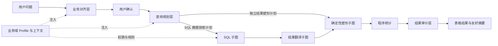

# 查询智能体应用编排

> **文档目的**
>
> 本文档定义查询会话、六子图流水线、用户交互、进度事件和终态结果的应用编排边界。

## 1. 组件职责

| 组件 | 职责 |
| --- | --- |
| `AgentQueryManager` | 创建进程内会话、限制并发、启动工作线程、复用业务域表结构缓存并管理应用退出 |
| `AgentQuerySession` | 原子维护状态、SSE 事件历史、友好轨迹、订阅者、待回答交互和最终结果 |
| `AgentQueryPipeline` | 顺序编排业务对齐、查询规划、SQL 查询、结果翻译、确定性塑形和结果审计 |
| `app/services/agent_queries.py` | 将内部会话、友好轨迹与表格结果转换为安全 HTTP 响应 |
| `app/router/agent_query.py` | 声明创建、状态、SSE、回答、轨迹、结果和取消协议 |

模型 SDK 和同步 LangGraph 工作流在专用线程池内运行，不占用 FastAPI 事件循环。线程池上限与活动会话上限使用同一配置，等待用户回答的会话也计入容量。

当前已注册两个查询业务域：`sports`（运动数据）和 `rewards`（积分与奖品数据）。两者共享上述会话和六个处理子图，但分别注入独立的表白名单、业务上下文、实体匹配规则和查询计划校验器。HTTP 创建查询时通过 `domain_key` 选择业务域，省略时默认使用 `sports`。

---

## 1.1 查询智能体分层设计与边界

查询智能体采用“通用编排层 + 业务域资源 + 独立子图”的结构。各层只负责自己的事实转换，不把数据库实现细节提前泄漏到业务对齐，也不让模型承担可以由程序确定性完成的工作。

| 层级 | 主要职责 | 读取的上下文 | 产出 | 不负责的内容 |
| --- | --- | --- | --- | --- |
| 会话与编排层 | 管理查询生命周期、用户交互、阶段切换、事件和终态 | 业务域 Profile、各子图结果 | 会话状态、SSE 事件、轨迹和最终结果 | 业务语义判断、SQL 拼接 |
| 业务对齐层 | 将用户表达转换为标准业务需求，处理词汇映射、集合量词、输出要求和关键歧义 | `table-overview.txt`、`business-vocabulary.txt`、核心规则 | 自然语言需求、结构化逻辑与布局要求，或放弃理由 | 表选择、字段选择、表关系、SQL、数据库查询 |
| 用户确认层 | 让操作员确认对齐后的业务需求 | 对齐结果 | 确认继续或取消 | 修改数据库、重新解释字段 |
| 查询规划层 | 确定查询主体、SQL 原始行粒度、集合量词、表集合、筛选、聚合、返回列及最终布局 | `table-context/*.txt`、核心规则、实体候选、`get_table_schema` 结果 | 相互独立的 SQL 数据获取计划和结果塑形计划，或放弃理由 | 执行 SQL、编造数据 |
| SQL 子图 | 只根据 SQL 数据获取计划生成、静态校验并执行单条只读 SQL | SQL 数据获取计划、真实表结构、表白名单 | 使用稳定结果列别名的 SQL 原始结果或明确错误 | 读取塑形计划、修改数据、翻译状态值 |
| 结果翻译子图 | 根据字段 `comment` 识别并翻译可追溯的状态、类型或布尔值 | SQL、相关表结构、前五行样本、字段注释 | 字段翻译映射 | 自行推断未定义枚举、改变行数或查询口径 |
| 结果塑形子图 | 按独立计划执行透传、分组和动态转列 | 翻译后完整结果、结果塑形计划 | 最终列定义和完整结果行 | 新增筛选、聚合、业务计算或调用模型 |
| 程序统计层 | 计算最终结果行数、类别分布和数值极值 | 塑形后的完整结果 | 前端表格和统计事实 | 让模型重新统计完整结果 |
| 结果审计层 | 判断结果是否回答原问题，并生成简洁解释和摘要 | 原问题、对齐需求、查询计划、程序统计、前五行样本 | 相关性说明、表粒度说明、结果摘要 | 改写 SQL、重新查询、对完整结果做未授权推断 |

### 上下文边界

- `business-alignment/table-overview.txt` 只描述业务对象、用途和数据特性，不包含表关系。
- `table-context/*.txt` 面向查询规划，包含 `ROW_GRAIN`、`QUERY_INVARIANTS` 和 `RELATIONSHIPS`。其中 `RELATIONSHIPS` 用于帮助规划层选择关联路径，但不能替代真实字段结构。
- `get_table_schema` 返回真实字段、类型、外键和数据库注释；只有在规划需要字段级事实时才读取。
- 业务域 Profile 负责表白名单、资源顺序、业务规则和校验器；通用引擎不硬编码运动或积分奖品语义。

### 数据流与失败边界

1. 业务对齐失败或用户取消时，不进入规划和数据库查询。
2. 规划层无法确认必要事实时，可以询问用户或通过放弃工具结束，不应生成猜测性的 SQL。
3. SQL 静态校验或可修复数据库执行错误以原工具失败结果反馈给 SQL 模型，并只在 SQL 生成预算内重试；连接、权限和超时错误不触发盲目改写。
4. 翻译失败时保留原始值继续；塑形契约失败时终止，不能用错误行粒度生成表格；审计失败仍保留已塑形表格。
5. 任一层都不得越过自己的边界修改业务数据；查询智能体整体只执行只读操作。

---

## 2. 查询阶段

### 2.1 业务对齐

对齐层只读取无表关系概述、业务词汇表和核心规则，不接触字段结构。它把用户表达改写为标准业务需求，同时提取 `all`、`any`、`none`、`exactly`、`at_least`、`at_most` 等集合约束、实际采用的核心规则标识、明确返回内容、完整或受限结果范围及表格布局；无法唯一理解时通过交互出口询问用户，超出业务范围时可携带明确理由正常停止。

运动业务域中，“运动记录”“运动凭证”和“打卡记录”默认对齐为用户逐条提交的运动凭证明细。“有效打卡记录”“审核通过的运动凭证”等表达中的修饰语仍是查询条件，对齐时不得因同义词归一而丢失。

用户要求查看凭证关联图片时，对齐结果只保留“查看图片”的业务意图和每条凭证的唯一标识，不得改写为返回图片内容或图片地址；实际图片由后续图片查看流程根据凭证标识获取。

运动业务域会在对齐终止工具提交后再次校验这一交付要求；如果对齐结果遗漏凭证唯一标识，工作流会把明确的修复信息作为原工具结果反馈给模型，不会让不完整需求进入查询规划阶段。

### 2.2 用户确认

对齐成功后必须暂停并展示改写结果。只有“确认并继续”等肯定回答才进入规划；其他回答按用户取消处理，不再调用后续模型和数据库。

### 2.3 查询规划

规划层按需读取白名单表结构，必要时用单表候选检索确认用户提到的实际实体值。规划结果分为两份：`query_plan` 是 SQL 数据获取计划，明确原始行粒度、表、别名、关联、普通筛选、量化条件、稳定结果列、分组、聚合、`HAVING`、排序和 `limit`；`result_shape_plan` 是翻译后本地程序使用的透传或动态转列计划。两份计划由规划终止工具同时提交，但分开消费。

对齐层确认的每个集合量词都必须在 `query_plan.quantified_conditions` 中落实，每个 `applied_business_rules` 标识也必须在 `implemented_business_rules` 中通过 `plan_references` 指向实际承载规则的筛选、关联、量化或聚合组件，不能维护第二份伪 SQL。每条量词计划分别声明成员正向条件 `predicate`、成员集合范围 `collection_filters` 和相关子查询的内外层主体关联 `correlation_condition`。规划使用 `HAVING`、`EXISTS`、`NOT EXISTS`、子查询或 CTE 表达“全部、任一、没有、数量”等集合语义，不能把“全部完成”退化为单行普通筛选。`all` 或 `none` 的成员谓词不得同时作为普通 `filters` 提前删除反例；动态转列需要保留成员行时，这两类量词统一使用可由 SQL 层校验的 `NOT EXISTS` 资格判断。完整导出要求强制 `pagination.limit = null`。塑形计划引用的字段必须全部由 `query_plan.select_fields[].result_field` 返回；`pivot` 必须额外返回最终行主体的真实 ID 作为分组键，不能仅按可能重复的名称合并。用户没有明确要求该 ID 时，它只存在于 `hidden_fields`，不会污染最终表格；用户明确要求 ID 时才可作为可见透传列。依赖不闭合或布局不一致会作为原规划工具失败结果反馈模型。

运动业务域把“项目进度达到 100%”统一规划为 `season_user_project.completion_progress >= 1`，同时要求 `correlation_condition` 直接通过 `season_user_project.season_user_id = season_user.id` 关联当前参与记录，并要求 `collection_filters` 只包含 `season_user_project.status = 1`。赛季范围等外层条件不能混入成员集合范围。`all` 的 `NOT EXISTS` 子查询据此只在当前用户的有效锁定项目中排除 `< 1` 的反例。规划层若把反例误写为成员谓词、遗漏或污染集合范围、错误关联其他赛季，或使用不稳定的等号口径，会在进入 SQL 前收到精确修复反馈。

运动业务域不向查询结果暴露 `proof_record.image_url` 内部存储路径。用户要求查看或返回运动凭证图片时，查询计划必须返回 `proof_record.id`，前端再使用[图片安全中转 API](../api/image.md) 按凭证主键读取图片。该规则由业务域终止计划校验器强制执行：违规字段会作为原工具调用的可重试失败结果返回模型，在有限修复次数内重新生成计划。

图片标识是对用户原有返回内容的附加要求，不能替代用户已经要求的凭证明细；如果用户明确只要求凭证标识，则允许只返回标识。

规划层必须先明确查询主体和结果行粒度。若主体是逐条运动凭证明细，凭证标识只能作为辅助定位字段；若主体明确是凭证标识，才允许生成仅返回标识的计划。

`proof_record.id` 是为前端图片中转保留的技术字段，表头固定显示为“凭证记录 ID”，不展示图片接口、内部路径等实现提示。

### 2.4 SQL 查询

SQL 子图按“生成、校验、执行”三步运行，只接收 `query_plan` 和真实表结构，不接收 `result_shape_plan`。每个 SELECT 输出必须按规划声明的 `result_field` 显式设置稳定别名。SQL 成功后才进入翻译层；SQL 失败不会调用翻译、塑形或审计子图。

SQL 子图在校验通过后同时保留两种等价形态：数据库执行形态将命名占位符编译为 asyncmy 使用的 `%s`；来源分析形态保留 `:parameter_name`，供后续 SQLGlot 重新解析字段与来源表。翻译层不得将 `%s` 执行 SQL 作为 AST 分析输入。

SQL 静态校验还会验证同一个 `EXISTS` 或 `NOT EXISTS` 是否同时包含规划要求的成员条件或反条件、全部集合范围，以及跨越子查询作用域的主体关联。仅在两个内层表之间建立同字段关联不能冒充外层主体关联。数值比较按十进制等值归一化，规划别名和 SQL 别名均还原到真实表名，避免 `1.0000` 与 `1.0`、不同合法别名造成误判。WHERE、HAVING、JOIN 和嵌套量词子查询中的筛选字面量必须参数化；错误反馈会指出具体谓词和值，并在有限生成预算内交给同一 SQL 工具调用修复。

### 2.5 结果翻译

翻译子图按“识别翻译字段、按字段生成注释映射、程序应用映射”三步运行。识别节点只接收 SQL、无注释表结构和前 `5` 行样本；规则节点为每个字段建立独立上下文，只读取该字段的数据库 `comment`，并以受控并发调用相同固定提示词。模型只生成映射，程序再对完整结果逐行应用；注释未定义的值保持原样。

翻译成功后，翻译行只作为展示、统计和审计的数据源，不覆盖 SQL 子图保留的原始行。翻译模型、工具协议或结构读取失败时，Pipeline 发布降级事件并继续使用原始值，因此已经成功的只读查询不会因展示增强失败而丢失。

### 2.6 结果塑形

状态翻译完成后，`ResultShapingSubgraph` 按 `result_shape_plan` 确定性运行，不调用模型。`passthrough` 按计划列顺序保留结果；`pivot` 先按主体真实 ID 等稳定字段分组，再按指定字段排序，将同类对象依次写入带稳定机器键和中文标题的动态列。仅供分组、排序的字段可标记为隐藏列。

塑形层不会重新筛选、聚合或计算业务结论。同组透传字段值冲突、引用列不存在、动态列数量超过已声明上限等契约错误会使查询失败，避免把不完整或错位数据展示给操作员。

### 2.7 结果整理与审计

本地程序根据塑形后的完整结果构造表格、计算行数、低基数字段分布和业务数值极值；审计模型只判断该表能否回答用户问题，并解释表格粒度和已有统计。

审计模型失败不会丢弃已经成功读取并整理的表格，终态仍可返回数据，并明确说明结果解释暂时不可用。

---

## 3. 会话状态与交互

| 状态 | 含义 | 是否终态 |
| --- | --- | --- |
| `running` | 后台正在处理 | 否 |
| `waiting_for_confirmation` | 等待确认对齐需求 | 否 |
| `waiting_for_clarification` | 等待补充业务事实 | 否 |
| `completed` | 查询与结果整理完成 | 是 |
| `abandoned` | 用户拒绝继续或智能体基于明确原因正常放弃 | 是 |
| `failed` | 模型、校验、数据库或内部处理失败 | 是 |
| `cancelled` | 用户取消或应用关闭 | 是 |

一个会话同一时刻最多存在一个待回答交互。回答必须携带当前 `interaction_id`，空回答、错误 ID 和重复回答均被拒绝；合法回答会唤醒原工作线程并继续原模型上下文。

取消操作对终态会话幂等。活动会话取消时立即唤醒可能等待交互的线程；如果模型外部调用尚未返回，返回后会观察取消状态且不会覆盖终态结果。

---

## 4. 事件发布规则

每个业务事件由会话补齐递增 `sequence`、`query_id` 和上海时区时间。关键阶段、结构准备、实体核对、用户交互和终态都会发布事件；心跳使用 SSE 注释帧，不占业务序号。

每个 SSE 订阅者拥有独立队列，不会互相消费事件。新订阅先按序号补发内存历史，再接收实时事件；进入终态后发送完剩余事件并关闭流。

会话同时维护一份独立友好轨迹：它从安全进度事件提取面向操作员的阶段说明，并额外记录原始问题和每次用户回答。结果审计成功时，最终 `result` 阶段和 `query_completed` 事件写入同一份受约束 `result_summary`，因此 SSE 与轨迹均能以结果摘要收尾。前端可先读取缓存查询标识列表，再按单个 `query_id` 拉取状态、轨迹或表格；列表不传输历史正文。轨迹不保存模型隐藏推理、SQL、表结构、工具参数或原始异常；表格由独立 `result` 接口读取，轨迹由独立 `trace` 接口读取。

事件文案必须面向操作员，不能直接拼接模型原文、SQL、表结构和原始异常。内部诊断只在显式注入追踪出口时记录，正式 API 默认关闭。查询进入终态前还会裁剪原始模型响应、SQL、表结构和候选轨迹，会话只保留轨迹、结果接口实际需要的对齐需求、表格、统计与审计结论。

---

## 5. 一致性、并发与资源

查询功能不写业务数据库，因此没有跨业务表写事务。候选读取和最终查询分别使用独立 MySQL 只读事务，结束时回滚并关闭连接。

管理器用异步锁保护会话创建、容量检查和过期清理；会话内部用线程锁与条件变量协调模型线程和 HTTP 事件循环。达到 `AGENT_QUERY_MAX_ACTIVE_SESSIONS` 时拒绝新任务，不排队无限堆积。

SSE 补发历史和友好轨迹分别保存于独立的有界内存集合，当前均使用 `AGENT_QUERY_EVENT_HISTORY_SIZE` 作为最大条目数。终态会话在最后活动时间超过 `AGENT_QUERY_SESSION_TTL_SECONDS` 后按后续访问或新建任务时清理；届时轨迹与表格结果同时不可读取。运行中会话不会被普通过期清理；每次等待交互固定最多 `5` 分钟，超时后查询发布失败终态而非取消。

---

## 6. 失败处理

- 业务域未注册时在创建阶段拒绝，不解释为文件路径或动态模块名。
- 未配置模型密钥时不启动后台任务。
- 工具 Schema 错误、业务校验错误、SQL 静态校验错误和可修复数据库执行错误以对应工具结果反馈给模型，并只在各阶段预算内修复。
- 表结构失败不缓存，短暂数据库故障恢复后可以重新读取。
- 翻译子图失败时发布非终态降级事件并使用原始值继续；只有后续结果阶段或整个查询失败才发布终态失败事件。
- 后台未捕获异常只记录 `query_id` 和安全日志上下文，页面得到统一失败提示。
- 应用退出先取消活动查询并唤醒等待线程，再关闭查询线程池。

---

## 7. 验证方式与已知限制

本地测试覆盖会话暂停恢复、交互答案轨迹、终态事件重放、管理器后台线程、进程级结构缓存、受保护 HTTP 链路、取消边界、量词覆盖校验、双计划隔离、动态转列和 SQL 执行错误修复。外部模型与数据库在自动化测试中使用替身；受控联调可以读取开发数据库，但不得修改数据。

当前会话状态没有持久化，也没有任务重试队列。服务重启、进程崩溃和多实例切换无法恢复原任务；前端应在 `404` 或连接永久失败时提示用户重新创建查询。
