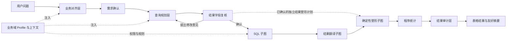

# 查询智能体应用编排

> **文档目的**
>
> 本文档定义查询会话、六子图流水线、用户交互、进度事件和终态结果的应用编排边界。

## 1. 组件职责

| 组件 | 职责 |
| --- | --- |
| `AgentQueryManager` | 创建进程内会话、限制并发、启动工作线程、复用业务域表结构缓存并管理应用退出 |
| `AgentQuerySession` | 原子维护状态、SSE 事件历史、友好轨迹、订阅者、待回答交互和最终结果 |
| `AgentQueryPipeline` | 顺序编排业务对齐、查询规划、SQL 查询、结果翻译、确定性塑形和结果审计 |
| `app/services/agent_queries.py` | 将内部会话、友好轨迹与表格结果转换为安全 HTTP 响应 |
| `app/router/agent_query.py` | 声明创建、状态、SSE、回答、轨迹、结果和取消协议 |

模型 SDK 和同步 LangGraph 工作流在专用线程池内运行，不占用 FastAPI 事件循环。线程池上限与活动会话上限使用同一配置，等待用户回答的会话也计入容量。

当前已注册两个查询业务域：`sports`（运动数据）和 `rewards`（积分与奖品数据）。两者共享上述会话和六个处理子图，但分别注入独立的表白名单、业务上下文、实体匹配规则和查询计划校验器。HTTP 创建查询时通过 `domain_key` 选择业务域，省略时默认使用 `sports`。

---

## 1.1 查询智能体分层设计与边界

查询智能体采用“通用编排层 + 业务域资源 + 独立子图”的结构。各层只负责自己的事实转换，不把数据库实现细节提前泄漏到业务对齐，也不让模型承担可以由程序确定性完成的工作。

| 层级 | 主要职责 | 读取的上下文 | 产出 | 不负责的内容 |
| --- | --- | --- | --- | --- |
| 会话与编排层 | 管理查询生命周期、用户交互、阶段切换、事件和终态 | 业务域 Profile、各子图结果 | 会话状态、SSE 事件、轨迹和最终结果 | 业务语义判断、SQL 拼接 |
| 业务对齐层 | 将用户表达转换为标准业务需求，处理词汇映射、集合量词、输出要求和关键歧义 | `table-overview.txt`、`business-vocabulary.txt`、核心规则 | 自然语言需求、结构化逻辑与布局要求，或放弃理由 | 表选择、字段选择、表关系、SQL、数据库查询 |
| 用户确认层 | 让操作员确认对齐后的业务需求，并复核规划后的最终行粒度、可见字段与返回范围 | 对齐结果或已校验双计划 | 确认继续、字段修改意见或取消 | 修改数据库、绕过计划校验 |
| 查询规划层 | 确定查询主体、分块行粒度、查询块依赖、集合量词、筛选、聚合、返回列及最终布局 | `table-context/*.txt`、核心规则、实体候选、`get_table_schema` 结果 | 相互独立的分块 SQL 数据获取计划和结果塑形计划，或放弃理由 | 执行 SQL、编造数据 |
| SQL 子图 | 只根据 SQL 数据获取计划生成、静态校验并执行单条只读 SQL | SQL 数据获取计划、真实表结构、表白名单 | 使用稳定结果列别名的 SQL 原始结果或明确错误 | 读取塑形计划、修改数据、翻译状态值 |
| 结果翻译子图 | 根据字段 `comment` 识别并翻译可追溯的状态、类型或布尔值 | SQL、相关表结构、前五行样本、字段注释 | 字段翻译映射 | 自行推断未定义枚举、改变行数或查询口径 |
| 结果塑形子图 | 按独立计划执行透传、分组和动态转列 | 翻译后完整结果、结果塑形计划 | 最终列定义和完整结果行 | 新增筛选、聚合、业务计算或调用模型 |
| 程序统计层 | 计算最终结果行数、类别分布和数值极值 | 塑形后的完整结果 | 前端表格和统计事实 | 让模型重新统计完整结果 |
| 结果审计层 | 判断结果是否回答原问题，并生成简洁解释和摘要 | 原问题、对齐需求、查询计划、程序统计、前五行样本 | 相关性说明、表粒度说明、结果摘要 | 改写 SQL、重新查询、对完整结果做未授权推断 |

### 上下文边界

- `business-alignment/table-overview.txt` 只描述业务对象、用途和数据特性，不包含表关系。
- `table-context/*.txt` 面向查询规划，包含 `ROW_GRAIN`、`QUERY_INVARIANTS` 和 `RELATIONSHIPS`。其中 `RELATIONSHIPS` 用于帮助规划层选择关联路径，但不能替代真实字段结构。
- `get_table_schema` 返回真实字段、类型、外键和数据库注释；只有在规划需要字段级事实时才读取。
- 业务域 Profile 负责表白名单、资源顺序、业务规则和校验器；通用引擎不硬编码运动或积分奖品语义。

### 数据流与失败边界

1. 业务对齐失败、需求确认取消或用户通过全局取消终止字段复核时，不进入后续数据库查询。
2. 规划层无法确认必要事实时，可以询问用户或通过放弃工具结束，不应生成猜测性的 SQL。
3. SQL 静态校验或可修复数据库执行错误以原工具失败结果反馈给 SQL 模型，并只在 SQL 生成预算内重试；没有形成唯一工具调用或输出达到长度上限时，也会以稳定协议错误反馈有限重试。连接、权限和超时错误不触发盲目改写。
4. 翻译失败时保留原始值继续；塑形契约失败时终止，不能用错误行粒度生成表格；审计失败仍保留已塑形表格。
5. 任一层都不得越过自己的边界修改业务数据；查询智能体整体只执行只读操作。

---

## 2. 查询阶段

### 2.1 业务对齐

对齐层只读取无表关系概述、业务词汇表和核心规则，不接触字段结构。它把用户表达改写为标准业务需求，同时提取 `all`、`any`、`none`、`exactly`、`at_least`、`at_most` 等集合约束、实际采用的核心规则标识、明确返回内容、完整或受限结果范围及表格布局；无法唯一理解时通过交互出口询问用户，超出业务范围时可携带明确理由正常停止。

运动业务域会区分“赛季要求锁定 N 项且全部完成”和“恰好完成 N 项”。前者把 `N` 记录为赛季要求数量的业务约束，集合逻辑只保留一条 `all`；后者才生成 `exactly(count=N)`。如果正式参与、完全完成和 `exactly` 锁定项目数量被重复提交，领域校验会把准确删除项和应保留的 `all` 约束反馈给对齐模型修复，避免后续计划同时维护等价数量口径。

运动业务域中，“运动记录”“运动凭证”和“打卡记录”默认对齐为用户逐条提交的运动凭证明细。“有效打卡记录”“审核通过的运动凭证”等表达中的修饰语仍是查询条件，对齐时不得因同义词归一而丢失。

核心玩法还区分大模型初审意见和管理员终审意见：两者独立保留，终审不得覆盖初审结论。用户指定审核阶段时，对齐层必须保留该阶段；查询跨越多个审核阶段的审核说明时，规划层分别返回初审与终审意见。减重等阶段型挑战不再假定用户基础资料含有身高，BMI 或其他派生指标的基线应从月初凭证信息及其初审意见理解。

用户要求查看凭证关联图片时，对齐结果只保留“查看图片”的业务意图和每条凭证的唯一标识，不得改写为返回图片内容或图片地址；实际图片由后续图片查看流程根据凭证标识获取。

运动业务域会在对齐终止工具提交后再次校验这一交付要求；如果对齐结果遗漏凭证唯一标识，工作流会把明确的修复信息作为原工具结果反馈给模型，不会让不完整需求进入查询规划阶段。

### 2.2 用户确认

对齐成功后必须暂停并展示改写结果。只有“确认并继续”等肯定回答才进入规划；其他回答按用户取消处理，不再调用后续模型和数据库。

### 2.3 查询规划

规划层按需读取白名单表结构，必要时用单表候选检索确认用户提到的实际实体值。规划结果分为两份：`query_plan` 是由 `query_blocks` 组成的 SQL 数据获取计划，`root_block_id` 指向最终结果块；`result_shape_plan` 是翻译后本地程序使用的透传或动态转列计划。每个查询块独立声明行粒度 `row_granularity`、粒度键 `grain_fields`、本块读取的真实表 `source_tables`、前置块 `input_blocks` 和外层 FROM 起点 `base_source`。`joins` 按 SQL 顺序显式声明右侧数据源、`inner/left` 保留语义、相对当前左侧行的关联基数、右侧稳定键和完整 ON；`deduplication` 唯一决定该块是否使用普通 `SELECT DISTINCT`。筛选、量词、分组、聚合、`HAVING`、输出字段和排序也只在所属块生效。两份计划由规划终止工具同时提交，但分开消费。

对齐层确认的每个集合量词都必须落实到某个查询块。量词通过 `subject_key` 声明被筛选主体键，数量型量词还通过单一 `member_key` 声明去重计数的集合成员键；`predicate`、`collection_filters` 和相关子查询的 `correlation_condition` 分别表示成员条件、集合范围和内外层关联。`all/any/none` 还通过 `collection_base_source` 和有序 `collection_joins` 唯一声明相关子查询内部的 FROM、JOIN 类型与完整 ON，成员条件只能引用该内部关系，关联条件必须同时引用内外层。`any`、`all/none`、数量型量词分别唯一派生 `EXISTS`、`NOT EXISTS` 和条件去重计数 `HAVING`，规划不再接收可与量词冲突的实现提示。数量型量词的 `subject_key`、`grain_fields` 和 `group_by` 必须完全一致，且不得再声明重复的自由 `having`。`require_non_empty` 显式决定 all/none 是否要求集合非空。每个 `applied_business_rules` 和面向人的 `business_caliber` 都必须通过带块作用域的 `plan_references` 定位实际组件，例如 `query_blocks[qualified_users].filters[0]`，不能维护第二份伪 SQL。`assumptions` 固定为空；影响结果的不确定事实必须先询问用户。

当资格判断粒度与最终明细粒度不一致时，规划必须先建立 `qualification` 或 `aggregation` 块，在主体粒度输出合格主体键，再由根 `result` 块读取该前置块并返回明细。禁止在同一块按主体分组或执行 `HAVING`，同时选择下级明细字段；分组块的输出只能是分组键或已声明聚合表达式。备注字段只描述业务含义，不能修复这种结构冲突。完整导出要求 `pagination.limit = null`。塑形计划只能引用根块 `select_fields[].result_field`；`pivot` 必须使用最终行主体真实 ID 作为稳定分组键，用户未要求的技术 ID 放入 `hidden_fields`。

运动业务域把“项目进度达到 100%”统一规划为 `season_user_project.completion_progress >= 1`，并要求 `collection_filters` 只包含 `season_user_project.status = 1`。全部完成固定使用 `NOT EXISTS` 排除进度小于完成边界的有效锁定项目；承载该资格的查询块不得同时使用 `GROUP BY`、聚合或 `HAVING`。如果最终输出还需要汇总，应由读取资格块的后续查询块单独聚合。

相关子查询必须把成员侧 `season_user_project.season_user_id` 关联到当前参与主体：主体直接来自真实表时使用 `season_user.id`；主体来自前置查询块时，可以使用该块显式输出且能沿查询块字段血缘追溯到 `season_user.id` 的 `season_user_id`。正式参与和全部项目完成同属 `season_user` 粒度时应优先由一个资格块共同处理，不得为满足固定表达式而复制真实表、重复资格条件或留下根块不可达的悬空块。`season_user_project` 只在量词内部作为成员集合读取，不能同时出现在该资格块的外层 `joins` 或 `filters`，否则会把一名用户展开成多行并迫使 SQL 发明计划外别名。赛季范围等外层条件不能混入成员集合范围。规划层若把反例误写为成员谓词、遗漏或污染集合范围、错误关联其他赛季，或使用不稳定的等号口径，会在进入 SQL 前收到精确修复反馈。

运动业务域不向查询结果暴露 `proof_record.image_url` 内部存储路径。只要根查询块的一行代表一条运动凭证，即粒度键可追溯到 `proof_record.id`，查询计划无论用户是否明确提到图片都必须返回该主键，并固定使用稳定结果键 `proof_record_id`、表头“凭证记录 ID”。普通透传表格必须保持该列可见，前端可据此定位唯一凭证，并使用[图片安全中转 API](../api/image.md) 按需读取图片。该规则由业务域终止计划校验器强制执行：缺少主键、结果键错误、表头错误或把主键隐藏时，违规项会作为原工具调用的可重试失败结果返回模型，并在规划总生成次数与总工具调用次数预算内重新生成计划。

图片标识是对用户原有返回内容的附加要求，不能替代用户已经要求的凭证明细；如果用户明确只要求凭证标识，则允许只返回标识。

规划层必须先明确查询主体和结果行粒度。若主体是逐条运动凭证明细，凭证标识只能作为辅助定位字段；若主体明确是凭证标识，才允许生成仅返回标识的计划。

`proof_record.id` 是逐条凭证结果的稳定身份字段，不只是图片需求的临时附加项。其结果键固定为 `proof_record_id`，表头固定显示为“凭证记录 ID”，不展示图片接口、内部路径等实现提示。

### 2.4 规划结果复核

规划终止工具的参数通过 Pydantic Schema、通用双计划契约和业务域规则校验后，工作流不会立即进入 SQL 层，而是暂停并向操作员展示以下信息：

- 塑形后每一行代表的业务对象；
- 最终可见表头，不展示仅供分组或排序的隐藏字段；
- 动态转列的字段标题模式；
- 完整返回或计划行数上限。

字段复核采用两个连续交互。第一步是不可自由输入的 `confirmation`，只提供“确认并继续”和“修正查询”：确认后进入 SQL 子图，选择修正则立即进入第二步。第二步是无快捷选项的 `clarification`，允许操作员填写“增加用户名”“删除用户 ID”“把当前积分改为积分余额”等具体意见。页面仍可通过全局取消接口终止任一等待状态。

第二步收集的自由文本意见会作为原 `execute_natural_language_query` 工具调用的 `revision_requested` 结果写回同一模型消息上下文。规划模型保留此前读取的表结构、实体确认、业务规则和查询口径，只修订受反馈影响的数据获取计划与塑形计划；修订后的计划必须重新通过全部校验，并再次回到第一步让操作员确认。该过程受原规划生成次数和工具调用次数共同限制，不会重新运行业务对齐层。

对齐层确认普通逐行表格时，规划层不得擅自改成 `pivot`。根查询块的每个 `result_field` 还必须被塑形计划消费：普通表格全部列入 `passthrough_fields`；动态转列则必须明确列入透传、分组、隐藏、动态值或排序字段。任何 SQL 已返回但塑形计划未引用的字段都会在用户复核前被拒绝，避免运动日期、凭证备注或审核说明在展示层静默消失。

### 2.5 SQL 查询

SQL 子图按“生成、校验、执行”三步运行，只接收 `query_plan` 和真实表结构，不接收 `result_shape_plan`。每个非根查询块必须生成一个与 `block_id` 同名的 CTE，根查询块对应最外层 SELECT；每块输出必须按本块 `select_fields` 顺序显式设置 `result_field`，后续块只能引用前置块已输出的字段。SQL 成功后才进入翻译层；SQL 失败不会调用翻译、塑形或审计子图。

SQL 子图在校验通过后同时保留两种等价形态：数据库执行形态将命名占位符编译为 asyncmy 使用的 `%s`；来源分析形态保留 `:parameter_name`，供后续 SQLGlot 重新解析字段与来源表。翻译层不得将 `%s` 执行 SQL 作为 AST 分析输入。

SQL 静态校验还会验证同一个 `EXISTS` 或 `NOT EXISTS` 是否使用 `SELECT 1`、计划指定的内部 FROM 和有序 JOIN，并同时包含规划要求的成员条件或反条件、全部集合范围，以及跨越子查询作用域的主体关联。仅在两个内层表之间建立同字段关联不能冒充外层主体关联；内部错误 ON、集合运算、`GROUP BY`、`HAVING`、排序或分页也不能进入量词子查询。数量型量词必须精确生成 `COUNT(DISTINCT CASE WHEN <集合范围 AND 成员条件> THEN <成员键> END)`，比较符和数量也必须与 `exactly/at_least/at_most` 一致，错误的计数键、`>=`/等号互换或额外冲突 `HAVING` 都会被拒绝。数值比较按十进制等值归一化。WHERE、HAVING、JOIN 和嵌套量词子查询中的筛选字面量必须参数化；错误反馈会指出具体谓词和值，并在有限生成预算内交给同一 SQL 工具调用修复。

SQL AST 校验会逐块核对 CTE 集合、真实表、前置块、输出表达式、`GROUP BY`、`WHERE` 和 `HAVING`。关系形状则按声明顺序精确核对：FROM 必须为 `base_source`，每个 JOIN 必须使用对应 `right_source`、`join_type` 和完整 ON，不能换成逗号关联、改变保留侧、把 ON 移入 WHERE 或增加未声明谓词；普通 `SELECT DISTINCT` 也必须与 `deduplication.mode` 双向一致。角色别名会逐项核对别名到真实来源表的映射，不能只保留别名文字却交换来源。每个 CTE 必须是一条独立 SELECT，非根块不能分页；查询块只允许协议已表达的 SELECT 子句，因此 `UNION`、`QUALIFY`、分组汇总修饰、非默认空值排序和表分区等改变结果范围的结构都会被拒绝。条件即使在整条 SQL 中出现，只要位于错误查询块或错误子句也会被拒绝；SQL 也不能增加无关 CTE 或省略计划块。错误会以原 `submit_sql_query` 的 `tool_call_id` 写入同一消息上下文，模型在剩余预算内修复，只有重新通过全部静态校验的 SQL 才会执行。

### 2.6 结果翻译

翻译子图按“识别翻译字段、按字段生成注释映射、程序应用映射”三步运行。识别节点只接收 SQL、无注释表结构和前 `5` 行样本；规则节点为每个字段建立独立上下文，只读取该字段的数据库 `comment`，并以受控并发调用相同固定提示词。模型只生成映射，程序再对完整结果逐行应用；注释未定义的值保持原样。

翻译成功后，翻译行只作为展示、统计和审计的数据源，不覆盖 SQL 子图保留的原始行。翻译模型、工具协议或结构读取失败时，Pipeline 发布降级事件并继续使用原始值，因此已经成功的只读查询不会因展示增强失败而丢失。

### 2.7 结果塑形

状态翻译完成后，`ResultShapingSubgraph` 按 `result_shape_plan` 确定性运行，不调用模型。`passthrough` 按计划列顺序保留结果；`pivot` 先按主体真实 ID 等稳定字段分组，再按指定字段排序，将同类对象依次写入带稳定机器键和中文标题的动态列。仅供分组、排序的字段可标记为隐藏列。

塑形层不会重新筛选、聚合或计算业务结论。同组透传字段值冲突、引用列不存在、动态列数量超过已声明上限等契约错误会使查询失败，避免把不完整或错位数据展示给操作员。

### 2.8 结果整理与审计

本地程序根据塑形后的完整结果构造表格、计算行数、低基数字段分布和业务数值极值；审计模型只判断该表能否回答用户问题，并解释表格粒度和已有统计。

审计模型失败不会丢弃已经成功读取并整理的表格，终态仍可返回数据，并明确说明结果解释暂时不可用。

---

## 3. 会话状态与交互

| 状态 | 含义 | 是否终态 |
| --- | --- | --- |
| `running` | 后台正在处理 | 否 |
| `waiting_for_confirmation` | 等待确认对齐需求 | 否 |
| `waiting_for_clarification` | 等待补充业务事实，或等待复核结果字段并提交修改意见 | 否 |
| `completed` | 查询与结果整理完成 | 是 |
| `abandoned` | 用户拒绝继续或智能体基于明确原因正常放弃 | 是 |
| `failed` | 模型、校验、数据库或内部处理失败 | 是 |
| `cancelled` | 用户取消或应用关闭 | 是 |

一个会话同一时刻最多存在一个待回答交互。回答必须携带当前 `interaction_id`，空回答、错误 ID 和重复回答均被拒绝；合法回答会唤醒原工作线程并继续原模型上下文。

取消操作对终态会话幂等。活动会话取消时立即唤醒可能等待交互的线程；如果模型外部调用尚未返回，返回后会观察取消状态且不会覆盖终态结果。

---

## 4. 事件发布规则

每个业务事件由会话补齐递增 `sequence`、`query_id` 和上海时区时间。关键阶段、结构准备、实体核对、用户交互和终态都会发布事件；心跳使用 SSE 注释帧，不占业务序号。

每个 SSE 订阅者拥有独立队列，不会互相消费事件。新订阅先按序号补发内存历史，再接收实时事件；进入终态后发送完剩余事件并关闭流。

会话同时维护一份独立友好轨迹：它从安全进度事件提取面向操作员的阶段说明，并额外记录原始问题和每次用户回答。结果审计成功时，最终 `result` 阶段和 `query_completed` 事件写入同一份受约束 `result_summary`，因此 SSE 与轨迹均能以结果摘要收尾。前端可先读取缓存查询标识列表，再按单个 `query_id` 拉取状态、轨迹或表格；列表不传输历史正文。轨迹不保存模型隐藏推理、SQL、表结构、工具参数或原始异常；表格由独立 `result` 接口读取，轨迹由独立 `trace` 接口读取。

事件文案必须面向操作员，不能直接拼接模型原文、SQL、表结构和原始异常。内部诊断只在显式注入追踪出口时记录，正式 API 默认关闭。查询进入终态前还会裁剪原始模型响应、SQL、表结构和候选轨迹；成功会话只保留结果接口实际需要的对齐需求、表格、统计与审计结论，SQL 失败会话另外保留稳定错误码、重试归属和生成次数，供结果接口定位失败类别。

---

## 5. 一致性、并发与资源

查询功能不写业务数据库，因此没有跨业务表写事务。候选读取和最终查询分别使用独立 MySQL 只读事务，结束时回滚并关闭连接。

管理器用异步锁保护会话创建、容量检查和过期清理；会话内部用线程锁与条件变量协调模型线程和 HTTP 事件循环。达到 `AGENT_QUERY_MAX_ACTIVE_SESSIONS` 时拒绝新任务，不排队无限堆积。

SSE 补发历史和友好轨迹分别保存于独立的有界内存集合，当前均使用 `AGENT_QUERY_EVENT_HISTORY_SIZE` 作为最大条目数。终态会话在最后活动时间超过 `AGENT_QUERY_SESSION_TTL_SECONDS` 后按后续访问或新建任务时清理；届时轨迹与表格结果同时不可读取。运行中会话不会被普通过期清理；每次等待交互固定最多 `5` 分钟，超时后查询发布失败终态而非取消。

---

## 6. 失败处理

- 业务域未注册时在创建阶段拒绝，不解释为文件路径或动态模块名。
- 未配置模型密钥时不启动后台任务。
- 工具 Schema 错误、业务校验错误、SQL 静态校验错误、可修复数据库执行错误和 SQL 工具协议错误以对应失败上下文反馈给模型，并只在各阶段预算内修复；用户对结果字段的意见也以正常工具结果写回，但不计作校验错误。
- 表结构失败不缓存，短暂数据库故障恢复后可以重新读取。
- 翻译子图失败时发布非终态降级事件并使用原始值继续；只有后续结果阶段或整个查询失败才发布终态失败事件。
- 后台未捕获异常只记录 `query_id` 和安全日志上下文，页面得到统一失败提示。
- 应用退出先取消活动查询并唤醒等待线程，再关闭查询线程池。

---

## 7. 验证方式与已知限制

本地测试覆盖会话暂停恢复、交互答案轨迹、规划字段复核与同上下文修订、终态事件重放、管理器后台线程、进程级结构缓存、受保护 HTTP 链路、取消边界、量词覆盖校验、双计划隔离、动态转列和 SQL 执行错误修复。外部模型与数据库在自动化测试中使用替身；受控联调可以读取开发数据库，但不得修改数据。

当前会话状态没有持久化，也没有任务重试队列。服务重启、进程崩溃和多实例切换无法恢复原任务；前端应在 `404` 或连接永久失败时提示用户重新创建查询。
