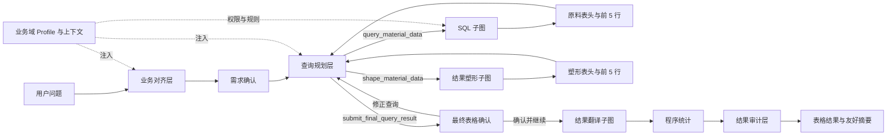

# 查询智能体应用编排

> **文档目的**
>
> 本文档定义查询会话、Planning 内部查询与塑形闭环、用户交互、进度事件和终态结果的应用编排边界。

## 1. 组件职责

| 组件 | 职责 |
| --- | --- |
| `AgentQueryManager` | 创建进程内会话、限制并发、启动异步流水线任务、复用业务域表结构缓存并管理应用退出 |
| `AgentQuerySession` | 原子维护状态、SSE 事件历史、友好轨迹、订阅者、待回答交互和最终结果 |
| `AgentQueryPipeline` | 编排业务对齐、交互式查询规划、用户消息格式化、字段翻译和结果审计；SQL 与塑形由 Planning 内部工具调用 |
| `app/services/agent_queries.py` | 将内部会话、友好轨迹与表格结果转换为安全 HTTP 响应 |
| `app/router/agent_query.py` | 声明创建、状态、SSE、回答、轨迹、结果和取消协议 |

业务对齐层、查询规划层、规划内部的单表候选检索、SQL 子图、原料塑形子图、用户消息格式化子图、结果翻译子图和结果审计子图都使用 `AsyncOpenAI` 与 LangGraph `ainvoke` 直接异步等待模型或数据库响应；查询管理器直接等待异步 `AgentQueryPipeline.run`。Planning 通过 `query_material_data` 和 `shape_material_data` 调用 SQL 与塑形子图，只把结果 ID、完整行数、表头和前 `5` 行预览返回规划模型；完整结果行保存在本轮后台缓存。塑形子图只让模型编译布局计划，完整结果的分组与转列仍由本地程序确定性执行。等待用户回答的会话仍计入活动会话容量。

当前已注册两个查询业务域：`sports`（运动数据）和 `rewards`（积分与奖品数据）。两者共享上述会话和处理子图，但分别注入独立的表白名单、业务上下文、实体匹配规则和查询计划校验器。HTTP 创建查询时通过 `domain_key` 选择业务域，省略时默认使用 `sports`。

Text-to-SQL 实现统一收口于 `app/agent/text2sql/`。七个子图分别位于 `subgraphs/alignment`、`planning`、`sql`、`shaping`、`message_formatting`、`translation` 和 `audit`；其中 Planning 组合 SQL 与塑形能力，Pipeline 消费 Planning 选中的最终结果后直接进入翻译。用户消息格式化子图只在交互问题和终态文案写入现有前端字段前运行；会话、SSE、交互等待和任务生命周期位于该包的运行时模块，与各子图的模型和算法实现保持边界。

---

## 1.1 查询智能体分层设计与边界

查询智能体采用“通用编排层 + 业务域资源 + 独立子图”的结构。各层只负责自己的事实转换，不把数据库实现细节提前泄漏到业务对齐，也不让模型承担可以由程序确定性完成的工作。

| 层级 | 主要职责 | 读取的上下文 | 产出 | 不负责的内容 |
| --- | --- | --- | --- | --- |
| 会话与编排层 | 管理查询生命周期、用户交互、阶段切换、事件和终态 | 业务域 Profile、各子图结果 | 会话状态、SSE 事件、轨迹和最终结果 | 业务语义判断、SQL 拼接 |
| 业务对齐层 | 将用户表达转换为标准业务需求，处理词汇映射、集合量词、输出要求和关键歧义 | `table-overview.txt`、`business-vocabulary.txt`、核心规则 | 对齐依据与完整自然语言需求，或放弃理由 | 表选择、字段选择、表关系、SQL、数据库查询 |
| 用户确认层 | 让操作员确认或修正业务对齐后的完整查询需求，并复核 Planning 选中的最终表格字段 | 对齐结果，或最终行数与表头 | 确认继续或修正查询；全局取消由独立接口处理 | 修改数据库、绕过计划校验 |
| 查询规划层 | 迭代查询原料、观察受限结果、执行塑形并选择最终结果 | `table-context/*.txt`、核心规则、实体候选、表结构、查询与塑形工具观察 | 最终选中的 SQL 原始结果、塑形结果及来源信息，或放弃理由 | 生成 SQL、直接读取完整缓存、编造字段与数据 |
| SQL 子图 | 将原料查询计划转换为参数化 SQL，静态校验并只读执行 | 二字段 `MaterialSqlQueryPlan`、真实表结构、表白名单 | 使用稳定结果列别名的纵向原料或明确错误 | 读取塑形指导、最终动态转列、修改数据、翻译状态值 |
| 结果塑形子图 | 把 Planning 提供的自然语言塑形指导编译为受约束布局，并对完整 SQL 原始结果执行透传、分组或动态转列 | 塑形指导、SQL 输出列、前五行样本和后台完整原始结果 | 带来源元数据的最终列定义和完整结果行 | 读取 SQL、增加筛选、聚合资格、业务计算或改写原始值 |
| 用户消息格式化子图 | 通过换行、空格和缩进整理用户可见的模型文案 | 一条将写入 `question` 或 `message` 的原始字符串 | 仍使用原字段返回的易读字符串 | 增删文字、调整标点、改写选项或业务事实 |
| 结果翻译子图 | 根据字段 `comment` 识别并翻译塑形后仍可追溯的状态、类型或布尔值 | 最终列、SQL 列来源映射、相关表结构、前五行样本、字段注释 | 字段翻译映射和翻译后完整结果 | 自行推断未定义枚举、改变行数或查询口径 |
| 程序统计层 | 计算最终结果行数、类别分布和数值极值 | 塑形后的完整结果 | 前端表格和统计事实 | 让模型重新统计完整结果 |
| 结果审计层 | 判断结果是否回答原问题，并生成简洁解释和摘要 | 原问题、对齐需求、查询计划、程序统计、前五行样本 | 相关性说明、表粒度说明、结果摘要 | 改写 SQL、重新查询、对完整结果做未授权推断 |

### 上下文边界

- `business-alignment/table-overview.txt` 只描述业务对象、用途和数据特性，不包含表关系。
- `table-context/*.txt` 面向查询规划，包含 `ROW_GRAIN`、`QUERY_INVARIANTS` 和 `RELATIONSHIPS`。其中 `RELATIONSHIPS` 用于帮助规划层选择关联路径，但不能替代真实字段结构。
- `get_table_schema` 返回真实字段、类型、外键和数据库注释；只有在规划需要字段级事实时才读取。
- 业务域 Profile 负责表白名单、资源顺序、业务规则和校验器；通用引擎不硬编码运动或积分奖品语义。

### 数据流与失败边界

1. 业务对齐失败或用户通过全局取消终止任务时，不进入或继续后续数据库查询；需求确认中的修正会返回原对齐上下文继续处理。
2. 规划层无法确认必要事实时，可以询问用户或通过放弃工具结束，不应生成猜测性的 SQL。
3. SQL 子图先在内部预算内修复可修复错误；`query_material_data` 最终失败时向 Planning 返回友好原因和修正方向，不产生 `material_result_id`。连接、权限和超时错误不触发盲目改写。
4. 塑形失败时不产生 `shaped_result_id`，Planning 根据反馈修正塑形指导或重新查询原料；只有通过 `submit_final_query_result` 选中的成功结果才能进入翻译。
5. 翻译失败时保留塑形后的原始值继续；审计失败仍保留已整理表格。
6. 任一层都不得越过自己的边界修改业务数据；查询智能体整体只执行只读操作。

SQL 或塑形工具的单轮失败仍属于 Planning 内部可恢复过程。服务端通过 `progress_updated` 和 `running` 告知前端正在自动修正，不得发布 `stage_completed` 与 `failure` 造成查询已经终止的假象。只有查询管理器确认重试耗尽、发生不可恢复异常或交互超时后，才发布 `query_failed` 终态事件。

---

## 2. 查询阶段

### 2.1 业务对齐

对齐层只读取无表关系概述、业务词汇表和核心规则，不接触字段结构。它把用户表达改写为一段完整、可独立理解的标准业务需求，并在自然语言中保留集合与数量口径、返回内容、结果范围和展示布局；无法唯一理解时通过交互出口询问用户，超出业务范围时可携带明确理由正常停止。

对齐子图使用标准 OpenAI 兼容异步客户端和 LangGraph 异步入口。模型请求、图执行及用户澄清回调均为可等待操作；正式会话现有的条件变量交互通过线程桥接，避免等待用户回答时占用事件循环。对齐层的公开 `run` 是异步接口，调用方必须使用 `await`。

对齐层系统提示词按“唯一任务、工作边界、决策流程、工具选择、对齐结果要求、硬性校验规则、业务域专属规则、业务知识”的固定顺序组装。决策流程与工具选择使用流程图和状态表突出当前动作。成功终止工具 `submit_aligned_query` 只接收 `reason` 和 `aligned_question`：前者保存简短、可核验的对齐依据，后者必须脱离依据后仍完整表达查询主体、条件、集合口径、返回内容、展示方式和结果范围。工具不再要求模型同步维护词汇映射、规则标识、结构化量词、布局和分页等嵌套字段。业务域 Profile 注入的专属规则位于通用约束之后、表概述与词汇等知识输入之前，不与通用工具协议混写。

运动业务域的专属规则再按“凭证图片意图、查询主体、完成数量语义”分成三个小节，每项规则使用单一语义的 bullet 表达。后续扩展该领域时应增加新的语义小节或分点，不应恢复为连续长段落。

对齐层 Prompt 还声明了通用 `system_guidance` 运行时指导协议。该消息由系统以 `user` 角色发送，是为兼容只允许首条 `system` 消息的模型模板；其 `guidance` 只指导当前动作，不属于用户业务事实、查询条件或澄清结果，也不得进入对齐交付。共享层的 `build_system_guidance_message()` 对指导文本做非空与长度校验，再统一渲染为固定 `context_type` 的 `user` 角色 YAML；调用节点只负责提供具体指导文本。

对齐层首次使用 `think` 时，可以在 `350` 个字符内完整梳理已确认概念、关键歧义、待确认内容和当前倾向的下一步，不要求压缩成单一词汇判断或立即形成最终结论；获得新信息、收到用户回答，或不同解释确实会改变下一步动作时，允许继续思考。每次思考仍应推进当前判断，避免重复已有结论和与当前决策无关的展开。

对齐节点对连续成功的 `think` 调用计数：第一次是必要的首轮判断，不触发指导；第二次连续 `think` 成功后，向紧邻的下一次模型请求追加一条温和的 `system_guidance`。该指导先要求模型判断是否仍存在新的决策信息：存在时可以聚焦该问题继续判断，不存在时再询问用户、提交对齐或说明原因结束，而不是直接认定思考已经完成。该指导只对紧邻一轮可见，响应返回后即从后续上下文移除；任一已注册的非 `think` 工具动作都会重置连续计数。工具协议、参数或业务校验错误仍使用原有精确失败结果，不由系统指导替代。

运动业务域会区分“赛季要求锁定 N 项且全部完成”和“恰好完成 N 项”。前者在对齐后的自然语言中同时说明赛季要求锁定 N 项，以及用户全部完成其有效锁定项目；只有用户明确要求恰好完成 N 项时，才采用后一种表述，避免把赛季配置数量误写成用户完成数量。

运动业务域中，“运动记录”“运动凭证”和“打卡记录”默认对齐为用户逐条提交的运动凭证明细。“有效打卡记录”“审核通过的运动凭证”等表达中的修饰语仍是查询条件，对齐时不得因同义词归一而丢失。

核心玩法还区分大模型初审意见和管理员终审意见：两者独立保留，终审不得覆盖初审结论。用户指定审核阶段时，对齐层必须保留该阶段；查询跨越多个审核阶段的审核说明时，规划层分别返回初审与终审意见。减重等阶段型挑战不再假定用户基础资料含有身高，BMI 或其他派生指标的基线应从月初凭证信息及其初审意见理解。

用户要求查看凭证关联图片时，对齐结果只保留“查看图片”的业务意图和每条凭证的唯一标识，不得改写为返回图片内容或图片地址；实际图片由后续图片查看流程根据凭证标识获取。

运动业务域会在对齐终止工具提交后再次校验这一交付要求；如果对齐结果遗漏凭证唯一标识，工作流会把明确的修复信息作为原工具结果反馈给模型，不会让不完整需求进入查询规划阶段。

### 2.2 用户确认

对齐模型提交结果后必须暂停并展示改写内容，选项固定为“确认并继续”和“修正需求”。确认后进入 Planning；选择修正时，系统紧接着发起自由文本澄清，收集具体修改意见，并把上一版对齐结果和用户修正作为原 `submit_aligned_query` 的工具反馈写回同一模型上下文。模型可以继续思考或澄清，再提交修正版并重新请求确认；修正不等同于取消，也不会提前访问数据库。全局取消仍通过独立查询取消接口完成。Planning 的最终表格复核仍使用“修正查询”，两组选项不能混用。

Planning 调用 `submit_final_query_result` 后，还会展示最终结果行数和表头并请求复核，但不向操作员暴露内部结果 ID、SQL 或工具参数。选择“确认并继续”后 Planning 才成功结束并进入翻译；选择“修正查询”时系统继续收集修改意见，模型根据意见重新查询或塑形；全局取消则以用户取消结束。

### 2.3 查询规划

规划层按需读取白名单表结构，必要时用单表候选检索确认用户提到的实际实体值。它不生成 SQL 查询块、JOIN AST 或结构化塑形对象，而是依次使用三个核心工具：

- `query_material_data`：提交 `guidance` 和 `required_tables`，调用 SQL 子图读取完整原料；
- `shape_material_data`：引用成功的 `material_result_id` 并提交塑形指导，对后台完整原料执行布局；
- `submit_final_query_result`：引用成功的 `shaped_result_id`，选择一份已验证结果结束 Planning。

规划层系统提示词按“唯一任务、工作边界、完整工作循环、工具选择、查询要求、原料观察、塑形要求、塑形观察、最终选择、硬性校验、业务知识”的固定顺序组织。任务规则位于稳定前缀，核心玩法和按依赖顺序排列的表概述作为 YAML 知识区置于末尾；旧 `planning_prompt_instructions` 中依赖结构化查询块的规则不会注入当前 Prompt。

数据库筛选、集合资格和统计口径必须全部写入 `guidance`，不能推迟给塑形或前端。塑形指导只能改变已经查询到的数据布局；其使用的展示值、稳定主体标识、排序值和动态列值必须已经由原料查询返回。没有读取真实表结构时只描述业务原料，不猜测字段原名。

规划层和单表候选子节点使用标准 Pydantic Function Calling Schema、`tool_choice=auto` 与本地状态机校验，不依赖供应商 strict 扩展。规划首个有效调用必须是唯一的 `think`；后续存在会改变动作的新判断点时允许连续调用 `think`，但每轮必须推进判断，不能重复已有结论。`think`、`ask_user`、两个数据处理工具和两个终止工具都必须单独调用，互不依赖的事实读取允许同轮并行。查询成功后必须先观察，不能在同一轮塑形；塑形成功后也必须先观察，不能在同一轮提交最终结果。

规划节点会统计连续成功的 `think` 调用。连续达到两次后，系统通过共享 `system_guidance` 协议向紧邻的下一次模型请求临时追加温和提示，要求模型先判断是否仍有新的决策信息：有则聚焦新问题继续思考，没有则读取事实、询问用户、查询原料、塑形、提交结果或说明无法继续的原因。指导消息由系统以 `user` 角色发送，不属于用户业务事实；请求完成后立即从后续上下文移除。任一协议合法的非 `think` 工具动作都会重置连续计数。

未调用工具、调用顺序或组合错误、未知工具和参数 Schema 错误都作为带精确修复动作的普通失败结果返回模型。一次并行事实读取中只要存在非法参数，整组都不执行，避免形成半成功上下文；模型修正后，旧的无效调用和错误反馈从后续上下文移除。启用 `trace` 时，统一模型消息队列仍保留错误发生时的请求和响应，因此无需业务分支额外记录错误轨迹。

`required_tables` 不得重复或越过业务域白名单。查询指导显式写出真实 `table.field` 时，SQL 子图会先用真实结构确认该字段存在，再要求最终 SQL 实际引用它。集合资格与最终明细粒度不同的查询，应在 `guidance` 中明确“先确定合格主体，再重新关联明细”，并把重新关联所需的最窄作用域稳定标识列为必取原料。逐条凭证结果仍应保留 `proof_record.id` 供前端定位图片，但不返回内部 `image_url`。

### 2.4 结果观察、缓存与最终选择

`query_material_data` 成功后，后台为完整 SQL 结果分配本轮唯一的 `material_result_id`。规划模型只观察以下信息：

- `material_result_id`；
- 完整原料结果行数；
- SQL 实际返回的真实表头；
- 前 `5` 行 Markdown 表格预览。

`shape_material_data` 只能引用本轮成功的原料 ID。成功后，后台为完整塑形结果分配 `shaped_result_id` 并保留其来源原料 ID；规划模型只观察两个结果 ID、完整塑形结果行数、塑形后的真实表头和前 `5` 行预览，不接收完整结果行。工具明确返回的行数可以判断空结果和结果规模；前 `5` 行不能替代完整结果，也不能用于推断未展示内容、类别分布或极值。

两个数据处理工具失败时不产生结果 ID。失败原因和修正方向作为有效工具观察返回；Planning 保留上一轮正确内容，只修正有问题的查询指导、所需表、结果引用或塑形指导，禁止原样重试。查询失败后不能塑形；塑形失败且原料完整时可以复用同一个原料 ID，原料缺失时必须重新查询。

只有 `submit_final_query_result` 和 `abandon_query_planning` 可以发起 Planning 终止。前者必须引用本轮真实存在且已经观察过的 `shaped_result_id`，并通过操作员最终表格复核后才形成成功终态；修正意见会作为该工具的正常结果返回模型继续迭代。成功终态只交付最终选中的 SQL 原始结果、塑形结果、来源 ID、查询与塑形指导及选择理由；未选候选不会进入 Pipeline，完整结果也不会写入模型上下文、SSE 或友好轨迹。

### 2.5 SQL 查询

SQL 子图按“生成、校验、执行”三步运行，由 Planning 的 `query_material_data` 调用，只接收二字段 `MaterialSqlQueryPlan` 及对应真实结构。该输入由工具参数的 `guidance` 和 `required_tables` 组成，类型本身禁止额外字段；塑形指导不进入 SQL 子图或模型上下文。Planning 必须提前把 SQL 所需的展示值、稳定标识、成员值和排序值列入 `guidance`。

SQL 子图在校验通过后同时保留两种等价形态：数据库执行形态将命名占位符编译为 asyncmy 使用的 `%s`；来源分析形态保留 `:parameter_name`，供后续 SQLGlot 重新解析字段与来源表。翻译层不得将 `%s` 执行 SQL 作为 AST 分析输入。

SQL 生成使用标准 Pydantic Function Calling Schema、`tool_choice=auto` 和唯一 `submit_sql_query` 协议。模型没有形成工具调用、调用多个或错误工具、输出被截断、参数 Schema 不合法、静态校验失败和可修复数据库错误，都会作为原工具调用的分类失败结果进入有限重试。未形成 `tool_call_id` 时会再次附加全局工具标签模板。工具协议或参数修正成功后立即清除旧协议错误；静态 SQL 错误只有在新草稿通过完整 AST 校验后才清除；数据库执行错误则保留到新的有效草稿进入执行。错误上下文清理不删除内部原始响应和诊断轨迹。

SQL 子图的模型生成和只读数据库执行均为异步路径。表结构已经由规划层提供时直接复用；缺失结构通过线程桥接现有进程级缓存读取器，避免在事件循环内调用同步包装。数据库查询直接使用 `asyncmy` 的只读事务和硬超时，不再通过 `asyncio.run` 建立嵌套事件循环。

SQL 静态校验使用 SQLGlot 验证单条只读语句、基础表集合、通配符、危险函数、字段真实性、显式计划字段覆盖、筛选值参数化、命名参数集合、顶层分页和唯一结果列。它不再恢复旧 `query_blocks` 的 CTE/JOIN AST，因此模型可以按实际复杂度选择 JOIN、相关子查询、聚合或 CTE；业务正确性主要由已确认的 `guidance`、显式字段闭合检查和后续结果审计共同保障。

SQL 成功后，完整结果只进入本轮 Planning 后台缓存；SQL 失败不会进入塑形、翻译或审计，而是先作为 `query_material_data` 失败观察返回 Planning。

### 2.6 结果塑形

Planning 调用 `shape_material_data` 后，工具根据 `material_result_id` 从本轮后台缓存取得完整 SQL 原始结果。`MaterialResultShapingSubgraph` 只接收塑形指导、SQL 输出列和原始结果。节点 1 仅向塑形模型提供指导、准确结果列和前 `5` 行样本，并要求通过 `submit_material_shape_plan` 提交 `passthrough` 或 `pivot` 计划；模型看不到 SQL、表结构、查询条件和完整结果。

节点 2 由本地程序对完整原始结果确定性执行布局。`passthrough` 逐行复制已声明可见列；`pivot` 按稳定主体键分组、按指定原料列稳定排序，再把成员原始值写入动态列。只用于分组和排序的技术字段自然隐藏。每个最终列同时记录其来源 SQL 结果列，供后续翻译追溯真实 `table.field`。

工具使用标准非 strict Pydantic Function Calling Schema、`tool_choice=auto` 和全局 tool-tag 模板。缺失调用、多调用、错误工具名、参数错误和不存在的结果列会得到分类反馈并允许一次修复。塑形模型不能提交筛选器、表达式、聚合或计算列；同组透传值冲突、动态列键冲突或实际成员超过明确列数时，子图失败且不返回部分表格。

塑形成功后的完整结果继续保存在 Planning 后台缓存，直到规划模型通过 `submit_final_query_result` 选择其中一份。失败不会产生可选结果 ID，也不会返回部分表格。

### 2.7 结果翻译

Planning 成功提交最终塑形结果后，主 Pipeline 不再执行 SQL 或塑形，而是直接进入翻译子图。翻译按“识别翻译字段、按字段生成注释映射、程序应用映射”三步运行。塑形列携带来源 SQL 别名，翻译层将其与最终选中 SQL 的直接字段血缘组合，因此普通列更名和动态列仍可追溯到真实 `table.field`。识别节点只接收列来源、无注释表结构和前 `5` 行最终样本；规则节点为每个字段建立独立上下文，只读取该字段的数据库 `comment`，并以受控并发调用相同固定提示词。模型只生成映射，程序再对完整塑形结果逐行应用；注释未定义的值保持原样。

两个模型节点都使用标准 Pydantic Function Calling Schema 和 `tool_choice=auto`，由 Prompt 要求唯一工具调用，再由程序校验缺少调用、多调用、错误工具名、输出截断、参数结构、字段血缘和注释映射。协议或参数失败会以带稳定错误码和唯一修复动作的普通结果进入一次有限修复；没有 `tool_call_id` 时同时附加全局工具标签模板。修复上下文仅存在于当前目标或当前字段的独立调用中，节点结束后不会进入其他字段或下游节点。部分 vLLM 工具解析器二次编码的嵌套对象和数组，会在首次 Pydantic 校验失败后递归还原并重新完整校验。

翻译子图使用标准模型地址和异步 SDK。字段规则通过异步信号量按 `AGENT_QUERY_TRANSLATION_MAX_PARALLEL_FIELDS` 控制并发；每个字段使用相同系统提示、通用 tool-tag 语法和工具 Schema 作为稳定前缀，动态 YAML 只包含当前字段事实。tool-tag 不包含具体工具或业务参数，真实调用完全依据当轮 Function Calling Schema；模型未形成 `tool_calls` 时会在纠错反馈中再次收到同一模板。缺失表结构通过线程桥接进程级缓存读取器，Pipeline 直接 `await` 翻译子图。

翻译成功后，翻译行只作为展示、统计和审计的数据源，不覆盖 SQL 子图保留的原始行，也不覆盖塑形子图保留的原始布局结果。翻译模型、工具协议或结构读取失败时，Pipeline 发布降级事件并继续使用塑形后的原始值，因此已经成功读取并整理的数据不会因展示增强失败而丢失。

### 2.8 结果整理与审计

本地程序根据塑形后的完整结果构造表格、计算行数、低基数字段分布和业务数值极值；审计模型只判断该表能否回答用户问题，并解释表格粒度和已有统计。

审计提示词与动态上下文构造统一位于 `subgraphs/audit/prompt/`，按角色、输出协议、事实边界、字段要求、表达要求和输入字段分层组织。`node.py` 只负责确定性统计、模型调用、工具协议校验和有限修复，不再反向承载或导出 Prompt 内容。

审计模型使用标准 Pydantic Function Calling Schema、`tool_choice=auto` 和通用 tool-tag 语法。程序要求唯一 `submit_query_result_audit` 调用；普通文本、多工具、错误工具、输出截断和参数 Schema 错误都会得到精确反馈并允许一次局部修复。参数错误通过原 `tool_call_id` 返回，缺少工具调用时再次提供不含具体工具的全局标签模板；临时模型请求失败也只重试一次。审计公开入口为异步接口，Pipeline 直接等待，不再占用工作线程。

审计模型失败不会丢弃已经成功读取并整理的表格，终态仍可返回数据，并明确说明结果解释暂时不可用。

### 2.9 用户消息格式化

业务对齐澄清、需求复核、Planning 澄清、最终表格复核、主动放弃原因和结果摘要在进入交互会话或终态事件前，统一经过用户消息格式化子图。固定且简短的阶段进度不调用该子图，避免增加无意义的模型请求。

格式化模型只允许调整 Unicode 空白字符。程序在采用结果前移除原文与结果中的全部空白并逐字符比较；文字、数字、标点或顺序发生任何变化时，都会把精确失败原因返回模型进行一次修复。连续缺少工具调用、参数错误、内容越界、供应商异常或修复后仍不合法时直接回退原文，因此展示增强不会阻断查询、改变选项值或修改业务语义。

格式化结果继续写入既有 `question`、SSE `message`、轨迹 `message` 和结果 `result_summary`，不增加 HTTP 字段。模型调用使用全局供应商、`tool_choice=auto`、非 strict Pydantic Function Calling 和关闭思考参数，并进入查询级模型消息轨迹队列。前端只需按纯文本保留空白排版，不解析 Markdown 或 HTML。

---

## 3. 会话状态与交互

| 状态 | 含义 | 是否终态 |
| --- | --- | --- |
| `running` | 后台正在处理 | 否 |
| `waiting_for_confirmation` | 等待确认对齐需求 | 否 |
| `waiting_for_clarification` | 对齐或规划过程中等待补充无法由规则和数据库事实消除的业务歧义 | 否 |
| `completed` | 查询与结果整理完成 | 是 |
| `abandoned` | 用户拒绝继续或智能体基于明确原因正常放弃 | 是 |
| `failed` | 模型、校验、数据库或内部处理失败 | 是 |
| `cancelled` | 用户取消或应用关闭 | 是 |

一个会话同一时刻最多存在一个待回答交互。回答必须携带当前 `interaction_id`，空回答、错误 ID 和重复回答均被拒绝；合法回答会唤醒当前交互等待并继续原模型上下文。

取消操作对终态会话幂等。活动会话取消时立即唤醒可能等待交互的线程；如果模型外部调用尚未返回，返回后会观察取消状态且不会覆盖终态结果。

---

## 4. 事件发布规则

每个业务事件由会话补齐递增 `sequence`、`query_id` 和上海时区时间。关键阶段、结构准备、实体核对、用户交互和终态都会发布事件；心跳使用 SSE 注释帧，不占业务序号。

每个 SSE 订阅者拥有独立队列，不会互相消费事件。新订阅先按序号补发内存历史，再接收实时事件；进入终态后发送完剩余事件并关闭流。

会话同时维护一份独立友好轨迹：它从安全进度事件提取面向操作员的阶段说明，并额外记录原始问题和每次用户回答。结果审计成功时，最终 `result` 阶段和 `query_completed` 事件写入同一份受约束 `result_summary`，因此 SSE 与轨迹均能以结果摘要收尾。前端可先读取缓存查询标识列表，再按单个 `query_id` 拉取状态、轨迹或表格；列表不传输历史正文。轨迹不保存模型隐藏推理、SQL、表结构、工具参数或原始异常；表格由独立 `result` 接口读取，轨迹由独立 `trace` 接口读取。生产排障使用的模型消息队列与该 HTTP 友好轨迹相互独立，不会进入会话缓存、SSE 或任何前端响应。

事件文案必须面向操作员，不能直接拼接模型原文、SQL、表结构和原始异常。内部诊断只在显式注入追踪出口时记录，正式 API 默认关闭。查询进入终态前还会裁剪原始模型响应、SQL、表结构和候选轨迹；成功会话只保留结果接口实际需要的对齐需求、表格、统计与审计结论，SQL 失败会话另外保留稳定错误码、重试归属和生成次数，供结果接口定位失败类别。

---

## 5. 一致性、并发与资源

查询功能不写业务数据库，因此没有跨业务表写事务。候选读取和最终查询分别使用独立 MySQL 只读事务，结束时回滚并关闭连接。

管理器用异步锁保护会话创建、容量检查和过期清理；会话内部用线程锁与条件变量协调异步流水线、线程桥接的交互等待和 HTTP 请求。达到 `AGENT_QUERY_MAX_ACTIVE_SESSIONS` 时拒绝新任务，不排队无限堆积。

SSE 补发历史和友好轨迹分别保存于独立的有界内存集合，当前均使用 `AGENT_QUERY_EVENT_HISTORY_SIZE` 作为最大条目数。终态会话在最后活动时间超过 `AGENT_QUERY_SESSION_TTL_SECONDS` 后按后续访问或新建任务时清理；届时轨迹与表格结果同时不可读取。运行中会话不会被普通过期清理；每次等待交互固定最多 `5` 分钟，超时后查询发布失败终态而非取消。

---

## 6. 失败处理

- 业务域未注册时在创建阶段拒绝，不解释为文件路径或动态模块名。
- 未配置模型密钥时不启动后台任务。
- 工具 Schema 错误、业务校验错误、SQL 静态校验错误、可修复数据库执行错误和工具协议错误以对应失败上下文反馈给模型，并只在各阶段预算内修复。`query_material_data` 或 `shape_material_data` 最终失败时向 Planning 返回友好原因和修正方向，不产生结果 ID。
- 表结构失败不缓存，短暂数据库故障恢复后可以重新读取。
- 翻译子图失败时发布非终态降级事件并使用原始值继续；只有后续结果阶段或整个查询失败才发布终态失败事件。
- 后台未捕获异常只记录 `query_id` 和安全日志上下文，页面得到统一失败提示。
- 应用退出会取消活动会话及其异步任务，并唤醒仍在线程桥接中等待回答的交互。

---

## 7. 验证方式与已知限制

本地测试覆盖异步对齐调用、会话暂停恢复、交互答案轨迹、Planning 查询—观察—塑形—观察闭环、成功结果 ID 与失败无 ID、最终结果选择、终态事件重放、管理器异步任务、进程级结构缓存、受保护 HTTP 链路、取消边界、量词口径、动态转列、SQL 执行错误修复，以及 Pipeline 从 Planning 直接进入翻译。外部模型与数据库在自动化测试中使用替身；受控联调可以读取开发数据库，但不得修改数据。

当前会话状态没有持久化，也没有任务重试队列。服务重启、进程崩溃和多实例切换无法恢复原任务；前端应在 `404` 或连接永久失败时提示用户重新创建查询。
