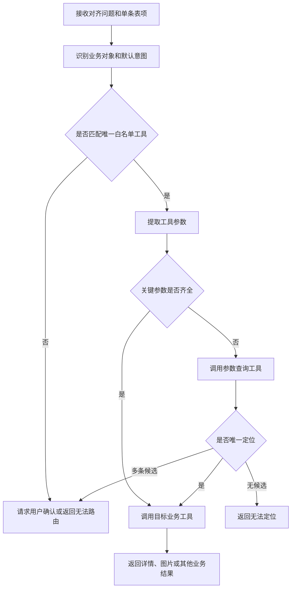

# 查询结果表项意图路由设计

> **设计状态**
>
> 本文记录查询结果表项二次访问的设计草案，当前尚未实现，不构成已经开放的 HTTP 接口契约。后续实现应在本文基础上补充正式 API、工具注册和测试说明。

## 1. 设计目标

查询智能体仍按当前方式自然返回对齐后的问题、表头和结果行，不为可能发生的后续操作强制增加数据库主键或图片地址。操作员选择一条结果后，前端把**对齐后的问题和该条表项**提交给新的意图路由；路由自行判断该表项对应的业务对象和默认详情能力。

该设计以低耦合为目标：原查询链不感知具体详情接口，前端不需要理解业务表和接口参数，后端也不保存第一轮完整查询结果供二次请求使用。

---

## 2. 输入边界

意图路由只接收以下业务上下文：

| 输入 | 作用 |
| --- | --- |
| `aligned_question` | 说明原查询已经对齐的业务范围、对象和口径 |
| `selected_row` | 提供操作员选中的单条结果及可用于参数提取的线索 |

前端不需要提交 `action`。选择哪个业务接口属于意图路由的职责；如果未来存在能够明确表达意图的前驱节点，可以直接把其判断交给路由，但不把该信息设为基础请求的必填条件。

示例输入如下。示例名称和数据仅用于说明结构：

```json
{
  "aligned_question": "查询示例用户在当前赛季终审拒绝的运动记录",
  "selected_row": {
    "project_name": "示例项目",
    "proof_date": "2026-08-15",
    "review_comment": "凭证内容不完整"
  }
}
```

该请求不携带第一轮模型轨迹、SQL、表结构或完整结果集合。输入字段数量、单字段长度和请求体大小应在正式接口设计时设置上限。

---

## 3. 核心处理流程

意图路由熟悉当前业务域注册的详情接口或工具，并按以下顺序处理：

1. 根据 `aligned_question` 判断原结果属于用户、运动凭证、项目进度、赛季参与或其他业务对象。
2. 结合 `selected_row` 的字段和值选择唯一的白名单业务接口或工具。
3. 从两个输入中提取该工具需要的参数。
4. 参数齐全时直接调用目标工具。
5. 缺少关键参数时，调用对应的参数查询工具补齐参数，再调用目标工具。
6. 参数查询存在多个候选时请求用户确认；没有候选时返回无法定位的业务结果。



缺少数据库主键不会直接判定失败。例如运动凭证表项没有凭证 ID 时，参数查询工具可以使用原问题中的用户和赛季，以及表项中的项目、运动日期、审核状态等线索定位凭证。只有查询结果唯一时，才能把补查得到的主键传给详情工具。

---

## 4. 工具注册约定

意图路由只能选择后端显式注册的白名单工具，不能根据模型文本动态拼接 URL 或调用任意接口。每个可路由工具至少应声明：

| 声明内容 | 说明 |
| --- | --- |
| 业务意图 | 该工具能够回答的详情需求 |
| 适用业务对象 | 用户、运动凭证、项目进度等 |
| 必需参数 | 调用目标接口必须提供的稳定参数 |
| 参数查询方式 | 缺少必需参数时允许使用的受控查询工具 |
| 返回类型 | JSON 详情、图片响应或其他受控结果 |
| 权限要求 | 调用前必须执行的管理端权限与资源访问校验 |

新增已有数据范围内的路由表达时，可以调整业务域提示词或工具描述。新增真正的业务能力时，仍需先实现对应接口或工具、注册参数 Schema，并补充权限和失败处理，不能只通过提示词虚构不存在的能力。

---

## 5. 参数补查规则

参数补查只用于获得目标业务工具缺失的关键参数，不负责重新回答第一轮完整查询。补查过程必须满足以下约束：

- 优先使用明确主键；没有主键时才组合使用名称、赛季、日期、项目和状态等业务线索。
- 客户端提交的字段和值只作为查询线索，不能作为已经验证的数据库事实。
- 查询必须受业务域表白名单、只读权限、超时和结果数量限制保护。
- 唯一命中后才能自动继续；多个候选必须交互确认，禁止任意选择第一条。
- 补查仍无法得到目标工具的必需参数时，应明确停止，不得伪造默认值。

第一轮结果自然包含主键时，路由可以直接使用并由目标工具再次验证资源是否存在；第一轮结果不包含主键时，仅增加一次受控补查，不要求修改原查询规划和 SQL 结果契约。

---

## 6. 安全与失败边界

- 意图路由及其调用的所有工具必须沿用管理端认证和权限边界。
- 目标工具必须重新验证客户端提供或补查得到的标识，不能因为模型成功提取参数就跳过权限、存在性和状态检查。
- `aligned_question` 与 `selected_row` 均属于不可信输入，应执行 Schema、长度和类型校验，并作为数据传给模型，不能拼接为可执行代码、SQL 或 URL。
- 路由结果必须经过严格 Schema 校验；工具名和参数不合法时应返回受控错误，并在有限次数内修复。
- 同一输入能够合理映射到多个默认详情接口时，应请求用户确认，不能依赖模型置信度静默选择。
- 初期路由只承担读取详情和资源访问，不授权数据修改、审核、结算或积分发放等有副作用操作。

路由本身不维护第一轮查询结果，也不依赖查询会话仍然存在。请求失败后可以安全重试；是否为图片响应提供缓存、流式中转或短期地址，由具体目标接口决定。

---

## 7. 验证场景

正式实现至少应覆盖以下场景：

- 表项包含目标主键时直接调用正确的详情工具。
- 表项缺少主键但业务线索能够唯一定位时，补查参数后调用详情工具。
- 补查返回多条候选时暂停并请求用户确认。
- 补查无结果时返回可理解的无法定位说明。
- 对齐问题与表项指向不同业务对象时不调用错误接口。
- 未注册工具、非法工具参数和越权资源访问在调用前或目标工具内被拒绝。
- 超长表项、异常字段类型和提示注入文本不能扩大工具白名单或数据权限。

---

## 8. 当前未确定事项

以下内容留待正式实现时确定：

- 意图路由 HTTP 路径、请求与响应 Schema；
- 详情结果是否沿用 SSE，或直接使用普通 HTTP 响应；
- 意图识别、参数补查与用户确认采用单一工作流还是独立子图；
- 首批开放的业务工具清单及其默认路由优先级；
- 图片等二进制资源是由意图接口直接中转，还是返回现有受控图片接口信息。

现有查询链的行为以[查询智能体应用编排](query-agent.md)和[查询智能体 API](../api/agent-query.md)为准；图片访问的现有安全边界以[图片安全中转 API](../api/image.md)为准。
