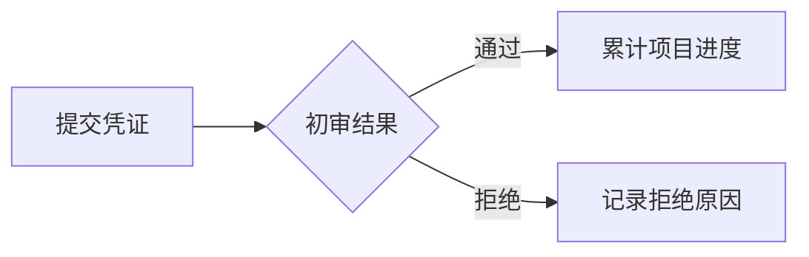

# 项目文档撰写规范

> **规范定位**
>
> 本文档规定本项目所有 Markdown 文档的结构、格式、表达和维护方式。目标不是堆叠语法，而是让读者能够**快速定位信息、准确理解规则、低成本维护内容**。

## 1. 适用范围

本规范适用于仓库内所有新增或修改的 Markdown 文档，包括但不限于：

- 项目总览与开发说明；
- 业务规则与领域设计；
- API、应用服务和基础设施文档；
- 定时任务、异步任务与运维说明；
- 数据库、测试、部署和故障排查文档；
- 目录内的 `README.md` 及其他协作文档。

修改历史文档时，至少应保证**本次新增或改动的章节**符合本规范。除非任务明确要求，不要仅为了统一格式而批量重写无关文档。

> **核心原则：结构服务于内容。**
>
> 应充分使用 Markdown 的标题、列表、强调、引用、表格、代码块、链接和图表，但不能为了显得丰富而滥用语法。读者理解内容所需的最简单结构，就是合适的结构。

---

## 2. 文档质量目标

一份合格的项目文档应同时满足以下要求：

1. **可定位**：读者通过标题和目录能够快速找到目标内容。
2. **可理解**：先交代目的与背景，再描述规则、流程和细节。
3. **可执行**：约束、步骤、输入、输出和异常都有明确表述。
4. **可追溯**：代码标识、接口、配置和关联文档能够被准确定位。
5. **可维护**：避免重复定义同一事实，修改时能明确找到唯一来源。
6. **可阅读**：段落简洁、留白充足，重点清晰，不形成大段文字墙。

---

## 3. 文档基本结构

### 3.1 标题层级

每份文档必须只有一个一级标题 `#`，用于表达文档主题。正文从二级标题 `##` 开始组织。

推荐层级如下：

```markdown
# 文档主题

## 1. 一级章节

### 1.1 二级章节

#### 1.1.1 必要的细分内容
```

必须遵守以下规则：

- 标题层级按顺序递进，禁止从 `##` 直接跳到 `####`。
- 常规文档最多使用到四级标题；需要更深层级时，应考虑拆分文档或改用列表。
- 标题应概括本节内容，避免“其他”“相关说明”“一些问题”等模糊名称。
- 同一层级标题采用一致的语法结构，例如统一使用名词短语或动宾短语。
- 较长文档可使用数字编号增强导航，但同一文档必须保持统一。
- 标题末尾通常不加句号、冒号等标点。

> **禁止**：用加粗文本模拟标题，例如 `**接口说明**`。需要形成章节时，应使用真实标题层级。

### 3.2 推荐章节顺序

不同类型的文档可以按需增减章节，但通常按照以下认知顺序组织：

1. 文档目的或功能目标；
2. 适用范围与非目标；
3. 术语、背景和前置条件；
4. 核心规则或总体设计；
5. 主要流程与状态变化；
6. 输入、输出和数据说明；
7. 异常、边界与安全要求；
8. 测试或验证方式；
9. 已知限制与关联文档。

应把读者最需要知道的结论放在前面，再展开原因和细节。不要把关键规则埋在示例或文档末尾。

### 3.3 段落与留白

文档必须保持足够的“呼吸感”：

- 标题、正文、列表、引用、表格和代码块之间保留一个空行。
- 一个段落只表达一个中心意思，建议控制在 **2～5 句**。
- 连续文字过长时，应按语义拆成小节、列表或表格。
- 不使用多个连续空行制造间距。
- 不在一行中塞入多个互不相关的规则。
- 不使用大量 `<br>`、空格或全角空格进行人工排版。

---

## 4. Markdown 语法使用规范

### 4.1 列表

无先后关系的内容使用无序列表，有明确顺序或操作步骤的内容使用有序列表。

无序列表适用于：

- 能力范围；
- 并列规则；
- 前置条件；
- 风险与限制。

有序列表适用于：

1. 执行流程；
2. 优先级；
3. 阅读顺序；
4. 必须按序完成的检查。

列表使用要求：

- 每个列表项保持同一种语法结构。
- 列表项是完整句子时，统一使用句号；仅为短语时，可以不加句号。
- 嵌套一般不超过两层，超过时应拆分为小节。
- 单个列表项包含多个段落或代码块时，应保持正确缩进和适当留白。
- 不要把只有一个项目的内容写成列表。

任务状态需要被持续更新时，可以使用任务列表：

```markdown
- [x] 完成接口定义
- [ ] 补充异常场景测试
- [ ] 更新部署说明
```

> **注意**：任务列表只用于真实的进度或验收项，不用于装饰普通列表。

### 4.2 强调与高亮

使用不同形式的强调表达不同语义：

| 写法 | 适用场景 | 示例 |
| --- | --- | --- |
| `**粗体**` | 关键结论、硬性约束、重要状态 | **禁止记录访问令牌** |
| `` `行内代码` `` | 文件名、字段名、类名、命令、配置值 | `season_user.status` |
| `*斜体*` | 轻量语气强调或术语首次引入 | *幂等* 表示重复执行结果一致 |
| `~~删除线~~` | 明确展示已废弃且需要保留痕迹的内容 | ~~旧接口 `/v1/checkin`~~ |

强调必须克制：

- 一个段落通常只强调真正影响理解的少数内容。
- 禁止整段加粗，避免所有内容都“重要”而失去重点。
- 标识符、路径、参数和值使用行内代码，不使用引号代替。
- 删除线不能替代版本管理；无保留价值的过期内容应直接删除。
- 不依赖非标准 `<mark>` 标签实现高亮，以保证不同 Markdown 渲染器下表现一致。

### 4.3 引用与提示块

引用块用于突出重要补充、风险、示例结论或背景，不用于承载大段普通正文。

项目统一使用“引用 + 粗体标签”的可移植写法：

```markdown
> **注意**
>
> 修改状态时，必须同时检查关联记录是否满足事务一致性要求。
```

常用标签及语义如下：

| 标签 | 使用场景 |
| --- | --- |
| **说明** | 补充背景或帮助理解的上下文 |
| **注意** | 容易忽略但不会直接造成严重后果的事项 |
| **警告** | 可能造成数据错误、安全问题或破坏性影响的风险 |
| **示例** | 对抽象规则的具体演示 |
| **结论** | 需要读者优先记住的最终判断 |

> **警告**
>
> 提示块不能代替正常章节。相同类型的提示连续出现时，应改写为一个独立小节或列表。

### 4.4 表格

表格适合表达字段、参数、状态、规则映射和多方案对比。

```markdown
| 状态 | 含义 | 是否允许修改 |
| --- | --- | --- |
| `pending` | 待审核 | 是 |
| `approved` | 已通过 | 否 |
```

表格使用要求：

- 每列必须有清晰表头，单元格内容应尽量简短。
- 同一列的数据格式和语义必须一致。
- 字段名、枚举值和类型使用行内代码。
- 表格前用一句话说明其目的，表格后仅补充无法放入单元格的重要规则。
- 单元格内出现长段落、多层列表或大段代码时，应改用分节说明。
- 不使用表格模拟页面布局。

### 4.5 代码块与命令

多行代码、配置、请求响应和命令必须使用围栏代码块，并标注语言：

````markdown
```python
def calculate_points() -> int:
    return 10
```

```bash
pytest tests/domain/test_points.py
```

```json
{
  "status": "approved"
}
```
````

代码块使用要求：

- 示例应聚焦当前主题，省略无关样板代码。
- 示例中的名称、类型和数据应与正文一致。
- 命令必须能够辨认执行目录；有环境前提时，应在代码块前说明。
- 命令、输出和错误信息应放在不同代码块中，并标明各自含义。
- 占位符使用清晰名称，例如 `<season_id>`，不得放入真实密钥或生产数据。
- 省略内容时使用明确注释或 `...`，不能让读者误以为示例是完整实现。

### 4.6 链接与交叉引用

文档应通过链接关联唯一事实来源，避免复制容易失效的内容。

- 仓库内文档优先使用相对路径，例如 `[赛季表说明](db/season.md)`。
- 链接文字必须描述目标内容，禁止使用“点击这里”“详情”等无语义文字。
- 引用代码文件时，应写明准确路径并使用行内代码。
- 外部链接应指向权威、稳定且与结论直接相关的来源。
- 修改文件名或目录时，必须同步检查引用它的链接。
- 同一事实在多处使用时，应确定一份主文档，其他文档通过链接引用。

示例：

```markdown
项目选择数量以 [`season.required_project_count`](db/season.md) 的定义为准。
```

> **注意**
>
> `description/db/` 是数据库表定义的只读事实来源。没有明确指令时，不得为了修复链接或统一格式而修改其中的文档。

### 4.7 图片与图表

当文字难以清楚表达流程、时序、状态变化或模块关系时，可以使用图片或 Mermaid 图表。

适合使用图表的场景包括：

- 三步以上且存在分支的业务流程；
- 多个参与方之间的调用时序；
- 状态机及状态转换条件；
- 三个以上模块的依赖关系；
- 复杂的数据实体关系。

简单线性步骤应优先使用有序列表，不必绘图。

Mermaid 示例：



图表使用要求：

- 图表前说明它要回答的问题，图表后补充无法在图中表达的关键约束。
- 节点名称使用明确的业务语言，避免只有字母或编号。
- 图表应保持单一主题；内容过多时拆成多张图。
- 图片必须填写有意义的替代文本，并使用仓库内稳定的相对路径。
- 图表不能成为业务规则的唯一载体，关键结论仍需用正文说明。

### 4.8 折叠内容与 HTML

超长日志、非核心完整示例等辅助内容，可以谨慎使用 `<details>` 折叠：

```html
<details>
<summary>查看完整响应示例</summary>

正文或代码块

</details>
```

除 `<details>` 等确有价值且渲染稳定的场景外，不应使用 HTML 完成 Markdown 已经支持的排版。禁止使用 HTML 控制字体、字号、颜色和空白。

### 4.9 分隔线

项目文档必须使用分隔线 `---` 区分二级大章节：

- 第一个二级标题 `##` 前不添加分隔线；
- 从第二个二级标题开始，必须在标题前添加一条独立的 `---`；
- 分隔线与前后内容各保留一个空行；
- 三级及更低层级标题不添加分隔线，避免文档被切分得过于零碎；
- 分隔线不能代替标题层级，也不得用于无明确章节边界的装饰。

示例：

```markdown
## 1. 功能目标

正文内容。

---

## 2. 核心规则

正文内容。
```

---

## 5. 内容表达规范

### 5.1 语言与术语

- 文档正文以简体中文为主，表达直接、准确、客观。
- 代码标识、协议字段、数据库字段、命令和无法准确翻译的技术术语保留原文。
- 同一概念只使用一个稳定名称；首次出现的专业术语应给出简短解释。
- 避免“可能”“大概”“相关处理”等无法指导实现的模糊表述。
- 区分“当前行为”“目标设计”和“建议方案”，不能把设想写成已经实现的事实。
- 使用“必须”“禁止”“应”“可以”表达不同约束强度，不随意混用。

### 5.2 标点与空格

- 中文句子使用全角中文标点。
- 中文与英文单词、阿拉伯数字之间保留一个半角空格，例如“使用 Python 3 开发”。
- 行内代码与相邻中文之间通常保留一个半角空格。
- 路径、URL、版本号和代码内容内部不添加多余空格。
- 同一列表和表格中的标点风格保持一致。

### 5.3 示例与事实

- 示例必须明确标记，不得与真实配置或生产数据混淆。
- 示例应覆盖最典型场景；边界场景可单独列出。
- 不得在示例中放入真实个人信息、访问凭证或生产环境地址。
- 数字、日期、时区、状态和单位必须写清口径。
- 尚未确认的内容应标注为“待确认”，并说明需要谁确认什么，不能直接补全为事实。

---

## 6. 不同文档类型的重点

不同层级文档除遵守本规范外，还应突出下表中的信息：

| 文档类型 | 必须重点说明的内容 |
| --- | --- |
| 项目总览 | 项目目标、边界、术语、架构、目录和文档阅读顺序 |
| API 文档 | 路径、方法、认证、请求、响应、错误码、幂等和示例 |
| 应用服务文档 | 用例流程、依赖、事务边界、失败处理和权限 |
| 领域文档 | 实体、值对象、不变量、状态流转和核心计算规则 |
| 基础设施文档 | 外部依赖、适配边界、配置、超时、重试和降级 |
| 任务文档 | 触发方式、处理范围、幂等、并发、重试和监控 |
| 数据库文档 | 表作用、字段语义、约束、索引、关系和迁移影响 |
| 故障排查文档 | 现象、影响、诊断步骤、根因、处理和验证方式 |

具体功能文档的必备内容和存放位置同时受根目录 `AGENTS.md` 约束。

### 6.1 API 文档聚合规则

API 文档必须以**单个接口为阅读单元**。同一接口的定义、请求、成功响应和异常处理必须放在同一个二级章节内，禁止按“全部接口定义”“全部成功响应”“全部异常响应”拆成彼此分离的大章节。

包含多个接口的文档应采用以下结构：

```markdown
## 2. `GET /example/items` 获取列表

### 2.1 接口定义

### 2.2 请求参数

### 2.3 成功响应

### 2.4 异常处理

---

## 3. `POST /example/items` 新增记录

### 3.1 接口定义

### 3.2 请求参数

### 3.3 成功响应

### 3.4 异常处理
```

具体要求如下：

- 接口二级标题应同时包含 HTTP 方法、路径和简短用途，便于浏览目录时直接定位。
- 请求参数、成功响应和异常处理即使内容较少，也应在所属接口章节内明确说明；确实无请求参数或业务异常时，直接写明“无”或说明边界。
- 多个接口共用的认证、缓存、事务或安全机制可以在接口章节之后集中说明，但每个接口的异常小节仍应列出该机制对当前接口产生的状态码和行为。
- 接口字段、示例和错误码只在所属接口章节维护，公共章节通过引用解释原理，不能迫使读者跨越多个章节才能拼出一份完整接口契约。

---

## 7. 文件组织与命名

- 文档必须放在职责匹配的目录中，避免所有文件堆放在 `description/` 根目录。
- 功能文档默认使用小写英文 `kebab-case` 命名，以连字符 `-` 分隔单词，例如 `season-enrollment.md`；禁止使用下划线分隔文档文件名。
- 项目级固定文档或用户明确指定的文件名按既定名称执行，例如 `document-style.md`。
- 文件名应表达稳定的业务主题，禁止使用 `new`、`latest`、`final`、`temp` 或无明确版本边界的 `v2`。
- 同一功能优先维护一份主文档；确需拆分时，应由总览文档链接各子文档。
- 不要创建无内容的目录、占位文档或仅包含标题的空文件。

---

## 8. 推荐文档模板

以下模板用于功能文档起稿。应根据功能实际情况删减不适用章节，不得保留空标题或模板提示语。

````markdown
# 功能名称

> **文档目的**
>
> 用一至两句话说明本文解决什么问题，以及目标读者是谁。

## 1. 功能目标

说明业务目标、适用范围和明确的非目标。

---

## 2. 核心规则

- **规则一**：描述可验证的业务约束。
- **规则二**：描述关键不变量或前置条件。

---

## 3. 主要流程

1. 描述触发条件。
2. 描述主要处理。
3. 描述结果和状态变化。

---

## 4. 输入与输出

| 名称 | 类型 | 必填 | 说明 |
| --- | --- | --- | --- |
| `example_id` | `int` | 是 | 示例标识 |

---

## 5. 异常与边界

> **警告**
>
> 说明最重要的失败风险或一致性要求。

- 描述无效输入的处理方式。
- 描述重复请求或并发执行的处理方式。

---

## 6. 数据与依赖

- [关联数据表](../db/example.md)
- `path/to/module.py`

---

## 7. 验证方式

```bash
<可确认存在的测试命令>
```

说明关键测试场景和预期结果。

---

## 8. 已知限制

列出当前真实存在、尚未解决且会影响使用或后续开发的限制。
````

---

## 9. 常见反例

以下写法会降低文档质量，应当避免：

- 用大段连续文字同时描述背景、流程、字段和异常。
- 标题层级跳跃，或用粗体、序号文本模拟标题。
- 每句话都加粗，或在三级及更低层级章节之间滥用提示块和分隔线。
- 为追求“高级语法”加入与内容无关的表格、图表和折叠块。
- 在多个文档中复制同一份字段定义或业务规则。
- 只记录“修改了什么”，不描述修改后的最终行为。
- 示例与真实行为不一致，或保留已经失效的命令和链接。
- 使用颜色、字体、居中等 HTML 样式依赖特定渲染器。
- 文档中出现真实密钥、用户隐私或生产数据。

---

## 10. 提交前自检清单

新增或修改文档后，必须完成以下检查：

- [ ] 文档只有一个一级标题，标题层级连续且名称清晰。
- [ ] 从第二个二级标题开始，大章节前均有独立分隔线，三级及更低标题前没有滥用分隔线。
- [ ] 开头已经说明文档目的、功能目标或适用范围。
- [ ] 关键结论位于对应章节前部，没有埋在长段落中。
- [ ] 段落、列表、表格、引用和代码块之间留有空行。
- [ ] 列表、表格和图表确实提升了信息表达效率。
- [ ] 强调语法使用克制，字段、路径和命令已使用行内代码。
- [ ] 代码块标注了语言，示例不包含敏感信息或虚构事实。
- [ ] 术语、状态、时间、数字和单位的口径明确且前后一致。
- [ ] 文档链接使用清晰名称，仓库内相对路径能够正确定位。
- [ ] 没有重复定义其他文档已经维护的唯一事实来源。
- [ ] 内容描述的是当前最终行为，而不是开发过程流水账。
- [ ] 没有未经授权修改 `description/db/` 中的文档。

> **完成标准**
>
> 文档应当让第一次接触该功能的开发者，仅通过标题浏览就能理解整体结构，并能在需要时快速找到规则、流程、接口、异常和验证方式。
