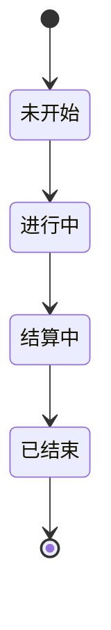

# 赛季生命周期

> **文档目的**
>
> 本文档定义 `season.status` 的四种业务状态、正常流转顺序、查询边界和历史数据迁移要求，为后续赛季管理与结算功能提供统一口径。

## 1. 状态定义

`season.status` 使用整数存储，状态含义如下：

| 状态值 | 名称 | 核心语义 | 是否属于当前赛季 |
| --- | --- | --- | --- |
| `0` | 未开始 | 赛季尚未进入正常参与阶段 | 否 |
| `1` | 进行中 | 用户可按赛季规则参与，业务进度持续产生 | 是 |
| `2` | 结算中 | 赛季已停止正常参与，正在完成终审、进度校正和积分结算 | 否 |
| `3` | 已结束 | 赛季结算工作已经完成 | 否 |

> **结论**
>
> “结算中”位于“进行中”和“已结束”之间。所有“当前赛季”查询仍只匹配 `status = 1`，不能把 `status = 2` 当作当前开放赛季。

---

## 2. 正常状态流转

正常生命周期为：



关键边界如下：

1. 赛季从 `1` 进入 `2` 后，不再属于当前赛季。
2. 待完成的终审、进度修正与积分结算在 `2` 阶段处理。
3. 只有结算工作全部完成后，赛季才进入 `3`。
4. 正向状态由定时任务推进；逆向流转、跳跃流转和管理员纠错权限仍待后续接口需求确认。

### 2.1 到期自动进入结算中

管理端后端通过[赛季状态与结算定时任务](../job/season-status-transition.md)自动执行 `1 进行中 → 2 结算中`。`end_date` 是有效期内最后一个完整自然日；上海业务日期严格晚于结束日期后的首次检查才执行流转。

任务锁定现有结算赛季和到期赛季，保证同一时间最多一个赛季进入结算。首次流转与清空临时补传资格处于同一事务，后续轮询不会重复清空。

### 2.2 结算完成后自动结束

赛季进入结算中后，任务持续执行[赛季结算规则](season-settlement.md)。只有全部正式参赛用户的 `final_points` 已写入，并且不存在有效补传资格时，任务才执行 `2 结算中 → 3 已结束`。

存在遗留待初审、待终审或开放补传资格时，赛季保持 `status = 2`。日期经过本身不能使结算赛季进入已结束。

### 2.3 创建赛季规则

新赛季创建后固定处于 `0 未开始`，并必须满足以下不变量：

- 开始日期严格晚于所有已有赛季的最大结束日期；
- 起止日期构成的闭区间不少于一个完整日历月；
- 要求项目数量为 `1～255` 的整数，且不得超过创建时 `project.status = 1` 的可见项目数量；
- 创建时在同一事务中锁定最新结束边界并再次校验，防止并发请求在同一历史边界后写入重叠赛季。
- 创建事务共享锁定当前可见项目集合，防止容量校验通过后、赛季写入前已有可见项目被并发停用。

完整日历月按日历月份而非固定天数计算。例如，`2026-08-01` 开始的赛季最早可在 `2026-08-31` 结束，`2026-08-15` 开始的赛季最早可在 `2026-09-14` 结束。

要求项目数量会作为赛季报名不变量持久化。只有用户选够该数量的项目并选择挑战等级，才属于正式参赛人员；创建接口不允许用超过当前可报名项目容量的数量生成不可完成的赛季。

---

## 3. 查询与业务边界

现有 `GET /season-statistics/current` 及项目参赛进度查询均以 `season.status = 1` 判断当前赛季。新增结算中状态不改变这些接口的请求、响应或异常协议。

后续开发应遵守以下规则：

- 当前赛季、报名、正常上传和当前排行榜等开放期能力，只能基于 `status = 1`；
- 赛季结算能力只面向 `status = 2`，并按用户行锁与条件更新保持幂等；
- `status = 3` 表示结算已完成，不能仅根据 `end_date` 自动推导；
- 状态值必须使用明确枚举或常量表达，禁止在新增业务代码中散落缺少语义的数字。

---

## 4. 历史数据迁移

旧结构使用 `status = 2` 表示“已结束”，新结构改为：

```text
2 = 结算中
3 = 已结束
```

因此迁移必须将所有历史 `status = 2` 更新为 `status = 3`。迁移脚本位于 `script/migrate-season-settling-status.sql`，执行前必须确认目标数据库、备份数据并停止赛季状态写入。

> **警告**
>
> 不能只修改字段注释而不迁移历史值，否则所有旧的已结束赛季都会被解释为结算中。

---

## 5. 数据与实现位置

- [赛季表说明](../db/season.md)
- [项目表说明](../db/project.md)
- [项目总览中的赛季与结算规则](../project.md)
- [赛季统计 API](../api/season-statistics.md)
- [赛季管理 API](../api/season.md)
- `app/services/seasons.py`
- `app/services/season_settlements.py`
- `app/repositories/seasons.py`
- `app/repositories/season_settlements.py`
- `app/repositories/season_statistics.py`
- `app/jobs/season_status.py`
- `script/migrate-season-settling-status.sql`

---

## 6. 验证方式

迁移前后应分别检查状态分布和字段注释，并确认：

- 旧 `status = 2` 记录全部变为 `status = 3`；
- 没有产生 `0`～`3` 之外的状态；
- 当前赛季查询仍只使用 `status = 1`；
- 开发库现有进行中赛季数量未发生变化。

相关回归测试命令：

```bash
python -m unittest tests.test_current_season_statistics tests.test_season_statistics_router tests.test_season_status_job tests.test_season_settlement -v
```

---

## 7. 已知限制

- 当前没有赛季状态流转接口；到期流转由后台任务自动完成。
- 当前没有补传提交与补传期限收口能力，存在开放资格时赛季会持续保持结算中。
- 结算过程使用状态、行锁、唯一键和通知事务保证幂等，但尚无独立结算执行审计表。
- 数据库目前通过字段语义约束状态范围，尚未增加 `CHECK` 约束。
