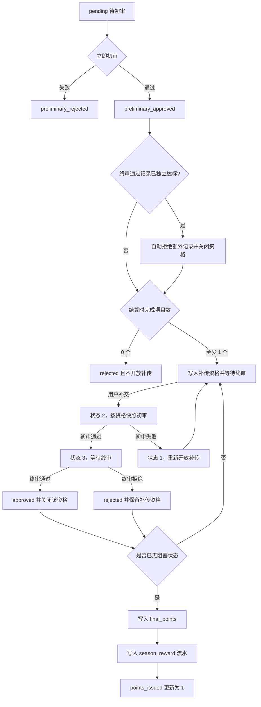

# 赛季结算规则

> **文档目的**
>
> 本文档定义赛季进入结算中后的用户分组、补传资格、最终积分和连续完成奖励口径。

## 1. 功能范围

结算仅处理满足正式参赛条件的 `season_user`：已选择挑战等级，且有效锁定项目数达到 `season.required_project_count`。普通上传在赛季进入 `status = 2` 后停止，结算流程只处理赛季截止前已经上传的凭证。

“定分”和“积分发放”是两个独立阶段：定分只写入 `season_user.final_points`；管理员随后按用户发放积分，写入 `season_reward` 流水并更新 `season_user.points_issued`。

---

## 2. 核心不变量

- 同一时间最多存在一个结算中赛季。
- 赛季截止前的正式参赛凭证只要仍为 `pending`，任何用户都不能开始定分。
- `final_points = NULL` 表示尚未定分；只有不存在待初审、待终审和有效补传资格时才能写入最终值。
- `points_issued = 0` 表示定分结果尚未计入全局积分流水；只有赛季奖励流水成功写入时才能更新为 `1`。
- 赛季必须在全部正式参赛用户完成定分和积分发放后才能进入已结束状态。
- 一条补传资格只对应一条 `proof_record`，数据库不保存凭证 ID 数组。
- 补传资格首次创建时固化初审上下文，资格重开不得被当前项目规则覆盖。
- 补传资格在终审通过前保持非零；状态 `1`、`2`、`3` 均允许用户再次覆盖提交，最新版本重新进入状态 `2`。
- 结算用户的有效项目数必须恰好等于赛季要求项目数，否则该用户停止处理并记录一致性错误。
- 只有终审通过凭证的 `progress_delta` 合计已经独立达到 `1.0000`，同项目的待终审凭证才属于不影响达标结果的额外记录。
- 任务重试不能重复创建资格、重复写入最终积分或重复创建结算通知。

---

## 3. 用户结算分支

遗留初审全部完成后，系统按当前项目进度和待终审记录处理用户：

| 条件 | 处理结果 |
| --- | --- |
| 项目已由终审通过记录独立达标，且仍有同项目待终审记录 | 自动拒绝这些额外记录、关闭对应资格，并保持项目满进度 |
| 完成 `0` 个项目 | 拒绝全部待终审记录、回退与回补进度、写入 `final_points = 0`、不开放补传 |
| 至少完成 `1` 个项目且存在待终审记录 | 为每条待终审记录建立补传资格，保持 `final_points = NULL` |
| 不存在待终审和有效补传资格 | 根据最终完成项目数立即定分 |
| 有效补传资格仍开放且未全部完成 | 等待补传流程，不提前定分 |
| 无待终审且已全部完成 | 关闭不再需要的剩余资格并立即定分 |

额外记录判定不能只依据 `season_user_project.completion_progress = 1.0000`，因为该进度可能包含尚未终审的贡献。系统先确认终审通过记录的原始贡献足以独立达标，再使用既有进度回退与回补规则拒绝额外记录，并为同一批处理只创建一条提示通知。该规则既适用于三项均已确定达标的用户，也适用于潜力用户中已经确定达标的单个项目。

零完成用户的待终审记录使用固定结算拒绝意见，不逐条创建终审拒绝通知，只创建一条赛季结算汇总通知。终审拒绝使进度下降到零的原合格用户仍保留既有补传资格，不转入零完成禁补分支。

---

## 4. 积分规则

设最终完成项目数为 `completed`，赛季要求项目数为 `required`：

```text
completed = 0          -> 0 分
0 < completed < required -> 20 分
completed = required   -> 挑战等级积分 + 连续完成奖励
```

连续完成奖励如下：

| 当前连续完整完成月份 | 额外积分 |
| --- | ---: |
| `1` | `0` |
| `2` | `SEASON_SETTLEMENT_TWO_MONTH_STREAK_BONUS_POINTS`，默认 `50` |
| `3` 及以上 | `SEASON_SETTLEMENT_THREE_MONTH_STREAK_BONUS_POINTS`，默认 `100` |

连续月份按自然月判断。只有当前赛季要求的全部项目已经确定达标且用户可以定分时，才查询连续完成记录并计算额外奖励。当前月完整完成后，查询前一个自然月；仅当前一个月也完整完成时，才继续查询前两个月。三个月档替代两个月档，两档不叠加。

奖励配置必须是 `0～4294967295` 的整数，在应用启动时加载。挑战等级积分与连续奖励之和还必须处于 `season_user.final_points` 的无符号整数范围内，否则该用户本轮定分失败并等待配置修正。配置修改只影响此后尚未写入 `final_points` 的用户；已定分用户继续按持久化的最终积分发放，避免配置变化改写既有权益。

部分完成获得的 `20` 分不会延续连续完成记录。历史月份必须存在已结束赛季、用户已经定分，并且其全部有效项目进度均为 `1.0000`。

---

## 5. 状态变化

结算相关状态按以下方向收敛：



终审与定分共享 `season_user` 行锁。终审通过最后一条待审记录时，在同一事务内关闭资格并尝试立即定分；任务轮询还会补偿进程中断造成的资格状态不同步。

### 5.1 管理员一键收口

管理员确认不再等待审核和补传时，可以对唯一结算中赛季执行一键收口。该操作使用以下最终口径：

- 有效 `pending` 和 `preliminary_approved` 凭证全部转为 `rejected`，`increase` 归零；
- `pending` 正常情况下尚未贡献进度，但仍执行归零以收敛异常历史数据；
- 每个有效项目只按 `approved` 凭证重新分配 `progress_delta`，最终进度封顶为 `1.0000`；
- `season_supplement_eligibility` 在结束前整表清空，非正式参与用户只处理凭证，不参与定分；
- 只为 `final_points IS NULL` 的正式参与用户按重算进度定分，既有定分结果保持不变；
- 所有尚未发放的正式参与用户立即写入赛季奖励流水，零积分也必须写入；
- 只有上述操作全部成功后，赛季才能从结算中转为已结束。

如果既有 `final_points` 与重算后的项目完成档位冲突，一键收口必须失败并整体回滚，不能重新计算已经确定的权益，也不能按不一致结果继续发放。

该规则既可以由管理员接口立即触发，也可以由后台任务在赛季结束日加配置自然日数后自动触发。两种入口复用同一个事务服务，不得形成不同的积分或凭证口径。

---

## 6. 异常与边界

- 客户端后端立即初审返回错误时，凭证保持 `pending`，不得伪造为初审拒绝。
- 补交初审只允许使用资格首次创建时固化的规则上下文，快照缺失或非法时必须保持状态 `2` 并停止本轮结算。
- 初审调用期间凭证已变化导致的 `409` 由下一次数据库查询确认最终状态。
- 多个结算中赛季或多个同时到期的进行中赛季属于一致性错误，任务停止写入。
- 补传截止时间和次数限制尚未实现；存在有效补传资格时，赛季保持结算中。
- 客户端补传成功后资格进入状态 `2`；补交初审通过后进入状态 `3`，初审失败时恢复为 `1` 供用户再次补交，终审或流程收口后关闭为 `0`。
- 一键收口是管理员明确终止等待后的不可分割写操作；任一用户的进度、定分、余额或通知写入失败时，整个赛季保持结算中。

---

## 7. 数据与实现

- [赛季表](../db/season.md)
- [赛季用户表](../db/season-user.md)
- [赛季用户项目表](../db/season-user-project.md)
- [凭证记录表](../db/proof-record.md)
- [赛季补传资格表](../db/season-supplement-eligibility.md)
- [挑战等级表](../db/project-level.md)
- [积分变动记录表](../db/point-record.md)
- `app/services/season_settlements.py`
- `app/repositories/season_settlements.py`

---

## 8. 验证场景

核心验证覆盖：

- 零完成、部分完成和全部完成三种基础积分；
- 两个月与三个月连续奖励读取环境配置并保持替代关系；
- 最后一刻上传凭证必须先完成立即初审；
- 零完成用户批量拒绝且不建立资格；
- 合格用户按凭证逐行建立资格；
- 资格首次创建时固化项目规则，重试和重开不覆盖快照；
- 补交记录通过专用入口初审，且不受后续实时规则变化影响；
- 终审通过记录独立达标时自动拒绝同项目额外待终审凭证；
- 当前赛季未全部确定达标时不查询或发放连续完成奖励；
- 开放资格阻止提前定分；
- 最后一条终审通过后立即定分；
- 重试不重复定分和通知；
- 首次发放写入赛季奖励流水并更新发放标记，重复发放不重复入账；
- 全部用户完成定分和积分发放后赛季进入已结束。
- 一键结算同时拒绝待初审与待终审凭证，只按终审通过凭证重算进度，并原子完成定分、发放和赛季结束。
