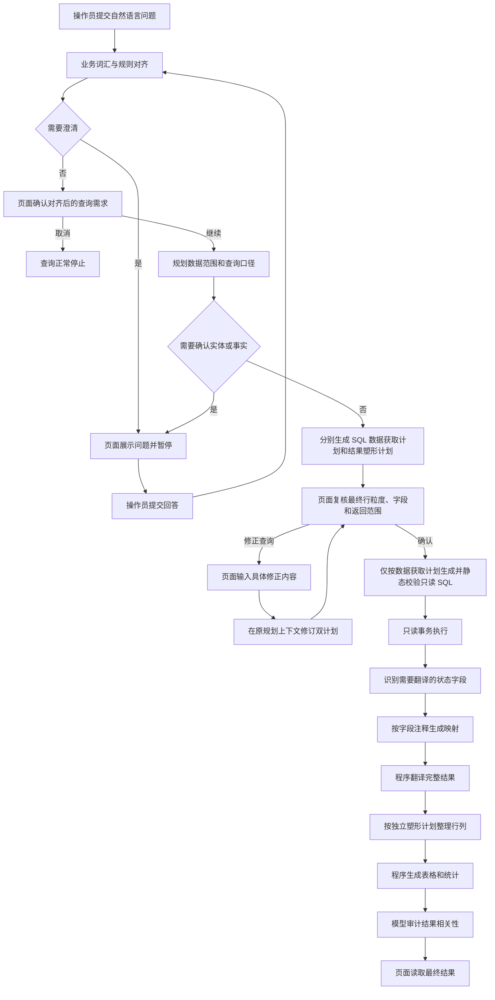

# 可交互数据查询智能体

> **功能定位**
>
> 本功能允许管理端操作员使用自然语言查询业务数据，并在页面上实时看到可理解的执行进度、确认对齐后的需求、补充必要事实，最后获得可直接渲染的表格与摘要。

## 1. 功能目标与范围

查询智能体把实验阶段形成的业务对齐、双计划查询规划、安全 SQL、结果翻译、确定性塑形和结果审计能力迁入正式应用。当前注册 `sports` 和 `rewards` 两个业务域：`sports` 用于查询企业运动赛季、报名、项目、进度、凭证、补传资格和排行榜；`rewards` 用于查询用户、部门、赛季参与、赛季结算积分、积分流水、商品和奖品履约。

本功能只执行只读查询，不修改业务表，不负责凭证审核、赛季结算或积分发放。不同业务域共用同一套工作流与工具实现，业务词汇、规则、表概述、实体匹配配置和表权限由独立业务包注入。

业务域资源、表白名单和专属业务口径彼此隔离，新增业务域不会复制通用工作流。积分与奖品查询规则见[积分与奖品查询业务域](../application/rewards-query.md)。

详细设计分别见：

- [查询智能体 API](../api/agent-query.md)；
- [查询智能体应用编排](../application/query-agent.md)；
- [查询智能体运行时与业务域扩展](../infrastructure/query-agent-runtime.md)。

---

## 2. 端到端流程

查询存在模型处理和用户交互，创建接口只返回任务标识，后续状态通过 SSE 和查询接口获取。

对齐后的需求确认和规划后的结果字段复核都是强制步骤。字段复核会展示最终一行代表什么、包含哪些可见字段以及返回范围，并让用户选择确认或修正；选择修正后，页面再通过独立自由文本交互收集增删改字段等具体意见。模型在原规划上下文中修订并重新提交校验，不会重跑业务对齐。确认前或修正期间使用全局取消操作都不会执行最终 SQL。

---

## 3. 操作员可见信息

页面可见事件只描述业务动作，例如“正在核对运动项目”“正在准备查询数据”和“共读取到若干条结果”。以下内部内容不会通过状态接口或 SSE 返回：

- 模型隐藏推理与原始响应；
- 工具调用参数和内部调用标识；
- 表结构原文、候选扫描 SQL 和最终 SQL；
- 数据库连接信息与原始异常。

页面可先读取保留期内的缓存查询标识，再按 `query_id` 分别读取友好轨迹和表格结果。友好轨迹包含原始问题、对齐后的问题、结果字段复核、关键阶段与交互问答，并在成功时以受约束的结果摘要收尾；表格结果包含表头、完整结果行、本地统计和受限审计说明。翻译模型只能根据数据库字段注释生成映射，完整结果由程序确定性转换；透传、分组和动态转列也由本地塑形子图完成，SQL 原始结果不会被模型改写。

---

## 4. 安全与资源规则

- 所有查询接口沿用管理端 Bearer Token 认证。
- 业务域同时提供远端工具表名枚举和本地表白名单；模型输出不能扩大数据范围。
- 单表候选读取每页最多 `10` 行、最多 `8` 列，只允许单表 SELECT，并使用 AST 校验、只读事务和超时。
- 最终 SQL 只允许单条只读查询，表集合必须与规划一致，外部筛选值必须参数化，分页必须与规划一致。
- 规划中的跨表关联必须全部落实；共同提供结果字段的表必须在同一个 SELECT 中正确关联，缺失条件会在执行前反馈给 SQL 模型并按原上下文修复。
- SQL 子图只消费数据获取计划；结果塑形计划在翻译后由本地程序执行，不能改变筛选和业务计算。
- 翻译层只处理可追溯到直接原始列的状态、类型和布尔编码；每个字段只读取自己的数据库注释，未知值保持原样。
- 结果审计模型只读取程序统计和前 `5` 行样本；表格完整结果不经过模型改写。
- 模型阶段同时受单次输出、生成轮次和工具调用次数限制；活动会话数量和事件历史也受环境配置限制。

数据库账号仍应遵循最小权限原则，只授予已注册业务域所需表的读取权限。应用层校验不能替代数据库权限隔离。

---

## 5. 状态、失败与恢复

查询状态包括运行中、等待确认、等待澄清、完成、正常停止、失败和取消。等待用户回答时，后台模型线程暂停，不会继续生成；提交正确的 `interaction_id` 后从原上下文恢复。单次交互最多等待 `5` 分钟，超时后以失败终态结束，避免长期占用查询线程池容量。

SSE 支持通过 `Last-Event-ID` 补发进程内仍保留的后续事件。查询结束后，页面可分别调用 `trace` 和 `result` 接口读取轻量时间线与完整表格。模型服务、数据库或应用内部失败会形成安全的终态提示，不会把原始异常发送到页面。

> **当前限制**
>
> 查询会话、待回答交互和事件历史只保存在单进程内存。服务重启会丢失未完成任务；多 Worker 或多实例部署无法自然共享状态。当前部署必须保持单 Worker，后续横向扩容前需要引入共享会话存储和跨实例事件通道。

---

## 6. 验证场景

核心验证包括：

- 业务域资源和工具表白名单可以独立注入；
- 创建任务、SSE 进度、需求确认、字段复核、计划修订、恢复和结果读取形成完整 HTTP 链路；
- 未认证请求不能创建查询；
- 不同订阅者可以重放同一事件历史；
- 业务域外表、跨表候选 SQL、子查询、通配字段和高风险函数在执行前被拒绝；
- 同一业务域的表结构成功结果可跨查询复用；
- 状态字段按 `comment` 翻译完整结果，注释外推值被拒绝，翻译失败时安全降级为原始值；
- 真实 DeepSeek 与开发数据库可以完成一次受控只读查询。

验证不得在输出中记录真实密钥、数据库密码、完整个人数据或原始模型轨迹。
