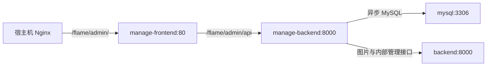

# 管理端 Docker Compose 部署

> **文档目的**
>
> 本文档说明管理端后端如何加入 `/home/ubuntu/flame-sport-pheno-deploy/docker-compose.yml`，以及容器内数据库、客户端后端、管理端前端之间的连接边界。

管理端后端使用服务名 `manage-backend`，容器内监听 `8000`，宿主机默认仅通过 `127.0.0.1:18001` 访问。本地 IDE 开发仍使用 `8001`，与容器内部端口相互独立。

---

## 1. 服务拓扑



所有容器使用 Compose 默认网络完成服务发现。管理端代码不得把容器目标写成 `127.0.0.1`：数据库使用 `mysql`，客户端后端使用 `backend`。

---

## 2. 后端镜像

仓库根目录的 `Dockerfile` 基于 Python 3.12 构建，并具备以下边界：

- 只复制 `requirements.txt` 和 `app/` 到运行镜像。
- `.env`、测试、文档、编辑器配置和本地缓存不进入构建上下文。
- 进程使用非 root 用户运行。
- Uvicorn 固定使用一个 Worker，避免进程内管理员登录缓存不一致，并降低小型服务器的内存和数据库连接占用。
- 容器健康检查访问无需认证的 `GET /flame/admin/api/health`。

> **重要**
>
> 登录 token 使用进程内缓存。未经会话存储改造前，不得通过增加 Uvicorn Worker 或横向扩容后端实例提升吞吐，否则不同进程之间无法共享登录状态。

---

## 3. 环境配置

根目录 `/home/ubuntu/flame-sport-pheno-deploy/.env` 是 Compose 的实际配置源，模板位于 `/home/ubuntu/flame-sport-pheno-deploy/.env.example`。

管理端主要变量如下：

| 变量 | 默认值 | 用途 |
| --- | --- | --- |
| `MANAGE_BACKEND_PORT` | `18001` | 管理端后端宿主机回环端口 |
| `MANAGE_FRONTEND_PORT` | `18081` | 管理端前端宿主机回环端口 |
| `MANAGE_ADMIN_KEY` | 无公开默认值 | 管理员登录密码，仅保存在实际 `.env` |
| `MANAGE_ADMIN_TOKEN_TTL_SECONDS` | `28800` | 管理 token 有效期 |
| `ACTIVE_SEASON_CONFIG_EDIT_WINDOW_HOURS` | `24` | 高影响配置允许修改的赛季时间窗口 |
| `MANAGE_MYSQL_POOL_SIZE` | `5` | 常驻异步数据库连接数上限 |
| `MANAGE_MYSQL_MAX_OVERFLOW` | `5` | 连接池临时扩展连接数 |
| `MANAGE_CLIENT_BACKEND_BASE_URL` | `http://backend:8000/flame/api/admin` | 客户端后端 Compose 内网管理接口根路径 |
| `MANAGE_CLIENT_BACKEND_TIMEOUT_SECONDS` | `10` | 客户端后端调用超时 |
| `MANAGE_IMAGE_CACHE_SECONDS` | `1204800` | 所有图片中转响应的浏览器缓存时长 |
| `DEEPSEEK_API_KEY` | 无公开默认值 | 客户端后端与管理端后端共享的 DeepSeek 密钥 |
| `DEEPSEEK_BASE_URL` | `https://api.deepseek.com` | DeepSeek OpenAI 兼容接口地址 |
| `DEEPSEEK_MODEL` | `deepseek-v4-flash` | 两个后端共享的默认模型名称 |
| `DEEPSEEK_HTTP_TIMEOUT_SECONDS` | `60` | DeepSeek 单次 HTTP 请求超时 |
| `DEEPSEEK_QUERY_*_MAX_TOKENS` | 见查询智能体运行文档 | 各查询阶段（含结果翻译）的单次生成上限 |
| `AGENT_QUERY_*` | 见查询智能体运行文档 | 查询生成轮次、翻译字段并发、工具次数和进程内会话资源上限 |

Compose 会把共享的 `MYSQL_USER`、`MYSQL_PASSWORD`、`MYSQL_DATABASE`、基础 `DEEPSEEK_*` 配置，以及查询智能体的 `DEEPSEEK_QUERY_*`、`AGENT_QUERY_*` 配置注入管理端后端，并将数据库主机固定为 `mysql:3306`。客户端后端默认使用 `http://backend:8000/flame/api/admin`；只有 Compose 服务名或管理接口路径变化时才调整该环境变量，生产容器不得误走公网。

管理端后端容器固定注入 `TZ=Asia/Shanghai`，镜像也使用相同默认值。涉及赛季日期边界的业务代码仍应显式使用 `Asia/Shanghai`，不得只依赖容器系统时区。

> **警告**
>
> `.env.example` 只能保存占位符。真实 MySQL 密码、管理员密码和模型密钥不得进入 Dockerfile、Compose 文件、镜像层或项目文档。

---

## 4. 启动顺序与失败语义

Compose 按健康状态建立依赖：

1. `mysql` 健康后启动客户端后端和管理端后端。
2. 客户端后端健康后，管理端后端才进入启动阶段。
3. 管理端后端健康后，管理端前端才启动。

管理端后端即使启动成功，也不代表数据库表结构或客户端内部接口完全兼容。接口调用仍按现有 HTTP 错误和数据库异常语义返回，不在容器层吞掉失败。

---

## 5. 生产入口

管理端前端容器统一承接 `/flame/admin/`，并在容器内把 `/flame/admin/api` 转发到 `manage-backend:8000`。宿主机 Nginx 只需把完整的 `/flame/admin/` 前缀转发到 `127.0.0.1:18081`。

当前宿主机 Nginx 的生产 `/flame/` 仍处于“升级改造中”状态。正式开放管理端前，必须单独增加更具体的 `/flame/admin/` 代理规则并执行 `nginx -t`；该系统级配置不属于本次 Compose 文件修改范围。

---

## 6. 验证方式

在 `/home/ubuntu/flame-sport-pheno-deploy` 执行：

```bash
docker compose config --quiet
docker compose build manage-backend manage-frontend
docker compose up -d mysql backend manage-backend manage-frontend
docker compose ps
```

容器启动后可从宿主机验证：

```bash
curl --fail http://127.0.0.1:18001/flame/admin/api/health
curl --fail http://127.0.0.1:18081/flame/admin/
```

验证至少覆盖：

- 管理端页面与静态资源能够从 `/flame/admin/` 加载。
- 页面刷新能够回退到 `index.html`。
- `/flame/admin/api/health` 能够经过管理端前端容器转发。
- 受保护接口缺少 token 时仍返回既定登录跳转响应。
- 管理端后端能够连接 MySQL，并能通过 Compose 内网访问客户端后端。

---

## 7. 已知限制

- 登录状态只保存在单个管理端后端进程内，容器重启后 token 会失效。
- 管理端前端是构建期配置，修改生产基础路径后必须重建镜像。
- 根 Compose 当前没有声明 CPU 或内存硬限制；资源控制依赖单 Worker、小连接池和宿主机监控，后续应根据实际峰值再设置限制。

关联文档：

- [FastAPI 应用结构与基础连接](application-structure.md)
- [Python 运行依赖](python-dependencies.md)
- [管理端密钥认证 API](../api/admin-authentication.md)
