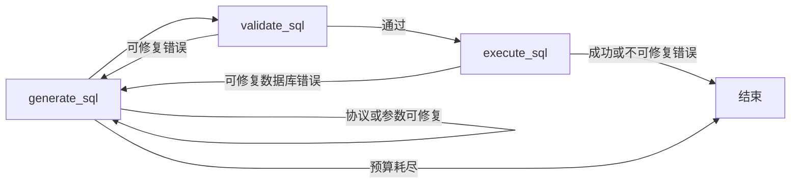

# 原料 SQL 查询子图

## 1. 功能目标

原料 SQL 查询子图由 Planning 的 `query_material_data` 工具调用。工具把本轮 `guidance` 和 `required_tables` 组成 `MaterialSqlQueryPlan`，子图再将其转换为一条参数化 MySQL 只读查询，经过静态安全校验后在独立只读事务中执行。

子图只负责读取后续塑形所需的纵向原料，不重新理解用户问题，不向用户追问，也不提前进行最终动态转列。Planning 工具循环见[纯文本原料查询规划契约](material-query-planning-contract.md)。

---

## 2. 输入与上下文

模型读取合法 YAML，动态上下文只包含以下内容：

| 输入 | 用途 |
| --- | --- |
| `material_query_plan.guidance` | 确定查询主体、范围、资格条件和必取业务原料 |
| `material_query_plan.required_tables` | 限定 SQL 必须且只能读取的真实基础表 |
| `allowed_table_schemas` | 提供字段名、数据类型、外键和数据库字段备注 |

`MaterialSqlQueryPlan` 只允许 `guidance` 和 `required_tables`，额外字段会被 Pydantic 拒绝。塑形指导不进入 SQL 子图。Planning 必须把 SQL 需要查询的全部业务值、稳定标识和排序原料写入 `guidance`；这些原料是否充分由 Planning 在观察查询结果后判断。

规划阶段已经读取成功的结构会直接复用。缺失结构通过业务域共享的进程级缓存读取；结构读取失败时不调用模型，也不执行 SQL。

---

## 3. 子图流程

### 3.1 SQL 生成

SQL 工具由 `SqlQueryDraft` Pydantic 模型生成标准 Function Calling Schema，包含：

- `sql`：一条 `SELECT` 或 `WITH ... SELECT`；
- `parameters`：固定 `name`、`value` 结构的命名参数列表；
- `result_columns`：按最外层 `SELECT` 顺序排列的唯一 `snake_case` 输出列。

API 使用 `tool_choice=auto` 且不启用供应商 strict 扩展。Prompt 要求模型唯一调用 `submit_sql_query`，程序再校验无工具、多工具、错误工具、输出截断和参数 Schema。DeepSeek 与 vLLM 复用全局供应商连接、关闭思考参数和通用 tool-tag 模板。

### 3.2 静态校验

SQLGlot 以 MySQL 方言执行以下检查：

1. 只允许单条只读查询，禁止注释、分号、多语句、写入和锁定读取。
2. 物理基础表集合必须与 `required_tables` 完全一致，并属于业务域白名单。
3. 禁止 `SELECT *`、数据库限定名、表范围修饰、身份函数和高风险函数。
4. 已限定的物理表字段必须存在于真实结构；`guidance` 显式声明的 `table.field` 必须存在且被 SQL 实际引用。
5. WHERE、HAVING、JOIN 和相关子查询中的外部筛选标量必须使用命名占位符；参数名集合必须与占位符集合完全一致。
6. 最外层 SQL 输出名称必须唯一，并与 `result_columns` 的名称和顺序完全一致。
7. 顶层 `LIMIT`、`OFFSET` 只接受非负整数，不由系统追加隐藏上限。

静态校验不再恢复旧 `query_blocks` 并强制模型逐块复刻 JOIN AST。模型可以按查询复杂度选择 JOIN、CTE、聚合或相关子查询；业务资格由已确认的 `guidance` 约束，显式字段闭合检查防止模型用固定参数或相似字段替代计划已经指定的真实字段。

### 3.3 只读执行

通过校验的命名占位符按出现顺序编译为 asyncmy `%s` 参数绑定，在 `START TRANSACTION READ ONLY` 中执行。查询受 `10` 秒超时保护，结束时始终回滚并关闭连接。

SQL 结果保留两种等价形式：执行形态使用 `%s`，来源分析形态保留命名占位符，供后续翻译层分析字段来源。两者不会分别执行。

子图成功后，`query_material_data` 才为完整结果分配本轮唯一的 `material_result_id` 并写入 Planning 后台缓存。规划模型只收到该 ID、完整结果行数、真实结果列和前 `5` 行 Markdown 预览，不接收完整结果行或 SQL。

---

## 4. 失败与修复

工具协议、Pydantic 参数、SQL 语法、安全校验、字段覆盖和可修复 MySQL 错误都会生成稳定错误代码、准确原因和唯一修复动作。已有 `tool_call_id` 时，错误作为同一次 `submit_sql_query` 的正常 `tool` 结果返回；模型修正并通过对应阶段后，旧失败调用和反馈从后续上下文移除，内部诊断轨迹继续保留。

MySQL `1055` 和 `1140` 均视为可修复的聚合分组错误。反馈要求模型补全最外层非聚合列的 `GROUP BY`，或在独立 CTE/子查询中按原计划主体粒度聚合后再关联明细；修复不得删除结果列、放宽筛选条件或改变行粒度。

连接、权限和超时错误不要求 SQL 模型盲目改写。子图在内部修复预算耗尽或遇到不可修复错误后，由 `query_material_data` 向 Planning 返回友好原因和修正方向；失败不会产生 `material_result_id`。Planning 可以据此补充或修正 `guidance` 与 `required_tables` 后发起新的工具调用。

生成次数由 `AGENT_QUERY_SQL_MAX_GENERATIONS` 限制，单次输出由 `DEEPSEEK_QUERY_SQL_MAX_TOKENS` 限制。

---

## 5. 权限与数据边界

子图不写业务数据库，不产生跨表写事务。运行账号应使用只读低权限 MySQL 用户。日志和普通接口不得输出筛选参数值、模型原始响应、未校验 SQL、结果行或个人敏感信息；诊断日志只有在显式开启时记录受控信息。

所涉及表及字段含义以业务域白名单和 `description/db/` 下的只读表文档为事实来源，本文件不复制第二份表结构定义。

---

## 6. 验证与已知限制

自动测试覆盖 Pydantic 工具描述、非 strict Schema、YAML 上下文、`tool_choice=auto`、DeepSeek/vLLM 请求参数、结构复用、字段真实性、显式计划字段覆盖、CASE 聚合常量、参数编译和异步执行。开发数据库联调仅执行只读查询。

Planning 通过 `query_material_data` 调用本子图，并在成功后使用 `material_result_id` 把完整结果交给[原料结果塑形子图](material-result-shaping-subgraph.md)。主 Pipeline 不再单独执行 SQL。自然语言 `guidance` 无法像旧查询块 AST 一样由程序证明全部业务谓词，因此 Planning 必须先观察真实表头和受限样本，末端结果审计仍需核对最终结果是否回答用户需求；复杂查询还应给 SQL 模型保留与查询长度相称的输出和修复预算。
