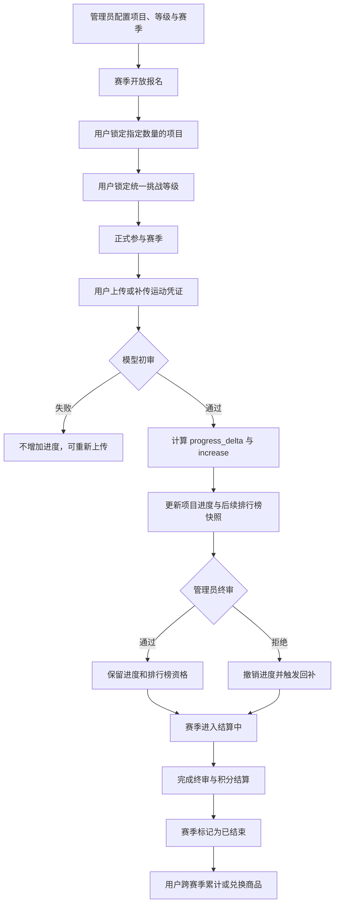
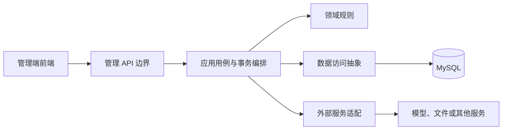
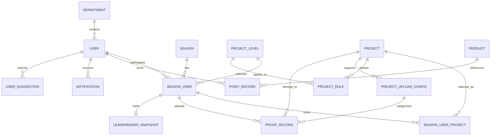

# 燃动现象管理端后端项目总览

> **文档目的**
>
> 本文档是项目业务与文档阅读的总入口，用于帮助开发者理解“燃动现象”的核心玩法、管理端后端的职责边界、关键业务不变量以及后续开发时应阅读的文档。

## 1. 项目定位

### 1.1 产品定位

**燃动现象**是一款面向企业员工的运动赛季应用。员工以赛季为周期参加运动挑战，通过上传运动凭证推进所选项目的完成进度，并在赛季结束后根据挑战完成情况和凭证审核结果结算积分。

积分属于用户的全局资产，跨赛季累计，可用于在积分商城兑换商品。

产品由两个主要使用端构成：

- **客户端**：面向企业员工，承载赛季报名、项目选择、挑战等级选择、凭证上传、进度查看、排行榜和积分商城等功能。客户端已经开发完毕，其既有玩法是管理端设计的重要业务前提。
- **管理端**：面向管理员和审核人员，承载业务配置、数据查询、凭证终审、赛季结算及运营管理等能力。

### 1.2 本仓库开发目标

本仓库的目标是开发**与管理端前端对接的后端服务**，通过稳定、清晰且可审计的管理 API 支撑后台运营。

本仓库应重点解决以下问题：

- 为管理端前端提供业务查询与配置接口；
- 保障管理员操作符合客户端已经采用的核心玩法；
- 正确处理凭证终审、进度回退与回补等高一致性业务；
- 支撑赛季状态管理、排行榜查看与赛季积分结算；
- 管理运动项目、挑战等级、规则、上传配置、商品及用户反馈等运营数据；
- 为后续开发维护准确、分层且可追溯的功能文档。

> **注意**
>
> 本仓库不是重新开发客户端，也不能为了简化管理端实现而改变客户端既有业务语义。管理端接口的具体路径、请求结构和权限规则，应以管理端前端需求及后续 API 文档为准。

### 1.3 当前项目状态

项目当前已进入核心管理功能集成完善阶段。仓库已经形成 FastAPI 路由、Schema、服务、仓储、异步 MySQL 会话、客户端后端 HTTP 适配器和进程内定时任务的完整分层，并已实现赛季与项目配置、凭证终审、赛季结算、积分和奖品履约、用户意见、图片中转及业务通知写入等主要管理能力。

当前实现边界如下：

- 应用结构、配置、数据库和客户端后端连接方式以 [FastAPI 应用结构与基础连接](infrastructure/application-structure.md) 为准；
- 除健康检查和 `/auth/login` 登录入口外，管理 API 默认使用[管理员共享密钥与短期 Bearer Token](api/admin-authentication.md)统一保护；
- 已确认技术依赖包括 FastAPI、Uvicorn、SQLModel、asyncmy、Pydantic Settings、HTTPX、OpenAI SDK 和 Pillow，具体用途以 [Python 运行依赖](infrastructure/python-dependencies.md) 为准；
- 赛季状态与结算使用管理端进程内定时任务，详细边界以[赛季状态与结算定时任务](job/season-status-transition.md)为准；
- 管理端只写入业务通知，客户端后端负责实际投递钉钉工作通知；
- 应用不会自动建表，当前仓库也没有统一数据库迁移工具；
- 共享密钥认证仍不等同于管理员个人身份、角色和权限模型，不得自行补全细粒度授权规则。

---

## 2. 核心业务术语

下表给出阅读和开发中必须统一使用的核心术语。

| 术语 | 含义 |
| --- | --- |
| 赛季 | 一段明确起止日期的运动挑战周期，同一时间以一个当前赛季为主要参与对象 |
| 运动项目 | 用户可以选择参与的运动类型，例如跑步、快走、健身、日常步数或减重挑战 |
| 挑战等级 | 用户为整个赛季选择的统一难度等级，等级越高，目标和奖励积分通常越高 |
| 项目规则 | 某个运动项目在某个挑战等级下的目标、单次要求和审核口径 |
| 赛季用户 | 某个用户在某个赛季中的参与记录，包括项目选择进度、挑战等级和结算结果 |
| 锁定项目 | 用户在当前赛季中已经确认选择、原则上不能随意更换的运动项目 |
| 正式参与 | 用户锁定了赛季要求数量的项目，并为整个赛季锁定了一个挑战等级 |
| 运动凭证 | 用户为已锁定项目提交的运动日期、图片、备注及凭证类型记录 |
| 初审 | 对单条凭证是否满足单次要求进行的模型辅助审核 |
| 终审 | 管理员对初审通过凭证进行的人工最终审核 |
| `progress_delta` | 初审给出的单条凭证原始进度增量，不因进度条封顶而截断 |
| `increase` | 单条凭证当前实际占用的项目进度，不能超过 `progress_delta` |
| 项目进度 | 某个用户在赛季中某个已锁定项目的实际完成比例，范围为 `0`～`1` |
| 有效打卡 | 能够进入排行榜统计的有效凭证，当前包括初审通过和终审通过凭证 |
| 全局积分 | 用户跨赛季共享的积分余额，通过积分变动流水记录每次增加和扣减 |

---

## 3. 核心业务流程

客户端玩法和管理端操作共同作用于同一套赛季数据。整体流程如下：



流程中的关键边界是：

- 客户端负责发起员工侧的报名、选择和上传行为；
- 管理端负责配置、查询、终审、纠错和结算等运营行为；
- 管理端修改任何状态时，都必须维护客户端依赖的业务不变量；
- 初审任务、排行榜刷新任务和其他后台作业的最终归属，需结合后续系统架构确认。

---

## 4. 核心玩法与业务规则

### 4.1 赛季规则

平台同一时间以一个当前赛季为主要参与对象。每个赛季至少包含以下业务要素：

- 赛季开始日期和结束日期；
- 用户必须选择的运动项目数量；
- 用户可以选择的挑战等级；
- 各运动项目在不同挑战等级下的完成规则；
- 报名开放状态和允许报名的时间范围。

用户只能在允许的报名时间内参与赛季：

1. 赛季开始前，如果赛季已开放，可以提前报名。
2. 赛季开始后，只允许在规定的前若干天内完成报名。
3. 超出报名时间后，不能通过普通客户端流程完成正式参与。

> **注意**
>
> 报名开放状态、赛后允许报名天数，以及赛季与可用等级、规则之间的持久化方式目前尚未在数据库文档中明确。实现相关管理能力前，必须先确认数据模型，不能只根据日期或现有字段自行推导。

赛季状态采用以下顺序：

```text
0 未开始 -> 1 进行中 -> 2 结算中 -> 3 已结束
```

“当前赛季”只指 `status = 1` 的赛季。`status = 2` 表示赛季已停止正常参与、正在完成终审和积分结算；结算全部完成后，才能进入 `status = 3`。

### 4.2 参与赛季

用户正式参与赛季必须按以下顺序完成：

1. 从当前赛季提供的运动项目中选择指定数量的项目。
2. 为整个赛季选择一个统一的挑战等级。
3. 项目数量和挑战等级都锁定后，用户才算正式参与；系统同时应记录正式报名时间。

必须满足以下限制：

- 项目数量由赛季的 `required_project_count` 决定，**不固定为 3 个**。
- 挑战等级属于用户本赛季的统一选择，不是每个项目分别选择。
- 同一用户选择的所有项目必须使用同一个挑战等级。
- 项目和挑战等级锁定后，原则上不能由用户随意更换。
- 后台纠错或作废选择时，必须同步维护有效项目数量、参与状态和后续统计结果。

`season_user` 记录存在不等于用户已经正式参与。正式参与至少应同时满足：

```text
有效锁定项目数 = season.required_project_count
season_user.level_id IS NOT NULL
```

`participated_at` 用于记录首次正式报名时间，但不作为统计正式参与人员的硬性筛选条件，以兼容无法准确还原该时间的历史记录。

### 4.3 运动项目、挑战等级与规则

平台可以配置不同运动项目，例如：

- 跑步或快走；
- 健身打卡；
- 日常步数；
- 球类活动；
- 户外登山；
- 减重挑战。

每个项目在不同挑战等级下可以设置不同目标，包括但不限于：

- 累计运动次数；
- 累计达标天数；
- 累计距离或时长；
- 单次运动距离、时长、配速或爬升要求；
- 基于体重或 BMI 的减重目标。

挑战等级越高，目标通常越高，对应的赛季完成奖励积分也越高。挑战等级对用户本赛季的全部已选项目生效。

管理端创建挑战等级时，必须同步补齐该等级与所有项目的规则矩阵。新规则沿用每个项目在已有等级下保持一致的评估指标名称，指标值可以先保存为 JSON `null`，等待后续配置；隐藏项目也必须初始化，避免重新启用后缺少等级规则。等级及其全部项目规则必须在同一事务中创建，不能暴露只有等级而缺少部分项目规则的中间状态。

管理端创建运动项目时也必须维护同一规则矩阵不变量：请求规则应恰好覆盖当前全部挑战等级，各等级必须使用顺序一致的评估指标 `label`，只有 `value` 等等级配置可以不同。项目基础信息、全部等级规则和至少一种凭证上传配置应作为一个完整配置写入；新项目图标必须是 WebP，并使用新的唯一 `.webp` 地址保存到客户端后端，避免复用缓存地址。该操作同样受统一赛季配置窗口保护。历史项目已经保存的其他图片格式不受此创建约束影响。

管理端配置既有项目等级规则时，评估指标的 `label` 是项目规则模板的一部分，普通配置操作只能按已有 `label` 修改对应的 `value`，不能增删、改名或重排标签。挑战副描述 `sub_desc` 和规则备注 `rule_note` 可以独立修改或清空；修改必须在统一赛季配置窗口与规则行锁保护下原子完成。

项目可通过 `status` 在可见与隐藏之间切换。隐藏项目只退出客户端普通可选项目口径，不得物理删除项目、规则或历史参与数据；可见状态修改必须在统一赛季配置窗口和项目行锁保护下完成。

管理端修改项目、等级和规则时，必须考虑历史数据：已经被用户选择或被历史审核使用的配置不应直接物理删除，也不能让历史记录因展示文案变化而失去关联。

### 4.4 上传运动凭证

用户只能为自己在当前赛季中已经有效锁定的项目上传凭证。每条凭证至少包含：

- 实际运动日期 `proof_date`；
- 凭证图片；
- 运动情况备注；
- 对应的项目上传配置，即凭证类型。

运动日期必须满足：

```text
season.start_date <= proof_date <= min(season.end_date, 今天)
```

这意味着凭证必须属于赛季周期，并且不能提前上传未来日期的运动记录。

同一用户、同一赛季、同一项目、同一个运动日期，只允许保留一条有效凭证。不同凭证类型也不能绕过“一项目一天一条有效凭证”的限制。

> **警告**
>
> “一项目一天一条有效凭证”涉及并发判重。当前表结构通过查询口径表达该规则，但并未提供只约束 `status = 1` 记录的数据库唯一键。实现上传或后台纠错逻辑时，必须明确事务和并发控制，避免产生多条有效记录。

### 4.5 补传与重新上传

普通上传和补传遵循同一套业务规则：

- 普通上传默认选择当天；
- 补传可以选择赛季内已经过去的日期；
- 所选日期已经存在同项目有效凭证时，再次上传视为重传。

重传必须使旧审核结果和旧进度贡献失效：

1. 撤销原凭证当前的 `increase`。
2. 为释放出的项目进度空间执行必要回补。
3. 更新凭证图片、备注及上传配置。
4. 清空原初审意见、终审意见、`progress_delta` 和 `increase`。
5. 将审核状态重新设置为 `pending`，等待再次初审。

重传后的凭证必须按新内容重新审核，不能继承原凭证的审核结果或实际进度贡献。

### 4.6 凭证初审

新上传或重传的凭证首先进入 `pending` 状态。模型辅助初审根据凭证内容、用户备注及对应项目挑战规则，判断**本条运动记录是否满足单次要求**。

初审状态包括：

| 状态 | 含义 | 是否增加项目进度 |
| --- | --- | --- |
| `pending` | 待初审 | 否 |
| `preliminary_approved` | 初审通过 | 是 |
| `preliminary_rejected` | 初审失败 | 否 |

初审必须区分“单条要求”和“赛季累计目标”：

- 规则要求单次跑步至少 `3 km` 时，本条凭证应证明单次距离达到要求。
- 规则要求赛季累计跑步 `20` 次时，用户当前只完成 `1` 次不能成为拒绝该条有效凭证的理由。
- “累计次数不足”“累计天数不足”等属于赛季整体完成情况，不是单条凭证初审失败的理由。

初审失败的凭证不增加项目进度，也不计入排行榜；用户可以重新上传后再次进入初审。

初审意见保存在 `proof_record.preliminary_review_comment`，管理员终审意见保存在 `proof_record.review_comment`。两个阶段不得覆盖对方的意见；重传时两列同时清空，避免新版本沿用旧审核结论。

### 4.7 项目进度

初审通过后，模型给出本条凭证的原始进度增量 `progress_delta`。系统再根据项目进度条剩余空间，计算真正生效的进度 `increase`。

计算关系如下：

```text
remaining = 1 - completion_progress
increase = min(progress_delta, remaining)
```

例如，项目当前进度为 `0.9000`，本条凭证原始增量为 `0.2000`，则最终保存：

```text
progress_delta = 0.2000
increase = 0.1000
completion_progress = 1.0000
```

项目进度必须始终满足以下不变量：

```text
0 <= increase <= progress_delta <= 1
0 <= completion_progress <= 1
completion_progress = SUM(当前有效通过凭证的 increase)
```

`progress_delta` 保留凭证原本能够贡献的进度；`increase` 记录该凭证当前实际占用的进度。即使进度条已经封顶，超出部分的原始贡献也不能丢失，因为它可能在其他凭证失效后参与回补。

### 4.8 进度回退与回补

已通过初审或终审的凭证被重传、作废或终审拒绝时，系统必须撤销该凭证当前的 `increase`。释放出的进度空间应尝试分配给同一赛季用户、同一项目下的其他凭证。

能够参与回补的凭证必须同时满足：

- 记录仍然有效；
- 审核状态仍然属于有效通过状态；
- `progress_delta > increase`，即仍有未实际分配的原始进度。

回退、回补和项目总进度更新必须处于同一事务中。事务完成后，项目进度仍需等于所有当前有效通过凭证的 `increase` 总和。

凭证回补的具体锁定与分配顺序以 [凭证记录表说明](db/proof-record.md) 为准。

### 4.9 管理员终审

管理员可以在赛季期间持续终审初审通过的凭证，不需要等待赛季结束或月末再集中处理。

终审状态和影响如下：

| 状态 | 含义 | 进度贡献 | 排行榜资格 |
| --- | --- | --- | --- |
| `approved` | 终审通过 | 保留 | 保留 |
| `rejected` | 终审拒绝 | 撤销并回补 | 取消 |

管理员终审拒绝时，必须在同一事务中完成：

1. 保存最终拒绝状态和必要的终审意见，并保留原初审意见。
2. 将该凭证的 `increase` 归零。
3. 从项目进度中撤销其实际贡献。
4. 使用其他符合条件的有效凭证回补释放空间。
5. 确保后续排行榜快照不再统计该凭证。

终审是影响用户权益和赛季结算的关键操作。后续实现必须具备明确的管理员身份、权限校验和可审计性；具体审计数据结构仍待确认。

### 4.10 减重挑战特殊规则

减重挑战通常包含两类凭证：

| 凭证类型 | 作用 | 是否推进进度 | 是否计入排行榜 |
| --- | --- | --- | --- |
| 月初记录 | 建立初始体重、BMI 或其他规则所需基线 | 否 | 否 |
| 月末记录 | 与有效月初基线比较并判断减重目标 | 达标后可直接完成 | 通过后最多计 `1` 次 |

特殊规则包括：

- 月初记录只建立基线，`progress_delta` 和 `increase` 均为 `0`。
- 月末记录必须存在有效的月初基线。
- 月末达到目标后，减重项目可以直接完成。
- 用户表不保存身高；需要 BMI 或其他派生指标时，用户应在月初凭证备注中提供对应指标或足以计算它的完整原始数据。
- 月末记录复用同赛季、同项目有效月初记录的初审意见作为基线上下文，管理员终审不得覆盖该初审基线。

减重数据涉及个人健康信息。管理端展示、日志记录和权限控制必须遵循最小必要原则，避免无关人员访问或日志泄露。

### 4.11 排行榜

排行榜以当前赛季的有效通过凭证数量作为主要统计依据。

当前统计口径如下：

| 凭证状态或类型 | 是否计入排行榜 |
| --- | --- |
| `preliminary_approved` | 是 |
| `approved` | 是 |
| `pending` | 否 |
| `preliminary_rejected` | 否 |
| `rejected` | 否 |
| 已重传替换或已作废凭证 | 否 |
| 减重挑战月初基线 | 否 |
| 通过的减重挑战月末记录 | 是，最多计 `1` 次 |

排行榜应展示用户、部门、挑战等级和有效打卡次数。排行榜数据定期刷新，不要求在上传或审核完成的瞬间立即变化。

当前快照设计只保留最新统计结果，不保留每日历史快照。排行榜排序和名次展示由接口契约与管理端前端需求进一步确认。

> **警告**
>
> [排行榜快照表说明](db/leaderboard-snapshot.md) 中仍存在“终审拒绝凭证继续计入排行榜”的旧口径，与当前玩法及 [凭证记录表说明](db/proof-record.md) 冲突。后续实现必须以本节的当前业务口径为准，但在没有明确数据库优化指令时，不得直接修改 `description/db/`。

### 4.12 赛季完成与积分结算

积分不是每上传一条凭证就立即发放。赛季进行期间的主要任务是推进项目进度并完成凭证审核；赛季进入“结算中”后，管理端先补齐截止前遗留初审，再统一判断用户的赛季完成情况。全部正式参赛用户完成定分和积分发放且没有开放补传资格后，赛季才标记为“已结束”。

结算至少需要检查：

- 用户是否正式参与赛季；
- 用户选择的统一挑战等级；
- 用户各已选项目的最终完成进度；
- 凭证最终审核结果；
- 挑战等级对应的奖励积分；
- 前两个自然月是否连续完整完成；
- 该用户和赛季是否已经定分，避免重复写入。

基础积分规则如下：

| 最终完成情况 | 基础积分 |
| --- | ---: |
| 一个项目都未完成 | `0` |
| 至少完成一个、但未完成赛季要求的全部项目 | `20` |
| 完成赛季要求的全部项目 | 用户挑战等级的 `project_level.reward` |

只有当前赛季要求的全部项目已经确定达标且可以定分时，才计算连续完成奖励。当前仍依赖待终审贡献、只完成部分项目或仅获得保底积分的用户都不计算额外奖励。

完整完成当前赛季时，连续完成奖励按自然月计算：

| 连续完整完成月份 | 额外积分 |
| --- | ---: |
| 1 个月 | `0` |
| 2 个月 | `SEASON_SETTLEMENT_TWO_MONTH_STREAK_BONUS_POINTS`，默认 `50` |
| 3 个月及以上 | `SEASON_SETTLEMENT_THREE_MONTH_STREAK_BONUS_POINTS`，默认 `100` |

三个月奖励替代两个月奖励，不与两个月档叠加。两个档位均在应用启动时从环境变量读取，修改配置只影响此后尚未定分的用户；已经写入 `final_points` 的结果不会重新计算。只获得 `20` 分保底积分不属于完整完成，并会中断连续记录；缺少某个自然月的已结束赛季也视为中断。

结算期间，如果某个项目仅凭终审通过记录的原始贡献已经足以达到 `100%`，该项目其余待终审记录不再影响赛季目标，系统直接拒绝并提示用户。判断时不能只看项目当前进度，因为当前进度可能仍包含初审通过但未终审的贡献。

结算结果通过 `season_user.final_points` 区分：

```text
NULL = 尚未结算
0    = 已结算但未获得积分
> 0  = 已结算并获得对应积分
```

定分只写入 `season_user.final_points`，并保持 `season_user.points_issued = 0`。管理员发放时，在同一事务内按最新有效余额创建包含最新 `points_after` 的 `season_reward` 流水，再把 `points_issued` 更新为 `1`；重复请求只返回已发放结果，不能重复加分。零分用户仍写入零积分流水，以明确完成发放处理。`point_record.gift_distribution_status` 只描述兑换礼品的发放情况，不参与赛季定分或奖励发放。

管理员确认不再等待遗留审核和补传时，可以一键完成结算；部署环境也可以配置在赛季结束后的指定自然日自动执行同一流程。系统会拒绝该赛季全部待初审和待终审凭证，将其实际贡献归零，只按终审通过凭证重新计算项目进度；随后清空补传资格表、为未定分用户定分、为未发放用户写入积分流水，并在全部步骤成功后把赛季更新为已结束。该操作必须全事务执行，任何用户的数据不一致都会使整个赛季保持结算中。

### 4.13 积分商城

用户积分跨赛季累计，与单个赛季脱钩。用户可以使用全局积分兑换商品，兑换成功后应：

1. 校验商品处于可兑换状态。
2. 校验用户可用积分充足。
3. 扣减用户全局积分余额。
4. 生成包含商品关联和变动后余额的积分流水，礼品发放状态默认为 `pending`。
5. 保证并发兑换不会产生负余额或重复扣减。

审核员处理礼品兑换时，可以将对应有效兑换流水标记为 `distributed`（已发放）或 `rejected`（拒绝发放）。两个结果都是终态，只能由 `pending` 转入，不能互相覆盖。

确认发放只更新原兑换流水的 `gift_distribution_status`。拒绝发放则必须在同一事务中将原流水标记为 `rejected`、写入失败提示，并新增一条独立退款流水，将原兑换扣除的积分补回用户最新余额；禁止直接改写原兑换流水的 `change_points` 或 `points_after`。

商品可以调整兑换所需积分，但历史兑换记录不能随商品当前积分要求变化。商品被历史流水引用后应下架，不应直接物理删除。

> **待确认**
>
> 当前 `point_record` 设计提供待发放、已发放和拒绝发放三态，但没有独立兑换订单、兑换数量、收件信息、兑换时积分快照、审核意见、处理时间和操作人。管理端扩展完整履约及审计能力前，必须先确认是否需要补充相应业务模型。

---

## 5. 管理端后端职责边界

### 5.1 能力域与实现状态

下表描述管理端后端的业务边界和当前实现状态。具体接口以[项目文档地图](README.md)中的 API 文档为准；未实现方向不能仅根据本表自行补全协议。

| 能力域 | 当前实现状态 | 关键约束 |
| --- | --- | --- |
| 部门与用户 | 已实现用户及部门展示信息的批量查询 | 保留历史关联，不泄露敏感信息 |
| 自然语言查询 | 已实现运动、积分与奖品业务域的业务对齐、交互确认、只读查询和 SSE 进度 | 只读、表白名单、参数化 SQL，当前仅支持单进程会话 |
| 运动项目 | 已实现查询、创建和可见状态管理 | 历史已引用项目不物理删除 |
| 挑战等级 | 已实现查询、创建和奖励积分修改 | 等级作用于用户整个赛季 |
| 项目规则 | 已实现查询及既有指标值、描述和备注修改 | JSON 结构必须校验，标签与历史语义保持稳定 |
| 上传配置 | 项目创建时可写入，尚无独立管理接口 | 凭证通过配置 ID 保留关联 |
| 赛季 | 已实现查询、创建、自动状态流转和结算；尚无普通编辑接口 | 同一时间最多一个进行中赛季和一个结算中赛季 |
| 参与记录 | 已实现当前赛季和结算赛季的参与及进度查询 | 后台纠错必须同步维护关联数据 |
| 凭证审核 | 已实现普通终审和结算专用终审 | 拒绝必须原子撤销进度并回补 |
| 排行榜 | 尚无管理端查询或刷新接口 | 只统计当前有效通过凭证 |
| 赛季结算 | 已实现定分、发放、终审联动、定时推进和一键收口 | 必须幂等、保持进度与积分一致、避免重复发放 |
| 积分 | 已实现赛季奖励入账和礼品拒绝退款，尚无通用人工调整接口 | 余额变更与流水必须一致 |
| 商品 | 已实现新增、查询、资料修改、上下架和礼品履约审核 | 历史兑换不受当前价格影响 |
| 用户反馈 | 已实现待处理意见查询及拒绝、解决处理 | 保护用户身份和反馈内容 |

新增接口前仍必须读取管理端前端页面、字段约定或用户给出的需求。没有明确需求时，不得将未实现方向扩展成自行设想的完整后台产品。

### 5.2 当前未覆盖的系统能力

以下能力尚未在本仓库形成完整实现，不得视为既定设计：

- 管理员个人账号、身份来源、角色、权限矩阵和操作审计；
- 管理员主动登出、单个 Token 撤销以及跨进程会话存储；
- 员工侧报名、普通上传、补传提交、补传截止时间和次数限制；
- 钉钉工作通知的实际投递与回执轮询；
- 排行榜刷新和管理端查询接口；
- 管理端与客户端后端之间独立的服务认证；
- 独立任务进程、持久化任务执行记录、指标和告警；
- 统一数据库迁移工具，以及尚未出现在数据库文档中的操作审计表和兑换订单模型。

---

## 6. 逻辑架构原则

项目已经采用 FastAPI、应用服务、仓储和外部客户端适配器组织代码。后续功能必须保持以下依赖方向，不得把 HTTP 或基础设施细节反向侵入业务编排。



各层职责如下：

- **管理 API 边界**：完成身份与权限校验、输入校验、协议转换和错误响应，不承载复杂业务规则。
- **应用用例与事务编排**：组织一次管理操作所需的领域能力、数据访问和事务边界。
- **领域规则**：集中实现审核状态、项目进度、回补、排行榜口径、结算和积分等核心不变量。
- **数据访问抽象**：处理查询、持久化和锁，不把具体 ORM 模型泄漏到业务核心。
- **外部服务适配**：隔离模型、文件、企业身份或其他第三方系统的协议和失败语义。

高风险操作必须优先保证一致性和可审计性。特别是终审拒绝、项目作废、赛季结算、积分调整和商品兑换，不能通过跨多个无事务步骤的方式实现。

---

## 7. 核心数据关系

以下关系用于帮助理解业务，具体字段、约束和建表语句必须以 `description/db/` 中的表文档为准。



> **说明**
>
> 该关系图只表达当前已形成文档的数据表之间的主要关系，不替代数据库文档，也不表示所有业务约束都已由数据库外键或唯一键实现。

---

## 8. 数据库文档索引

`description/db/` 是数据库结构和字段语义的只读事实来源。开发时只阅读与当前任务相关的表文档，不需要无差别加载全部文档。

### 8.1 组织、用户与通知

| 表 | 作用 | 文档 |
| --- | --- | --- |
| `department` | 企业部门基础信息 | [部门表说明](db/department.md) |
| `user` | 用户基础信息、部门归属、头像和身高 | [用户表说明](db/user.md) |
| `notification` | Markdown 工作通知及钉钉投递状态 | [用户通知表说明](db/notification.md) |
| `user_suggestion` | 用户建议与反馈 | [用户建议表说明](db/user-suggestion.md) |

### 8.2 项目与赛季配置

| 表 | 作用 | 文档 |
| --- | --- | --- |
| `project` | 运动项目基础信息 | [项目表说明](db/project.md) |
| `project_level` | 挑战等级及完成奖励积分 | [项目等级表说明](db/project-level.md) |
| `project_rule` | 项目与等级对应的挑战规则 | [项目规则表说明](db/project-rule.md) |
| `project_upload_config` | 项目的凭证类型和上传提示 | [项目上传配置表说明](db/project-upload-config.md) |
| `season` | 赛季日期、要求项目数量和状态 | [赛季表说明](db/season.md) |

### 8.3 参与、凭证与排行榜

| 表 | 作用 | 文档 |
| --- | --- | --- |
| `season_user` | 用户赛季参与、等级和结算结果 | [赛季用户表说明](db/season-user.md) |
| `season_user_project` | 用户锁定的项目及项目进度 | [赛季用户项目表说明](db/season-user-project.md) |
| `proof_record` | 运动凭证、审核状态和进度贡献 | [凭证记录表说明](db/proof-record.md) |
| `season_supplement_eligibility` | 结算中赛季允许用户补传的凭证资格 | [赛季补传资格表说明](db/season-supplement-eligibility.md) |
| `leaderboard_snapshot` | 当前排行榜最新快照 | [排行榜快照表说明](db/leaderboard-snapshot.md) |

### 8.4 积分与商品

| 表 | 作用 | 文档 |
| --- | --- | --- |
| `point_record` | 用户全局积分的变动流水 | [积分变动记录表说明](db/point-record.md) |
| `product` | 积分商城商品及兑换积分要求 | [商品表说明](db/product.md) |

---

## 9. 文档阅读规则

### 9.1 每次开发前的固定阅读顺序

每个智能体或开发者开始任务前，必须按以下顺序阅读：

1. 根目录 `AGENTS.md`，确认开发、安全、测试和数据库只读要求。
2. [项目文档撰写规范](document-style.md)，确认新增或修改文档的格式要求。
3. 本文档，确认项目定位、核心玩法、管理端边界和业务口径。
4. 查阅 [项目文档地图](README.md)，定位与当前任务直接相关的功能文档和数据库文档。
5. 阅读选定的相关文档，不无差别加载全部资料。
6. 检查目标代码、相邻模块、调用方、测试和配置。

读取文档的目的是建立足够上下文，不是机械加载整个仓库。除项目级必读文档外，应按任务范围选择相关资料。

### 9.2 按任务选择数据库文档

| 任务类型 | 必须优先阅读的数据库文档 |
| --- | --- |
| 部门或用户管理 | [部门表](db/department.md)、[用户表](db/user.md) |
| 运动项目管理 | [项目表](db/project.md)、[项目规则表](db/project-rule.md)、[上传配置表](db/project-upload-config.md) |
| 挑战等级管理 | [项目等级表](db/project-level.md)、[项目规则表](db/project-rule.md)、[赛季用户表](db/season-user.md) |
| 赛季管理 | [赛季表](db/season.md)、[赛季用户表](db/season-user.md)、[赛季用户项目表](db/season-user-project.md) |
| 凭证查询或终审 | [凭证记录表](db/proof-record.md)、[赛季用户项目表](db/season-user-project.md)、[项目规则表](db/project-rule.md) |
| 进度回退或回补 | [凭证记录表](db/proof-record.md)、[赛季用户项目表](db/season-user-project.md) |
| 排行榜 | [排行榜快照表](db/leaderboard-snapshot.md)、[凭证记录表](db/proof-record.md)、[赛季用户表](db/season-user.md)、[用户表](db/user.md)、[部门表](db/department.md) |
| 用户业务通知 | [用户通知表](db/notification.md)、[用户表](db/user.md)；涉及具体业务时继续读取对应业务表文档 |
| 赛季结算 | [赛季表](db/season.md)、[赛季用户表](db/season-user.md)、[赛季用户项目表](db/season-user-project.md)、[项目等级表](db/project-level.md)、[积分流水表](db/point-record.md) |
| 积分或商品 | [积分流水表](db/point-record.md)、[商品表](db/product.md)、[用户表](db/user.md) |
| 用户反馈 | [用户建议表](db/user-suggestion.md)、[用户表](db/user.md) |

任务涉及状态变更、外键关系或跨表事务时，还必须继续阅读所有直接关联表的文档。

### 9.3 文档冲突处理

发现任务要求、本文档、功能文档、数据库文档和现有代码不一致时：

1. 先确认冲突内容及其影响范围。
2. 判断是否属于旧口径、未完成迁移或尚未落地的新需求。
3. 向用户说明冲突和建议处理方式，不能静默选择更容易实现的一方。
4. 没有明确数据库优化指令时，保持 `description/db/` 只读。
5. 业务口径确认后，更新对应的非数据库功能文档；数据库文档仅在获得明确授权后修改。

---

## 10. 功能文档维护规则

功能开发完成后，必须按照功能所处层级创建或更新文档：

| 功能层级 | 文档目录 | 主要内容 |
| --- | --- | --- |
| 对外管理 API | `description/api/` | 路径、请求、响应、错误码、权限和示例 |
| 应用用例与事务 | `description/application/` | 用例流程、事务边界、依赖和失败处理 |
| 核心业务规则 | `description/domain/` | 术语、状态流转、不变量和计算规则 |
| 数据访问与外部集成 | `description/infrastructure/` | 适配边界、配置、超时、重试和降级 |
| 定时或异步任务 | `description/job/` | 触发条件、处理范围、幂等、重试和监控 |
| 跨层完整功能 | `description/features/` | 用户目标、端到端流程及各层文档链接 |

所有文档必须遵循 [项目文档撰写规范](document-style.md)。同一业务事实应有唯一主文档，其他文档通过链接引用，不得复制出多份容易失效的定义。

当以下内容发生变化时，必须同步更新本文档：

- 产品定位或管理端职责边界；
- 核心玩法、状态语义或关键业务不变量；
- 逻辑架构和主要模块边界；
- 文档目录、阅读顺序或数据库文档索引；
- 已确认的重大待定事项。

---

## 11. 当前已知冲突与待确认事项

> **警告**
>
> 本节中的事项会直接影响接口或数据设计。在获得明确结论前，不得通过猜测补全实现，也不得自行修改数据库文档。

| 事项 | 当前情况 | 开发前需要确认的内容 |
| --- | --- | --- |
| 排行榜终审拒绝口径 | 当前玩法和 `proof_record` 文档要求不计入，但 `leaderboard_snapshot` 文档仍写为计入 | 实现时按当前玩法排除 `rejected`，后续是否授权修正文档 |
| 报名窗口 | 支持赛前开放及开赛后前若干天报名，但 `season` 没有对应字段 | 开放状态、截止规则和持久化方式 |
| 赛季可用项目 | 用户应从赛季提供的项目中选择，但当前没有赛季与项目关联 | 是否所有启用项目均可参与，或需要赛季项目配置 |
| 赛季可用等级 | 产品语义上每个赛季包含可参与等级，当前等级表为全局配置 | 是否所有启用等级对所有赛季生效，或需要赛季关联 |
| 赛季项目规则 | 产品语义允许赛季拥有各等级规则，当前规则表不关联赛季 | 规则是否全局复用，是否允许不同赛季使用不同规则 |
| 管理端身份权限 | 已使用共享管理员密钥和短期 Bearer Token 建立统一访问门槛，但暂无管理员个人模型 | 个人身份来源、角色、数据权限和操作审计 |
| 后台作业运行保障 | 赛季状态与结算任务已由管理端进程内调度，排行榜刷新仍未实现 | 多实例互斥、独立任务进程、持久化执行记录和监控告警 |
| 商品兑换记录 | 当前由积分流水记录商品关联和礼品履约三态，没有独立兑换订单 | 是否需要订单、数量、收件信息、积分快照、审核意见、处理时间和操作人 |
| 赛后补传 | 已建立按凭证记录的补传资格，并联动结算终审与定分，但没有员工侧补传接口 | 提交入口、截止时间、次数限制及资格关闭规则 |
| 内部服务认证 | 管理端调用客户端后端的固定管理接口，当前依赖 Docker 或局域网信任边界 | 是否增加服务凭证、签名、访问控制和密钥轮换 |
| 查询智能体横向扩容 | 查询会话、待回答交互和 SSE 历史当前保存在单进程内存 | 共享会话存储、跨实例事件通道、任务恢复和路由策略 |

---

## 12. 开发完成标准

除根目录 `AGENTS.md` 的完成标准外，管理端功能交付还必须满足：

- 管理端行为不破坏本文档描述的客户端核心玩法；
- 涉及审核、进度、排行榜、结算和积分时，业务口径保持一致；
- 高风险写操作具备明确事务、幂等、权限和审计方案；
- API 行为与管理端前端已确认的契约一致；
- 对应层级的功能文档已经创建或更新；
- 未经明确授权，没有修改 `description/db/` 或执行数据库结构变更；
- 所有未确认事项均被如实说明，没有被隐藏为默认实现。
