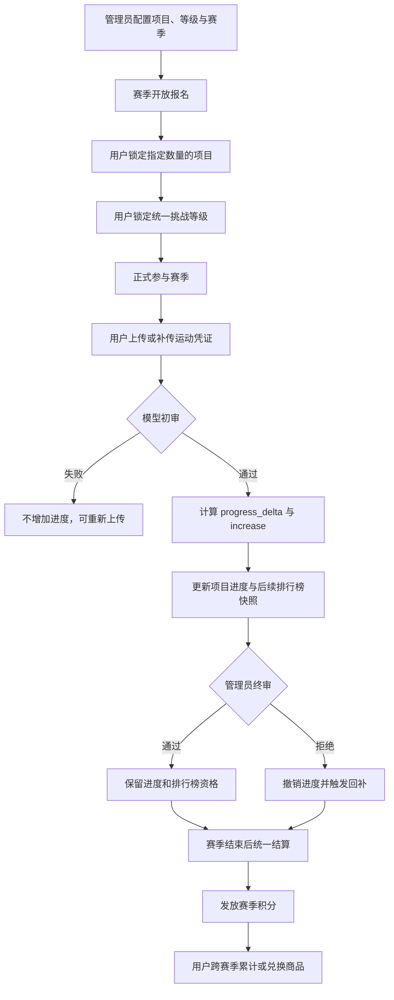
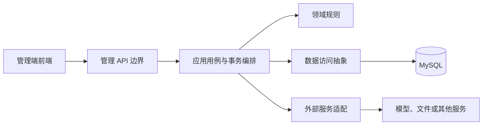
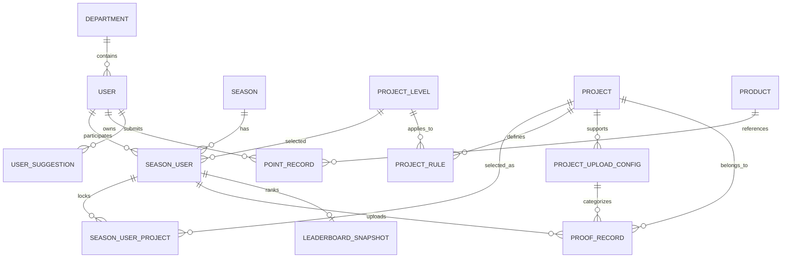

# 燃动现象管理端后端项目总览

> **文档目的**
>
> 本文档是项目业务与文档阅读的总入口，用于帮助开发者理解“燃动现象”的核心玩法、管理端后端的职责边界、关键业务不变量以及后续开发时应阅读的文档。

## 1. 项目定位

### 1.1 产品定位

**燃动现象**是一款面向企业员工的运动赛季应用。员工以赛季为周期参加运动挑战，通过上传运动凭证推进所选项目的完成进度，并在赛季结束后根据挑战完成情况和凭证审核结果结算积分。

积分属于用户的全局资产，跨赛季累计，可用于在积分商城兑换商品。

产品由两个主要使用端构成：

- **客户端**：面向企业员工，承载赛季报名、项目选择、挑战等级选择、凭证上传、进度查看、排行榜和积分商城等功能。客户端已经开发完毕，其既有玩法是管理端设计的重要业务前提。
- **管理端**：面向管理员和审核人员，承载业务配置、数据查询、凭证终审、赛季结算及运营管理等能力。

### 1.2 本仓库开发目标

本仓库的目标是开发**与管理端前端对接的后端服务**，通过稳定、清晰且可审计的管理 API 支撑后台运营。

本仓库应重点解决以下问题：

- 为管理端前端提供业务查询与配置接口；
- 保障管理员操作符合客户端已经采用的核心玩法；
- 正确处理凭证终审、进度回退与回补等高一致性业务；
- 支撑赛季状态管理、排行榜查看与赛季积分结算；
- 管理运动项目、挑战等级、规则、上传配置、商品及用户反馈等运营数据；
- 为后续开发维护准确、分层且可追溯的功能文档。

> **注意**
>
> 本仓库不是重新开发客户端，也不能为了简化管理端实现而改变客户端既有业务语义。管理端接口的具体路径、请求结构和权限规则，应以管理端前端需求及后续 API 文档为准。

### 1.3 当前项目状态

项目目前处于初始化阶段。仓库中已有数据库表说明、Python 基础依赖清单和一个示例 `main.py`，但尚未形成完整的应用架构、认证方案、接口协议或测试体系。

因此，在相关方案被明确之前：

- 不得把示例 `main.py` 视为正式架构或编码风格；
- 已确认基础技术依赖包括 FastAPI、Uvicorn、SQLModel、asyncmy、Pydantic Settings、HTTPX、OpenAI SDK 和 Pillow，具体使用方式以 [Python 运行依赖](infrastructure/python_dependencies.md) 及后续架构文档为准；
- 不得自行假定迁移工具、任务调度框架或尚未形成文档的架构细节；
- 不得自行设计管理端身份、角色和权限模型并当作既定事实；
- 不得虚构管理端前端尚未提供的字段、接口或交互约定。

## 2. 核心业务术语

下表给出阅读和开发中必须统一使用的核心术语。

| 术语 | 含义 |
| --- | --- |
| 赛季 | 一段明确起止日期的运动挑战周期，同一时间以一个当前赛季为主要参与对象 |
| 运动项目 | 用户可以选择参与的运动类型，例如跑步、快走、健身、日常步数或减重挑战 |
| 挑战等级 | 用户为整个赛季选择的统一难度等级，等级越高，目标和奖励积分通常越高 |
| 项目规则 | 某个运动项目在某个挑战等级下的目标、单次要求和审核口径 |
| 赛季用户 | 某个用户在某个赛季中的参与记录，包括项目选择进度、挑战等级和结算结果 |
| 锁定项目 | 用户在当前赛季中已经确认选择、原则上不能随意更换的运动项目 |
| 正式参与 | 用户锁定了赛季要求数量的项目，并为整个赛季锁定了一个挑战等级 |
| 运动凭证 | 用户为已锁定项目提交的运动日期、图片、备注及凭证类型记录 |
| 初审 | 对单条凭证是否满足单次要求进行的模型辅助审核 |
| 终审 | 管理员对初审通过凭证进行的人工最终审核 |
| `progress_delta` | 初审给出的单条凭证原始进度增量，不因进度条封顶而截断 |
| `increase` | 单条凭证当前实际占用的项目进度，不能超过 `progress_delta` |
| 项目进度 | 某个用户在赛季中某个已锁定项目的实际完成比例，范围为 `0`～`1` |
| 有效打卡 | 能够进入排行榜统计的有效凭证，当前包括初审通过和终审通过凭证 |
| 全局积分 | 用户跨赛季共享的积分余额，通过积分变动流水记录每次增加和扣减 |

## 3. 核心业务流程

客户端玩法和管理端操作共同作用于同一套赛季数据。整体流程如下：



流程中的关键边界是：

- 客户端负责发起员工侧的报名、选择和上传行为；
- 管理端负责配置、查询、终审、纠错和结算等运营行为；
- 管理端修改任何状态时，都必须维护客户端依赖的业务不变量；
- 初审任务、排行榜刷新任务和其他后台作业的最终归属，需结合后续系统架构确认。

## 4. 核心玩法与业务规则

### 4.1 赛季规则

平台同一时间以一个当前赛季为主要参与对象。每个赛季至少包含以下业务要素：

- 赛季开始日期和结束日期；
- 用户必须选择的运动项目数量；
- 用户可以选择的挑战等级；
- 各运动项目在不同挑战等级下的完成规则；
- 报名开放状态和允许报名的时间范围。

用户只能在允许的报名时间内参与赛季：

1. 赛季开始前，如果赛季已开放，可以提前报名。
2. 赛季开始后，只允许在规定的前若干天内完成报名。
3. 超出报名时间后，不能通过普通客户端流程完成正式参与。

> **注意**
>
> 报名开放状态、赛后允许报名天数，以及赛季与可用等级、规则之间的持久化方式目前尚未在数据库文档中明确。实现相关管理能力前，必须先确认数据模型，不能只根据日期或现有字段自行推导。

### 4.2 参与赛季

用户正式参与赛季必须按以下顺序完成：

1. 从当前赛季提供的运动项目中选择指定数量的项目。
2. 为整个赛季选择一个统一的挑战等级。
3. 项目数量和挑战等级都锁定后，记录正式报名时间，用户才算正式参与。

必须满足以下限制：

- 项目数量由赛季的 `required_project_count` 决定，**不固定为 3 个**。
- 挑战等级属于用户本赛季的统一选择，不是每个项目分别选择。
- 同一用户选择的所有项目必须使用同一个挑战等级。
- 项目和挑战等级锁定后，原则上不能由用户随意更换。
- 后台纠错或作废选择时，必须同步维护有效项目数量、参与状态和后续统计结果。

`season_user` 记录存在不等于用户已经正式参与。正式参与至少应同时满足：

```text
有效锁定项目数 = season.required_project_count
season_user.level_id IS NOT NULL
season_user.participated_at IS NOT NULL
```

### 4.3 运动项目、挑战等级与规则

平台可以配置不同运动项目，例如：

- 跑步或快走；
- 健身打卡；
- 日常步数；
- 球类活动；
- 户外登山；
- 减重挑战。

每个项目在不同挑战等级下可以设置不同目标，包括但不限于：

- 累计运动次数；
- 累计达标天数；
- 累计距离或时长；
- 单次运动距离、时长、配速或爬升要求；
- 基于体重或 BMI 的减重目标。

挑战等级越高，目标通常越高，对应的赛季完成奖励积分也越高。挑战等级对用户本赛季的全部已选项目生效。

管理端修改项目、等级和规则时，必须考虑历史数据：已经被用户选择或被历史审核使用的配置不应直接物理删除，也不能让历史记录因展示文案变化而失去关联。

### 4.4 上传运动凭证

用户只能为自己在当前赛季中已经有效锁定的项目上传凭证。每条凭证至少包含：

- 实际运动日期 `proof_date`；
- 凭证图片；
- 运动情况备注；
- 对应的项目上传配置，即凭证类型。

运动日期必须满足：

```text
season.start_date <= proof_date <= min(season.end_date, 今天)
```

这意味着凭证必须属于赛季周期，并且不能提前上传未来日期的运动记录。

同一用户、同一赛季、同一项目、同一个运动日期，只允许保留一条有效凭证。不同凭证类型也不能绕过“一项目一天一条有效凭证”的限制。

> **警告**
>
> “一项目一天一条有效凭证”涉及并发判重。当前表结构通过查询口径表达该规则，但并未提供只约束 `status = 1` 记录的数据库唯一键。实现上传或后台纠错逻辑时，必须明确事务和并发控制，避免产生多条有效记录。

### 4.5 补传与重新上传

普通上传和补传遵循同一套业务规则：

- 普通上传默认选择当天；
- 补传可以选择赛季内已经过去的日期；
- 所选日期已经存在同项目有效凭证时，再次上传视为重传。

重传必须使旧审核结果和旧进度贡献失效：

1. 撤销原凭证当前的 `increase`。
2. 为释放出的项目进度空间执行必要回补。
3. 更新凭证图片、备注及上传配置。
4. 清空原审核意见、`progress_delta` 和 `increase`。
5. 将审核状态重新设置为 `pending`，等待再次初审。

重传后的凭证必须按新内容重新审核，不能继承原凭证的审核结果或实际进度贡献。

### 4.6 凭证初审

新上传或重传的凭证首先进入 `pending` 状态。模型辅助初审根据凭证内容、用户备注及对应项目挑战规则，判断**本条运动记录是否满足单次要求**。

初审状态包括：

| 状态 | 含义 | 是否增加项目进度 |
| --- | --- | --- |
| `pending` | 待初审 | 否 |
| `preliminary_approved` | 初审通过 | 是 |
| `preliminary_rejected` | 初审失败 | 否 |

初审必须区分“单条要求”和“赛季累计目标”：

- 规则要求单次跑步至少 `3 km` 时，本条凭证应证明单次距离达到要求。
- 规则要求赛季累计跑步 `20` 次时，用户当前只完成 `1` 次不能成为拒绝该条有效凭证的理由。
- “累计次数不足”“累计天数不足”等属于赛季整体完成情况，不是单条凭证初审失败的理由。

初审失败的凭证不增加项目进度，也不计入排行榜；用户可以重新上传后再次进入初审。

### 4.7 项目进度

初审通过后，模型给出本条凭证的原始进度增量 `progress_delta`。系统再根据项目进度条剩余空间，计算真正生效的进度 `increase`。

计算关系如下：

```text
remaining = 1 - completion_progress
increase = min(progress_delta, remaining)
```

例如，项目当前进度为 `0.9000`，本条凭证原始增量为 `0.2000`，则最终保存：

```text
progress_delta = 0.2000
increase = 0.1000
completion_progress = 1.0000
```

项目进度必须始终满足以下不变量：

```text
0 <= increase <= progress_delta <= 1
0 <= completion_progress <= 1
completion_progress = SUM(当前有效通过凭证的 increase)
```

`progress_delta` 保留凭证原本能够贡献的进度；`increase` 记录该凭证当前实际占用的进度。即使进度条已经封顶，超出部分的原始贡献也不能丢失，因为它可能在其他凭证失效后参与回补。

### 4.8 进度回退与回补

已通过初审或终审的凭证被重传、作废或终审拒绝时，系统必须撤销该凭证当前的 `increase`。释放出的进度空间应尝试分配给同一赛季用户、同一项目下的其他凭证。

能够参与回补的凭证必须同时满足：

- 记录仍然有效；
- 审核状态仍然属于有效通过状态；
- `progress_delta > increase`，即仍有未实际分配的原始进度。

回退、回补和项目总进度更新必须处于同一事务中。事务完成后，项目进度仍需等于所有当前有效通过凭证的 `increase` 总和。

凭证回补的具体锁定与分配顺序以 [凭证记录表说明](db/proof_record.md) 为准。

### 4.9 管理员终审

管理员可以在赛季期间持续终审初审通过的凭证，不需要等待赛季结束或月末再集中处理。

终审状态和影响如下：

| 状态 | 含义 | 进度贡献 | 排行榜资格 |
| --- | --- | --- | --- |
| `approved` | 终审通过 | 保留 | 保留 |
| `rejected` | 终审拒绝 | 撤销并回补 | 取消 |

管理员终审拒绝时，必须在同一事务中完成：

1. 保存最终拒绝状态和必要的审核意见。
2. 将该凭证的 `increase` 归零。
3. 从项目进度中撤销其实际贡献。
4. 使用其他符合条件的有效凭证回补释放空间。
5. 确保后续排行榜快照不再统计该凭证。

终审是影响用户权益和赛季结算的关键操作。后续实现必须具备明确的管理员身份、权限校验和可审计性；具体审计数据结构仍待确认。

### 4.10 减重挑战特殊规则

减重挑战通常包含两类凭证：

| 凭证类型 | 作用 | 是否推进进度 | 是否计入排行榜 |
| --- | --- | --- | --- |
| 月初记录 | 建立初始体重和 BMI 基线 | 否 | 否 |
| 月末记录 | 与有效月初基线比较并判断减重目标 | 达标后可直接完成 | 通过后最多计 `1` 次 |

特殊规则包括：

- 月初记录只建立基线，`progress_delta` 和 `increase` 均为 `0`。
- 月末记录必须存在有效的月初基线。
- 月末达到目标后，减重项目可以直接完成。
- BMI 根据用户身高和凭证中的体重信息计算，不作为所有凭证的通用字段保存。
- 用户缺少有效身高时，不能完成依赖 BMI 的自动判断。

减重数据涉及个人健康信息。管理端展示、日志记录和权限控制必须遵循最小必要原则，避免无关人员访问或日志泄露。

### 4.11 排行榜

排行榜以当前赛季的有效通过凭证数量作为主要统计依据。

当前统计口径如下：

| 凭证状态或类型 | 是否计入排行榜 |
| --- | --- |
| `preliminary_approved` | 是 |
| `approved` | 是 |
| `pending` | 否 |
| `preliminary_rejected` | 否 |
| `rejected` | 否 |
| 已重传替换或已作废凭证 | 否 |
| 减重挑战月初基线 | 否 |
| 通过的减重挑战月末记录 | 是，最多计 `1` 次 |

排行榜应展示用户、部门、挑战等级和有效打卡次数。排行榜数据定期刷新，不要求在上传或审核完成的瞬间立即变化。

当前快照设计只保留最新统计结果，不保留每日历史快照。排行榜排序和名次展示由接口契约与管理端前端需求进一步确认。

> **警告**
>
> [排行榜快照表说明](db/leaderboard_snapshot.md) 中仍存在“终审拒绝凭证继续计入排行榜”的旧口径，与当前玩法及 [凭证记录表说明](db/proof_record.md) 冲突。后续实现必须以本节的当前业务口径为准，但在没有明确数据库优化指令时，不得直接修改 `description/db/`。

### 4.12 赛季完成与积分结算

积分不是每上传一条凭证就立即发放。赛季期间的主要任务是推进项目进度并完成凭证审核；赛季结束后，再统一判断用户的赛季完成情况并结算积分。

结算至少需要检查：

- 用户是否正式参与赛季；
- 用户选择的统一挑战等级；
- 用户各已选项目的最终完成进度；
- 凭证最终审核结果；
- 挑战等级对应的奖励积分；
- 该用户和赛季是否已经结算，避免重复发放。

结算结果通过 `season_user.final_points` 区分：

```text
NULL = 尚未结算
0    = 已结算但未获得积分
> 0  = 已结算并获得对应积分
```

积分发放必须同时生成有效积分流水，并确保赛季结算结果与用户全局积分余额一致。重复执行结算任务时，不能重复发放奖励。

> **待确认**
>
> 当前资料没有明确“是否必须完成全部已选项目”“是否允许部分完成获得部分奖励”等最终达标算法。实现结算前必须由产品或用户确认，不能仅凭等级奖励字段自行推断。

### 4.13 积分商城

用户积分跨赛季累计，与单个赛季脱钩。用户可以使用全局积分兑换商品，兑换成功后应：

1. 校验商品处于可兑换状态。
2. 校验用户可用积分充足。
3. 扣减用户全局积分余额。
4. 生成包含商品关联和变动后余额的积分流水。
5. 保证并发兑换不会产生负余额或重复扣减。

商品可以调整兑换所需积分，但历史兑换记录不能随商品当前积分要求变化。商品被历史流水引用后应下架，不应直接物理删除。

> **待确认**
>
> 当前数据库只有商品和积分流水文档，没有独立兑换订单、数量、兑换时积分快照及履约状态设计。管理端实现兑换记录或履约管理前，必须先确认是否需要补充相应业务模型。

## 5. 管理端后端职责边界

### 5.1 计划承载的能力域

下表描述管理端后端应覆盖的业务方向，不代表具体 API 已经确定。

| 能力域 | 管理端主要职责 | 关键约束 |
| --- | --- | --- |
| 部门与用户 | 查询组织与用户信息、维护允许管理的状态 | 保留历史关联，不泄露敏感信息 |
| 运动项目 | 管理项目基础信息和启停状态 | 历史已引用项目不物理删除 |
| 挑战等级 | 管理等级名称、奖励积分和状态 | 等级作用于用户整个赛季 |
| 项目规则 | 管理项目与等级对应的目标和审核口径 | JSON 结构必须校验，历史语义需稳定 |
| 上传配置 | 管理各项目支持的凭证类型和填写提示 | 凭证通过配置 ID 保留关联 |
| 赛季 | 管理日期、项目数量、状态和报名相关配置 | 同一时间只允许一个进行中赛季 |
| 参与记录 | 查询用户项目、等级、进度和参与状态 | 后台纠错必须同步维护关联数据 |
| 凭证审核 | 查询凭证、填写审核意见并执行终审 | 拒绝必须原子撤销进度并回补 |
| 排行榜 | 查询或触发刷新当前排行榜快照 | 只统计当前有效通过凭证 |
| 赛季结算 | 计算最终结果并发放等级奖励 | 必须幂等、可审计、避免重复发放 |
| 积分 | 查询积分流水并处理授权范围内的人工调整 | 余额变更与流水必须一致 |
| 商品 | 管理商品信息、兑换积分与上下架状态 | 历史兑换不受当前价格影响 |
| 用户反馈 | 查询和管理用户提交的建议 | 保护用户身份和反馈内容 |

具体接口开发必须先读取管理端前端页面、字段约定或用户给出的接口需求。没有明确需求时，不得将本表扩展成自行设想的完整后台产品。

### 5.2 不在当前总览中确认的内容

以下事项尚未被当前资料确认，不得视为既定设计：

- 管理员登录方式、身份来源、角色和权限矩阵；
- 管理端 API 的路径、版本、分页、排序和统一响应格式；
- 具体 Web 框架、ORM、依赖注入和任务调度方案；
- 客户端现有后端与管理端后端的部署关系；
- 初审模型服务、文件服务和排行榜任务由哪个进程负责；
- 缓存、消息队列、对象存储和部署环境；
- 操作审计表、兑换订单及其他尚未出现在数据库文档中的模型。

## 6. 逻辑架构原则

在具体技术栈确定前，项目只约束逻辑职责，不提前锁定框架和目录名称。



各层职责如下：

- **管理 API 边界**：完成身份与权限校验、输入校验、协议转换和错误响应，不承载复杂业务规则。
- **应用用例与事务编排**：组织一次管理操作所需的领域能力、数据访问和事务边界。
- **领域规则**：集中实现审核状态、项目进度、回补、排行榜口径、结算和积分等核心不变量。
- **数据访问抽象**：处理查询、持久化和锁，不把具体 ORM 模型泄漏到业务核心。
- **外部服务适配**：隔离模型、文件、企业身份或其他第三方系统的协议和失败语义。

高风险操作必须优先保证一致性和可审计性。特别是终审拒绝、项目作废、赛季结算、积分调整和商品兑换，不能通过跨多个无事务步骤的方式实现。

## 7. 核心数据关系

以下关系用于帮助理解业务，具体字段、约束和建表语句必须以 `description/db/` 中的表文档为准。



> **说明**
>
> 该关系图只表达当前已有表之间的主要关系，不替代数据库文档，也不表示所有业务约束都已由数据库外键或唯一键实现。

## 8. 数据库文档索引

`description/db/` 是数据库结构和字段语义的只读事实来源。开发时只阅读与当前任务相关的表文档，不需要无差别加载全部文档。

### 8.1 组织与用户

| 表 | 作用 | 文档 |
| --- | --- | --- |
| `department` | 企业部门基础信息 | [部门表说明](db/department.md) |
| `user` | 用户基础信息、部门归属、头像和身高 | [用户表说明](db/user.md) |
| `user_suggestion` | 用户建议与反馈 | [用户建议表说明](db/user_suggestion.md) |

### 8.2 项目与赛季配置

| 表 | 作用 | 文档 |
| --- | --- | --- |
| `project` | 运动项目基础信息 | [项目表说明](db/project.md) |
| `project_level` | 挑战等级及完成奖励积分 | [项目等级表说明](db/project_level.md) |
| `project_rule` | 项目与等级对应的挑战规则 | [项目规则表说明](db/project_rule.md) |
| `project_upload_config` | 项目的凭证类型和上传提示 | [项目上传配置表说明](db/project_upload_config.md) |
| `season` | 赛季日期、要求项目数量和状态 | [赛季表说明](db/season.md) |

### 8.3 参与、凭证与排行榜

| 表 | 作用 | 文档 |
| --- | --- | --- |
| `season_user` | 用户赛季参与、等级和结算结果 | [赛季用户表说明](db/season_user.md) |
| `season_user_project` | 用户锁定的项目及项目进度 | [赛季用户项目表说明](db/season_user_project.md) |
| `proof_record` | 运动凭证、审核状态和进度贡献 | [凭证记录表说明](db/proof_record.md) |
| `leaderboard_snapshot` | 当前排行榜最新快照 | [排行榜快照表说明](db/leaderboard_snapshot.md) |

### 8.4 积分与商品

| 表 | 作用 | 文档 |
| --- | --- | --- |
| `point_record` | 用户全局积分的变动流水 | [积分变动记录表说明](db/point_record.md) |
| `product` | 积分商城商品及兑换积分要求 | [商品表说明](db/product.md) |

## 9. 文档阅读规则

### 9.1 每次开发前的固定阅读顺序

每个智能体或开发者开始任务前，必须按以下顺序阅读：

1. 根目录 `AGENTS.md`，确认开发、安全、测试和数据库只读要求。
2. [项目文档撰写规范](document-style.md)，确认新增或修改文档的格式要求。
3. 本文档，确认项目定位、核心玩法、管理端边界和业务口径。
4. 查阅 [项目文档地图](README.md)，定位与当前任务直接相关的功能文档和数据库文档。
5. 阅读选定的相关文档，不无差别加载全部资料。
6. 检查目标代码、相邻模块、调用方、测试和配置。

读取文档的目的是建立足够上下文，不是机械加载整个仓库。除项目级必读文档外，应按任务范围选择相关资料。

### 9.2 按任务选择数据库文档

| 任务类型 | 必须优先阅读的数据库文档 |
| --- | --- |
| 部门或用户管理 | [部门表](db/department.md)、[用户表](db/user.md) |
| 运动项目管理 | [项目表](db/project.md)、[项目规则表](db/project_rule.md)、[上传配置表](db/project_upload_config.md) |
| 挑战等级管理 | [项目等级表](db/project_level.md)、[项目规则表](db/project_rule.md)、[赛季用户表](db/season_user.md) |
| 赛季管理 | [赛季表](db/season.md)、[赛季用户表](db/season_user.md)、[赛季用户项目表](db/season_user_project.md) |
| 凭证查询或终审 | [凭证记录表](db/proof_record.md)、[赛季用户项目表](db/season_user_project.md)、[项目规则表](db/project_rule.md) |
| 进度回退或回补 | [凭证记录表](db/proof_record.md)、[赛季用户项目表](db/season_user_project.md) |
| 排行榜 | [排行榜快照表](db/leaderboard_snapshot.md)、[凭证记录表](db/proof_record.md)、[赛季用户表](db/season_user.md)、[用户表](db/user.md)、[部门表](db/department.md) |
| 赛季结算 | [赛季表](db/season.md)、[赛季用户表](db/season_user.md)、[赛季用户项目表](db/season_user_project.md)、[项目等级表](db/project_level.md)、[积分流水表](db/point_record.md) |
| 积分或商品 | [积分流水表](db/point_record.md)、[商品表](db/product.md)、[用户表](db/user.md) |
| 用户反馈 | [用户建议表](db/user_suggestion.md)、[用户表](db/user.md) |

任务涉及状态变更、外键关系或跨表事务时，还必须继续阅读所有直接关联表的文档。

### 9.3 文档冲突处理

发现任务要求、本文档、功能文档、数据库文档和现有代码不一致时：

1. 先确认冲突内容及其影响范围。
2. 判断是否属于旧口径、未完成迁移或尚未落地的新需求。
3. 向用户说明冲突和建议处理方式，不能静默选择更容易实现的一方。
4. 没有明确数据库优化指令时，保持 `description/db/` 只读。
5. 业务口径确认后，更新对应的非数据库功能文档；数据库文档仅在获得明确授权后修改。

## 10. 功能文档维护规则

功能开发完成后，必须按照功能所处层级创建或更新文档：

| 功能层级 | 文档目录 | 主要内容 |
| --- | --- | --- |
| 对外管理 API | `description/api/` | 路径、请求、响应、错误码、权限和示例 |
| 应用用例与事务 | `description/application/` | 用例流程、事务边界、依赖和失败处理 |
| 核心业务规则 | `description/domain/` | 术语、状态流转、不变量和计算规则 |
| 数据访问与外部集成 | `description/infrastructure/` | 适配边界、配置、超时、重试和降级 |
| 定时或异步任务 | `description/job/` | 触发条件、处理范围、幂等、重试和监控 |
| 跨层完整功能 | `description/features/` | 用户目标、端到端流程及各层文档链接 |

所有文档必须遵循 [项目文档撰写规范](document-style.md)。同一业务事实应有唯一主文档，其他文档通过链接引用，不得复制出多份容易失效的定义。

当以下内容发生变化时，必须同步更新本文档：

- 产品定位或管理端职责边界；
- 核心玩法、状态语义或关键业务不变量；
- 逻辑架构和主要模块边界；
- 文档目录、阅读顺序或数据库文档索引；
- 已确认的重大待定事项。

## 11. 当前已知冲突与待确认事项

> **警告**
>
> 本节中的事项会直接影响接口或数据设计。在获得明确结论前，不得通过猜测补全实现，也不得自行修改数据库文档。

| 事项 | 当前情况 | 开发前需要确认的内容 |
| --- | --- | --- |
| 排行榜终审拒绝口径 | 当前玩法和 `proof_record` 文档要求不计入，但 `leaderboard_snapshot` 文档仍写为计入 | 实现时按当前玩法排除 `rejected`，后续是否授权修正文档 |
| 报名窗口 | 支持赛前开放及开赛后前若干天报名，但 `season` 没有对应字段 | 开放状态、截止规则和持久化方式 |
| 赛季可用项目 | 用户应从赛季提供的项目中选择，但当前没有赛季与项目关联 | 是否所有启用项目均可参与，或需要赛季项目配置 |
| 赛季可用等级 | 产品语义上每个赛季包含可参与等级，当前等级表为全局配置 | 是否所有启用等级对所有赛季生效，或需要赛季关联 |
| 赛季项目规则 | 产品语义允许赛季拥有各等级规则，当前规则表不关联赛季 | 规则是否全局复用，是否允许不同赛季使用不同规则 |
| 结算达标算法 | 已明确赛季结束后统一结算，但未明确部分完成规则 | 是否要求全部项目完成及奖励计算方式 |
| 管理端身份权限 | 当前用户表不负责登录和权限，暂无管理员模型 | 认证来源、角色、数据权限和操作审计 |
| 后台作业归属 | 初审、排行榜刷新和结算均需要后台执行能力 | 任务所在服务、触发方式、频率、重试和监控 |
| 商品兑换记录 | 当前只有商品和积分流水，没有独立兑换订单 | 是否需要订单、数量、积分快照和履约状态 |
| API 协议 | 管理端前端对接格式尚未提供 | 路径、版本、响应结构、分页、筛选和错误码 |
| 技术栈 | 已确定 Python 3.12 基础依赖，但应用结构、数据库版本和测试工具仍未完整确认 | 数据库版本、迁移工具、测试工具及部署方式 |

## 12. 开发完成标准

除根目录 `AGENTS.md` 的完成标准外，管理端功能交付还必须满足：

- 管理端行为不破坏本文档描述的客户端核心玩法；
- 涉及审核、进度、排行榜、结算和积分时，业务口径保持一致；
- 高风险写操作具备明确事务、幂等、权限和审计方案；
- API 行为与管理端前端已确认的契约一致；
- 对应层级的功能文档已经创建或更新；
- 未经明确授权，没有修改 `description/db/` 或执行数据库结构变更；
- 所有未确认事项均被如实说明，没有被隐藏为默认实现。
